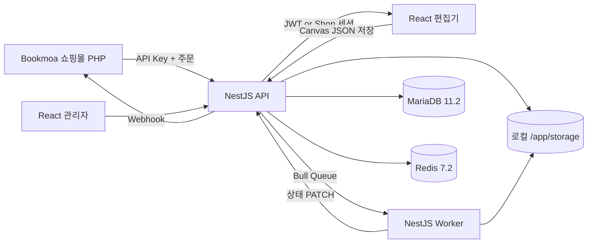
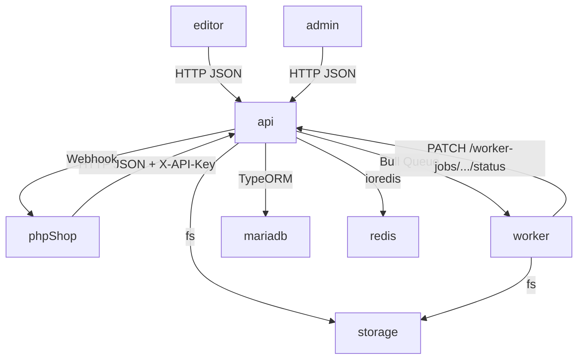
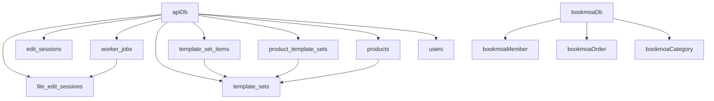
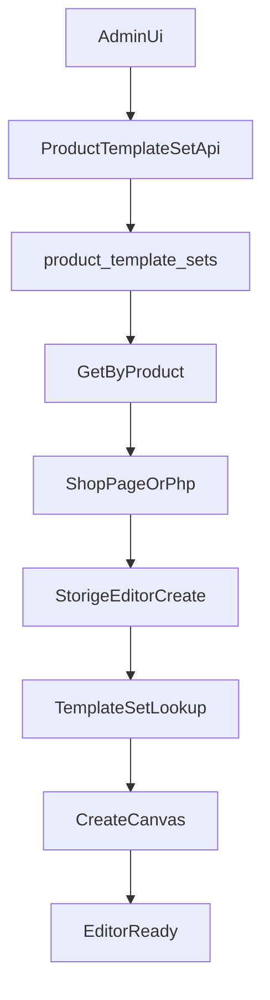

# Storige 인수인계 & 실전 개발 가이드

> 📌 **전체 진입점은 [`00_MASTER_DEVELOPMENT_GUIDE.md`](./00_MASTER_DEVELOPMENT_GUIDE.md)** 입니다. 이 문서는 그 가이드에서 "P0~P16 우선순위 + Deep Scan 12 이슈"를 다루는 **상세 참조 문서**입니다.
>
> 본 문서는 `CLAUDE.md`와 `.cursor/plans/takeover_report.md`(ChatGPT-5.4 분석본)을 기반으로,
> **이 프로젝트를 전혀 모르는 사람이 그대로 따라하면** 개발·보완·최적화·기능추가·배포까지
> 수행할 수 있도록 재정리한 실전 매뉴얼입니다.
>
> - 작성일: 2026-04-15
> - 대상 레포: `/Users/yohan/claude/Bookmoa Storige editor/storige`
> - 읽는 순서: **0 → 1 → 2 → 3 → … → 12** 순서대로 따라가세요. 건너뛰면 반드시 막힙니다.

---

## 0. 3분 요약 — 지금 이 프로젝트는 뭔가?

Storige는 **"인쇄 쇼핑몰에서 고객이 직접 편집한 파일을 제출·검증·합성해 출력용 PDF를 만들어내는"** 플랫폼입니다.

- **Bookmoa**라는 외부 쇼핑몰과 연동되며, 고객이 상품을 사면 편집기(iframe 또는 SPA)가 열리고,
  편집이 끝나면 API가 편집 데이터를 저장하고, Worker가 PDF로 합성하여 Bookmoa에 Webhook으로 결과를 통보합니다.
- **구성 요소**: 편집기 SPA(`editor`) + 관리자 SPA(`admin`) + REST API(`api`) + PDF Worker(`worker`) + 공용 패키지 3종.
- **원작자 부재**, 코드와 문서가 일부 불일치, 인증/세션/콜백 경로가 한 가지가 아니라 **세 갈래**로 공존합니다.

### 전체 플로우 한 장



---

## 1. 환경 준비 — 이대로만 따라하면 실행됩니다

### 1.1 필수 시스템 요구사항
| 항목 | 버전 | 확인 명령 |
| --- | --- | --- |
| Node.js | **≥ 20.0.0** | `node -v` |
| pnpm | **≥ 9.0.0** (lock은 `9.15.0`) | `pnpm -v` |
| Docker & Compose | 최신 | `docker -v && docker compose version` |
| Ghostscript | 설치 필요(Worker) | `gs -v` |
| MariaDB 클라이언트 | 선택 | `mariadb --version` |

> macOS는 `brew install node@20 pnpm ghostscript`, Ubuntu는 `apt-get install ghostscript`.

### 1.2 저장소 구조(실제 디렉터리 기준)

```
storige/
├── apps/
│   ├── editor/        # React + Vite + Fabric.js 고객 편집기 (port 3000)
│   ├── admin/         # React + Vite + AntD 관리자 (port 3001)
│   ├── api/           # NestJS REST API (port 4000, global prefix /api)
│   └── worker/        # NestJS + Bull 큐 워커 (port 4001)
├── packages/
│   ├── types/         # 공용 TS 타입 (CJS+ESM 이중 출력, 반드시 먼저 빌드)
│   ├── canvas-core/   # Fabric.js 래퍼 + 플러그인 시스템
│   ├── ui/            # 공용 React UI
│   └── ai/            # ★ README에는 누락된 패키지(AI 관련)
├── docker/            # 서비스별 Dockerfile
├── docker-compose.yml # 운영형 통합 실행
├── ecosystem.config.js# PM2 설정(프로덕션 선택지)
├── scripts/           # 배포/통합 테스트 셸 스크립트
├── storage/           # 로컬 파일 저장소 (컨테이너에 /app/storage 마운트)
├── test-php/          # ★ 메인 서비스가 아닌 PHP 연동 시뮬레이터
├── docs/              # 설계 문서(50+ 개, 최신성 편차 큼)
└── .cursor/plans/     # 본 문서와 takeover_report.md 위치
```

> **주의:** `README.md`의 구조 설명에는 `packages/ai`가 빠져 있습니다. 실제 존재합니다.
> `README.md`가 링크한 `.claude/plans/snuggly-soaring-piglet.md`는 **현재 저장소에 없습니다.**

### 1.3 환경 변수 파일 세팅

`.env` 파일은 **3곳에서 따로 로드**됩니다. 하나만 만들면 반드시 실행 중 실패합니다.

| 위치 | 용도 | 원본 | 최소 필수 값 |
| --- | --- | --- | --- |
| `./.env` (루트) | docker-compose 실행 시 | `.env.example` | `MYSQL_ROOT_PASSWORD`, `DATABASE_*`, `JWT_SECRET`, `API_KEYS`, `WORKER_API_KEY`, `API_BASE_URL` |
| `apps/api/.env` | API 로컬 실행 시 | `apps/api/.env.example` | `DATABASE_HOST=localhost`, DB/Redis 연결, `JWT_SECRET`, `API_KEYS` |
| `apps/editor/.env` | Vite 브라우저 변수 | `apps/editor/.env.example` | `VITE_API_BASE_URL=http://localhost:4000/api` |
| `apps/worker/.env` | Worker 로컬 실행 시 | `apps/worker/.env.example` | Redis, DB, **+ 수동 추가: `WORKER_API_KEY`, `API_BASE_URL`** |

> **함정 1**: `apps/worker/.env.example`에는 `WORKER_API_KEY`·`API_BASE_URL`이 **빠져 있습니다.**
> 이 두 값이 없으면 Worker가 상태를 API에 PATCH할 때 조용히 실패합니다. 루트 `.env.example`를 보고 직접 복사해 넣어야 합니다.
>
> **함정 2**: `WORKER_API_KEY`는 반드시 `API_KEYS` 콤마 목록에 포함된 값 중 하나여야 합니다.

### 1.4 첫 실행 체크리스트

```bash
# 1) 레포 루트에서
pnpm install

# 2) 공용 타입 먼저 빌드 (다른 패키지가 의존)
pnpm --filter @storige/types build

# 3) (필요 시) canvas-core도 선빌드
pnpm --filter @storige/canvas-core build

# 4) 환경 변수 파일 복사
cp .env.example .env
cp apps/api/.env.example apps/api/.env
cp apps/editor/.env.example apps/editor/.env
cp apps/worker/.env.example apps/worker/.env
# → worker/.env에 WORKER_API_KEY, API_BASE_URL 두 줄 추가

# 5) DB/Redis만 도커로 먼저 올리기(권장)
docker compose up -d mariadb redis

# 6) 전체 개발 서버
pnpm dev

# 또는 개별 실행
pnpm --filter @storige/api dev       # :4000 (global prefix /api)
pnpm --filter @storige/worker dev    # :4001
pnpm --filter @storige/editor dev    # :3000
pnpm --filter @storige/admin dev     # :3001
```

API 문서: `http://localhost:4000/api/docs` (Swagger). 포트 4000은 `:4000/api/*`가 실제 경로입니다.

---

## 2. 기술 스택 전체 지도

| 계층 | 스택 | 핵심 버전 | 근거 |
| --- | --- | --- | --- |
| 모노레포 | pnpm workspaces + Turborepo | pnpm 9.15.0, turbo ^2.3.3, TS ^5.7.2 | 루트 `package.json` |
| Editor | React 18.3.1, Vite 6.0.7, Fabric 5.5.2, Zustand 5.0.3, Tailwind | — | `apps/editor/package.json` |
| Admin | React 18.3.1, Vite 6.0.7, Ant Design 5.23.2, React Query 5.62.11 | — | `apps/admin/package.json` |
| API | NestJS 10, TypeORM 0.3.20, mysql2 3.12.0, Bull 4.16.4, Anthropic SDK 0.32.1, Replicate 1.0.1 | — | `apps/api/package.json` |
| Worker | NestJS 10, Bull 4.16.4, pdf-lib 1.17.1, sharp 0.33.5, node-canvas 2.11.2 | — | `apps/worker/package.json` |
| Canvas Core | fabric 5.5.2, jspdf 2.5.1, svg2pdf.js 2.2.4, fabric-history 1.7.0, opentype.js 1.3.4 | — | `packages/canvas-core/package.json` |
| DB | MariaDB 11.2 (TypeORM `synchronize: true` in dev only) | — | `apps/api/src/app.module.ts` |
| 큐 | Redis 7.2 + Bull | — | `docker-compose.yml` |
| 파일 저장 | 로컬 FS `/app/storage` (Docker volume) | — | `docker-compose.yml` |

### TypeScript 엄격도 주의
- `apps/editor/tsconfig.json` → `strict: false` ★ 타입 회귀 위험이 가장 큼
- `apps/admin/tsconfig.json` → `strict: true`, unused 체크 ON
- `apps/api`, `apps/worker` → NestJS 표준(CommonJS, decorator metadata)
- `packages/types` → **CJS + ESM 이중 출력**, `exports`로 분기. 이걸 모르고 재빌드 안 하면 타입 에러가 앱 전체로 번집니다.

---

## 3. 편집기(Canvas) 아키텍처 — "버그 수정 전에 이 절만은 반드시 읽기"

### 3.1 진입점
1. `apps/editor/src/utils/createCanvas.ts` → `createCanvas()` 가 진입점.
2. 다음 순서로 엔진을 세팅합니다.
   1. 설정 스토어 갱신
   2. DOM `<canvas>` 생성
   3. `configureFabricDefaults()` — 1회만
   4. `createFabricCanvas()` — Fabric 인스턴스 생성(uuid 기반 id 부여)
   5. 폰트 로드
   6. `Editor` 인스턴스 생성 후 플러그인 체인 등록
   7. `workspace.init()`
   8. `appStore.init(canvas, editor, initId)`

### 3.2 등록되는 플러그인(순서가 곧 의존성)

```
WorkspacePlugin → SpreadPlugin(옵션) → ObjectPlugin → RulerPlugin(옵션)
→ ControlsPlugin → GroupPlugin → HistoryPlugin → CopyPlugin → AlignPlugin
→ DraggingPlugin → FontPlugin → FilterPlugin → EffectPlugin → SmartCodePlugin
→ ImageProcessingPlugin(옵션) → AccessoryPlugin → PreviewPlugin
→ TemplatePlugin → ServicePlugin
```

**대부분의 도메인 로직은 React 컴포넌트가 아니라 플러그인에 있습니다.** UI만 수정하려다 실수로 플러그인 훅을 건드리는 일이 많으니 주의.

### 3.3 저장/로드/PDF 내보내기는 전부 `ServicePlugin` 하나에 응집
- **파일**: `packages/canvas-core/src/plugins/ServicePlugin.ts` (대형 파일)
- 담당 영역:
  - `saveJSON()` → `canvas.toJSON(core.extendFabricOption)`으로 **커스텀 메타 포함 직렬화**
  - `loadJSON()` → history 끄기 → clear → 폰트 추출 → `FontPlugin.ensureFontLoaded` → `loadFromJSON` → 후처리 → `afterLoad` 훅 → history 복구
  - PDF 다중 페이지 생성, 글리프 검증, 텍스트 path/이미지 폴백, overlay/effects 마스크, SVG→PDF(`svg2pdf`), 단계적 실패 복구(이미지 제거 → SVG 단순화 → 래스터 폴백), 상태 복원
- **교훈**: JSON 저장과 PDF 내보내기가 서로 영향을 주기 쉽습니다. 한 쪽만 수정하면 회귀가 잘 납니다.

### 3.4 커스텀 오브젝트
- 명시적 Fabric 커스텀 클래스는 `fabric.GuideLine` 하나(`packages/canvas-core/src/ruler/guideline.ts`).
  - `excludeFromExport: true`, `extensionType: 'guideline'`, `fromObject` 역직렬화 제공
- 나머지는 표준 Fabric 오브젝트에 `id`, `extensionType`, `effects`, `parentLayerId`, CMYK 원본값, lock 속성 등의 **메타데이터를 붙이는 방식**.

### 3.5 직렬화 보존 필드
- `core.extendFabricOption` 에 정의된 필드들이 `toJSON` 시 함께 직렬화됩니다.
- 커스텀 속성을 추가할 때는 반드시 이 배열에 추가하지 않으면 **저장은 되지만 불러올 때 사라집니다.**

---

## 4. 서비스 분리와 데이터 흐름

### 4.1 왜 API 한 개가 아니라 4개 앱인가

| 서비스 | 역할 | 기술 |
| --- | --- | --- |
| `apps/editor` | 고객이 인쇄물을 디자인하는 SPA | React + Fabric.js |
| `apps/admin` | 템플릿·리뷰·자산 관리 SPA | React + AntD + React Query |
| `apps/api` | 인증·세션·파일·템플릿·큐잉 REST | NestJS 10 |
| `apps/worker` | PDF 검증/변환/합성 큐 소비자 | NestJS + Bull + pdf-lib + sharp + ghostscript |

### 4.2 호출 다이어그램



### 4.3 Worker 큐 3종 (`apps/worker/src/processors/`)
- `pdf-validation` / `@Process('validate-pdf')`
- `pdf-conversion` / `@Process('convert-pdf')`
- `pdf-synthesis` / `@Process('synthesize-pdf')`

실제 PDF 작업은 `apps/worker/src/services/`의 세 서비스(`pdf-validator`, `pdf-converter`, `pdf-synthesizer`)가 수행합니다.

---

## 5. 인증 — ★ 세 갈래가 공존합니다. 먼저 이해 안 하면 무조건 막힙니다

| 흐름 | 토큰 저장 위치 | 발급 엔드포인트 | 해당 앱 |
| --- | --- | --- | --- |
| 일반 Bearer 로그인 | `localStorage.auth_token` | `POST /api/auth/login`, `/auth/refresh`, `/auth/me` | Editor |
| Admin 재발급형 | `localStorage.accessToken`, `localStorage.refreshToken` | `POST /api/auth/login`, 401 시 `/auth/refresh` | Admin |
| Bookmoa Shop 세션 | **HttpOnly 쿠키** `storige_access`, `storige_refresh` | `POST /api/auth/shop-session` (API Key 필요), `/auth/shop-refresh` | PHP 쇼핑몰 임베드 |

**실수 주의**
- 에디터는 `auth_token`, 어드민은 `accessToken/refreshToken`. **같은 저장소(localStorage)지만 키가 다릅니다.**
- 두 SPA를 동시에 띄우면 이상한 상태가 될 수 있으니 개발 중엔 별도 브라우저 프로필 권장.
- Shop 세션은 일반 `users` 테이블 검증을 하지 않습니다(API Key 통과 시 JWT 발급).
- 허용 헤더는 `Content-Type, Authorization, Accept, X-API-Key` (`apps/api/src/main.ts`).

---

## 6. 데이터베이스 — "EditSession"이 **두 개**입니다

### 6.1 DB 구성
- 메인 DB: MariaDB 11.2 (TypeORM)
  - `apps/api/src/app.module.ts` — `entities: [__dirname + '/*/entities/*.entity{.ts,.js}']`
  - `synchronize: process.env.NODE_ENV === 'development'` ← **프로덕션에선 꺼짐, 마이그레이션 전략 없음**
- **Bookmoa 읽기 전용 별도 연결**: `apps/api/src/bookmoa/bookmoa.module.ts` (`name: 'bookmoa'`, `synchronize: false`)
  - 등록 엔티티: `BookmoaMemberEntity`, `BookmoaOrderEntity`, `BookmoaCategoryEntity`

### 6.2 혼동 포인트: 이름은 같은데 테이블은 다른 두 엔티티

| 파일 | 클래스 | 테이블 | 용도 |
| --- | --- | --- | --- |
| `apps/api/src/editor/entities/edit-session.entity.ts` | `EditSession` | `edit_sessions` | 캔버스 편집 세션/이력 중심 |
| `apps/api/src/edit-sessions/entities/edit-session.entity.ts` | `EditSessionEntity` | `file_edit_sessions` | 주문/파일/워커 상태/콜백 URL 포함(외부 연동용) |

- `WorkerJob` 은 `file_edit_sessions`(후자)에 `ManyToOne`으로 연결됩니다.
- 즉, **워커 처리 로직을 디버깅할 때는 `edit_sessions`가 아니라 `file_edit_sessions`부터 보세요.**

### 6.3 템플릿/상품 관계
- `template_sets` (마스터 템플릿 세트)
- `template_set_items` (세트 내 개별 항목)
- `product_template_sets` (상품 ↔ 템플릿셋 매핑)
- `products.template_set_id` (상품이 참조하는 대표 템플릿셋)

### 6.4 ERD 요약



---

## 7. API 표면 지도

기준: `apps/api/src/main.ts`의 global prefix `api`. 모든 실제 경로는 `/api/*`입니다.

| 도메인 | 대표 경로 | 인증 | 비고 |
| --- | --- | --- | --- |
| Auth | `/api/auth/*` | 공개/`@Public()`/API Key/JWT 혼합 | login·register·refresh·shop-refresh=공개, shop-session=API Key, me=JWT |
| Edit Sessions | `/api/edit-sessions/*` | 기본 JWT, `GET .../external`=API Key | 주문/파일/워커 상태 세션 |
| Worker Jobs | `/api/worker-jobs/*` | JWT/역할 + `*/external`=API Key | 검증/변환/합성/외부 폴링 |
| Templates | `/api/templates`, `/api/template-sets`, `/api/categories`, `/api/product-template-sets` | 공개/관리자/API Key 혼합 | `template-sets/admin/update-thumbnails`는 `@Public()` → **운영 보안 재검토 필요** |
| Storage / Files | `/api/storage/*`, `/api/files/*` | 다운로드·썸네일=공개, 업로드·삭제=JWT/API Key | — |
| Library | `/api/library/*` | 조회 GET=공개, 쓰기=관리자 | 폰트/배경/클립아트/도형 |
| Editor | `/api/editor/*` | 공개 다수 | 캔버스 편집 세션/자동저장/검증/PDF |
| Products | `/api/products/*`, `/api/products/spine/*` | 상품 변경=역할, spine=공개 | 책등 계산 별도 |
| Health | `/api/health*` | 공개 | — |

**보안 재검토 항목(운영 전 필수)**
- `PATCH /api/worker-jobs/:id/status` — 컨트롤러 `worker-jobs.controller.ts:252~261`에 `@Public()`/`ApiKeyGuard`가 **명시적으로 없습니다**. `auth.module.ts:42` 의 전역 `JwtAuthGuard`가 붙으므로 JWT 필요. 반면 Worker 측 Conversion/Synthesis는 여기로 `X-API-Key`를 보냅니다 → §8.2 참고. **불일치 확정**, 양쪽 중 한쪽 수정 필수.
- `PATCH /api/worker-jobs/external/:id/status`(컨트롤러 `:237~244`)는 `@Public()+ApiKeyGuard+@ApiSecurity('api-key')`로 올바르게 외부 인증 체계.
- `template-sets/admin/update-thumbnails` — `@Public()`이면 관리자 권한 체크가 없습니다.
- Swagger 태그가 완비되지 않은 컨트롤러가 있어, 신뢰의 출처는 **Swagger가 아니라 컨트롤러 소스**입니다.

Swagger: `GET /api/docs`

---

## 8. 비동기 파이프라인 — 큐 & 웹훅

### 8.1 흐름
```mermaid
flowchart TD
  editorOrShop --> apiCreateJob[API: WorkerJobsService.create]
  apiCreateJob --> redisQueue[Bull(Redis)]
  redisQueue --> processor[Worker Processor]
  processor --> statusPatch[API: PATCH worker-jobs status]
  statusPatch --> updateSession[file_edit_sessions worker 상태 갱신]
  statusPatch --> webhook[WebhookService.send]
  webhook --> shopReceiver[Bookmoa 수신]
```

### 8.2 큐 종류와 콜백 경로(★ 일관성 결함)

| 프로세서 | 큐 이름 | 상태 업데이트 경로 | Worker가 보내는 헤더 | 서버 가드 실태 |
| --- | --- | --- | --- | --- |
| `ValidationProcessor` | `pdf-validation` | `PATCH /worker-jobs/external/:jobId/status` (processor `:119`) | `X-API-Key` | `@Public() + ApiKeyGuard` (컨트롤러 `:237~244`) ✅ 정상 동작 |
| `ConversionProcessor` | `pdf-conversion` | `PATCH /worker-jobs/:jobId/status` 비-`external` (processor `:102`) | `X-API-Key` (참고: conversion.processor.ts:102 헤더) | `@Public()` 없음 → 전역 `JwtAuthGuard` 경유, **API Key 무시되고 401 가능** ❌ |
| `SynthesisProcessor` | `pdf-synthesis` | `PATCH /worker-jobs/:jobId/status` 비-`external` (processor `:854`) | `X-API-Key` | 동상 ❌ |

→ Worker는 세 프로세서 모두 `X-API-Key`를 첨부합니다. 그러나 컨트롤러에서 `external/:id/status`는 `@Public()+ApiKeyGuard`로 열려있고, **비-`external` 경로 `:id/status`는 `@Public()`이 없어 `auth.module.ts:42`의 전역 `JwtAuthGuard`를 거칩니다.** 따라서 Worker의 Conversion/Synthesis 상태 PATCH는 사실상 **401 실패 경로**입니다.

**권장 수정**: 프로세서의 URL을 전부 `/worker-jobs/external/:id/status`로 통일하거나, 컨트롤러에 동등한 `@Public()+ApiKeyGuard` 비-external 경로를 두는 방식 중 택1. 현재 운영에서 "Worker는 도는데 상태가 안 바뀐다"는 현상의 1차 용의자입니다.

### 8.3 Webhook 종류
- 세션 검증: `session.validated`, `session.failed`
- 합성 결과: `synthesis.completed`, `synthesis.failed`
- **두 종류의 callbackUrl이 공존**: `file_edit_sessions.callbackUrl` vs Worker job options 내부 `callbackUrl`
- 스프레드 합성은 Worker가 **직접** webhook POST를 추가로 보내는 경로가 있어 중복 이벤트 가능성 있음
- 서명 방식: `WebhookService` 는 HMAC이 아니라 `identifier:event:timestamp` Base64 — 이름이 서명이어도 **암호학적 서명 아님**.
- 재시도 요청은 `X-Storige-Retry` 만 추가, 원래 `X-Storige-Signature`를 유지하지 않음

### 8.4 관련 `.env`(정합성 검증 필요)
- `.env.example`에 `BOOKMOA_WEBHOOK_URL`, `WEBHOOK_SECRET`이 있지만 현재 코드와 1:1 대응이 분명치 않음 → 운영 전 실제 호출 경로 검증 필수.

---

## 9. 배포 — Docker / PM2 / 하이브리드

### 9.1 옵션 A: docker-compose(운영형 통합)

```bash
cp .env.example .env   # 비밀번호·시크릿 반드시 교체
docker compose up -d --build
docker compose logs -f
```

서비스 스택: `nginx(80/443) · api(4000) · worker(4001) · editor · admin · mariadb(3306) · redis(6379)`.
- `./storage` 디렉터리가 api/worker/nginx에 공유 마운트됩니다.
- nginx는 `api`, `editor`, `admin`을 뒤에 두고 프록시합니다.

### 9.2 Dockerfile 차이(운영 영향도)

| 파일 | 런타임 | 특징 & 위험 |
| --- | --- | --- |
| `docker/api/Dockerfile` | Node 20 Alpine 멀티스테이지 | 워크스페이스 전체 복사 후 `@storige/types` 빌드. **`:23`에 `pnpm --filter @storige/types build \|\| true` 있음 → 빌드 실패 마스킹 위험** |
| `docker/editor/Dockerfile` | nginx:alpine 정적 | `types` + `canvas-core` 선빌드. **`:23`, `:24` 각각 `\|\| true` 사용(총 2개)**, api와 동일 위험 |
| `docker/admin/Dockerfile` | nginx:alpine 정적 | — (`\|\| true` 없음) |
| `docker/worker/Dockerfile` | Node + 런타임에 ghostscript/imagemagick/cairo/pango | **가장 배포 실패 가능성 높음**. canvas 네이티브 빌드 필수. **`:35`에 `\|\| true` 1개 사용** |

> **`\|\| true` 전체 위치 (2026-04-16 스캔)**: `docker/api/Dockerfile:23`, `docker/worker/Dockerfile:35`, `docker/editor/Dockerfile:23`, `docker/editor/Dockerfile:24` — **3개 파일 · 총 4군데**. P0-B 정비 시 전부 함께 제거하거나 정당성 주석을 붙이세요.

### 9.3 옵션 B: PM2 (`ecosystem.config.js`)
- `apps/{api,worker,editor,admin}`를 각각 `dist/` 또는 `serve dist`로 가동.
- Worker에 `max_memory_restart: 2G` 설정되어 있음(대용량 PDF 대응).
- 정적 SPA 2개는 `npx serve -l <port> -s` 로 서빙.
- 주의: PM2 모드는 nginx·mariadb·redis를 별도 수단으로 운영해야 합니다.

### 9.4 Vercel (`vercel.json`)
- 프런트 SPA의 프리뷰용으로 설정 파일이 존재. 프로덕션 API/Worker는 Vercel 대상이 아닙니다.

### 9.5 배포 검증 스크립트
- `scripts/deploy.sh`, `scripts/dev-start.sh`, `scripts/server-setup.sh`
- `scripts/test-bookmoa-integration.sh`, `scripts/test-integration.sh` — 통합 스모크 테스트

---

## 10. PHP 디렉터리의 정체(`test-php/`)

**메인 서비스가 아닙니다.** 별도 `docker-compose.yml`을 가진 **쇼핑몰 연동 시뮬레이터**입니다.
- `config.php`: API 호출 헬퍼 + 테스트 유저 생성/로그인
- `editor.php`: 로그인으로 JWT 받아 `editor-bundle.iife.js` 임베드
- `callback.php`: 편집 완료 후 리다이렉트 랜딩
- `webhook.php` + `webhook-status.php`: Worker webhook 수신 + 상태 UI

일반 개발 시작점이 아니고, **연동 회귀 테스트할 때만 띄우면 됩니다.**

---

## 10.5 Admin에서 실제 상품과 템플릿셋을 연결하고 Editor를 띄우는 운영 매뉴얼

이 절은 **“Admin에서 무엇을 설정해야 실제 웹사이트 상품에서 Editor가 뜨는가?”** 만을 코드 기준으로 정리한 실무용 절차입니다.

### 10.5.1 먼저 이해할 것: 연결 방식은 두 종류입니다

| 방식 | 저장 위치 | 의미 | 실제 웹사이트 상품 연동과의 거리 |
| --- | --- | --- | --- |
| **외부 상품 코드 매핑** | `product_template_sets` | `sortcode` + 선택적 `prdt_stan_seqno` → `templateSetId` 다중 연결 | **가장 직접적** |
| 내부 상품 FK | `products.template_set_id` | Storige 내부 `products` 행에 대표 템플릿셋 1개 연결 | 보조 경로 |

근거:
- `apps/api/src/templates/entities/product-template-set.entity.ts`
- `apps/api/src/products/entities/product.entity.ts`
- `apps/admin/src/pages/ProductTemplateSets/ProductTemplateSetList.tsx`
- `apps/admin/src/pages/Products/ProductList.tsx`

**실제 외부 웹사이트 상품에서 Editor를 띄우는 핵심 경로는 첫 번째입니다.**  
즉, Admin의 본 작업은 “상품 화면에서 템플릿셋을 바로 실행”이 아니라 **외부 상품 식별자(`sortcode`, 필요 시 `stanSeqno`)로 템플릿셋을 찾을 수 있게 매핑 데이터를 만드는 일**입니다.

### 10.5.2 운영자가 실제로 눌러야 하는 화면

#### A. 권장 경로: `상품-템플릿 연결`
- 사이드바 경로: **`템플릿 → 상품-템플릿 연결`**
- 파일:
  - `apps/admin/src/components/Layout/MainLayout.tsx`
  - `apps/admin/src/App.tsx`
  - `apps/admin/src/pages/ProductTemplateSets/ProductTemplateSetList.tsx`

이 화면은 `product_template_sets`를 관리합니다.  
즉, **북모아 상품 코드(`sortcode`) 기준**으로 템플릿셋을 여러 개 연결할 수 있습니다.

#### B. 보조 경로: `products`
- 라우트는 `apps/admin/src/App.tsx`에 `path="products"`로 존재
- 실제 UI 컴포넌트는 `apps/admin/src/pages/Products/ProductList.tsx`
- 하지만 `MainLayout.tsx`의 사이드바 메뉴에는 `/products` 진입 항목이 없습니다.

즉, 이 화면은 존재하지만 **사이드바 표준 운영 플로우에는 올라와 있지 않습니다.**  
`products.template_set_id`를 직접 관리하는 내부 경로로 이해하면 됩니다.

### 10.5.3 사전 준비: 먼저 템플릿셋부터 만들어야 합니다

작업 순서:
1. `템플릿 → 템플릿셋관리`로 이동
2. 필요한 템플릿셋을 생성 또는 수정
3. 최종적으로 사용할 `templateSetId`가 실제로 존재하는 상태를 만든다

관련 파일:
- `apps/admin/src/pages/TemplateSets/TemplateSetList.tsx`
- `apps/admin/src/pages/TemplateSets/TemplateSetForm.tsx`
- `apps/admin/src/api/template-sets.ts`

백엔드에서도 `product_template_sets` 생성 시 `templateSetId`가 존재하고 `isDeleted: false`인지를 먼저 확인합니다.  
근거: `apps/api/src/templates/product-template-sets.service.ts:create()`

### 10.5.4 권장 운영 절차: `sortcode` 기준으로 연결하기

#### 1. `상품-템플릿셋 연결 관리` 화면 열기
- 제목: `상품-템플릿셋 연결 관리`
- 버튼: `연결 추가`
- 검색창: `상품코드 검색 (예: 001001001)`

근거: `apps/admin/src/pages/ProductTemplateSets/ProductTemplateSetList.tsx`

#### 2. `연결 추가` 모달에서 상품코드(`sortcode`) 입력
- 필드명: `상품코드 (sortcode)`
- 입력 UI: `AutoComplete`
- 검색은 `bookmoaApi.getCategories({ search, limit: 20 })`를 호출
- 표시 형식: `${sortcode} - ${name}`

즉, 운영자는 상품명 또는 코드로 검색하지만, 실제 저장 키는 **`sortcode`** 입니다.

#### 3. 필요하면 규격 번호(`prdtStanSeqno`) 입력
- 필드명: `규격 번호 (선택)`
- 안내 문구: `비워두면 해당 상품의 모든 규격에 적용됩니다`

이 값은 DB에는 `prdt_stan_seqno`로 저장되고, 외부 조회 쿼리에서는 `stanSeqno`라는 이름으로 사용됩니다.

#### 4. 템플릿셋 하나 또는 여러 개 선택
- 필드명: `템플릿셋 선택`
- `Select mode="multiple"`이므로 여러 개 선택 가능
- 한 개 선택 시 `create`
- 여러 개 선택 시 `bulkCreate`

중요 동작:
- 여러 개를 선택하면 `displayOrder`가 선택 순서대로 들어갑니다.
- 첫 번째 항목이 `isDefault: true`로 저장됩니다.
- UI에도 `순서대로 displayOrder가 지정됩니다. 첫 번째가 기본 템플릿이 됩니다.` 라는 안내가 있습니다.

#### 5. 기본/활성/순서 관리
목록에서 조절 가능한 값:
- **기본**: 별 아이콘 (`isDefault`)
- **활성**: 스위치 (`isActive`)
- **순서**: `displayOrder`

운영 해석:
- 외부 상품 조회 결과는 `isDefault DESC`, `displayOrder ASC` 순으로 정렬됩니다.
- 따라서 “웹사이트에서 기본으로 무엇을 먼저 보여줄지”는 이 세 값이 실질적으로 결정합니다.

### 10.5.5 백엔드 매핑 규칙: 실제로 어떻게 조회되는가

관련 파일:
- `apps/api/src/templates/product-template-sets.controller.ts`
- `apps/api/src/templates/product-template-sets.service.ts`
- `apps/api/src/templates/dto/product-template-set.dto.ts`
- `apps/api/src/templates/entities/product-template-set.entity.ts`

#### 생성 시 필수/선택 식별자
- 필수: `sortcode`, `templateSetId`
- 선택: `prdtStanSeqno`

#### 중복 제약
유니크 제약:
- `(sortcode, prdtStanSeqno, templateSetId)`

즉, 같은 상품/규격/템플릿셋 조합은 중복 등록되지 않습니다.

#### 외부 조회 엔드포인트
실제 쇼핑몰/외부 시스템이 템플릿셋을 조회할 때 쓰는 API:
- `GET /api/product-template-sets/by-product`
- 인증: `X-API-Key`
- 쿼리:
  - `sortcode` 필수
  - `stanSeqno` 선택

#### 조회 fallback 규칙
`ProductTemplateSetsService.findByProduct()` 기준:
1. `sortcode + stanSeqno`가 있으면 정확히 그 규격으로 먼저 조회
2. 결과가 없으면 `sortcode + prdtStanSeqno IS NULL`로 fallback
3. 최종 결과에서 `isActive: true`이고 `templateSet.isDeleted !== true`인 항목만 유효

즉, 운영 규칙은 이렇게 이해하면 됩니다.
- **규격별 템플릿이 있으면 그걸 우선**
- **없으면 상품 공통 템플릿으로 fallback**
- **비활성/삭제 템플릿셋은 실제 운영 결과에서 제외**

### 10.5.6 실제 상품 페이지에서 Editor가 뜨는 런타임 흐름

관련 파일:
- `apps/editor/src/embed.tsx`
- `apps/editor/src/views/EditorView.tsx`
- `apps/editor/src/hooks/useEditorContents.ts`
- `apps/editor/src/api/edit-sessions.ts`
- `apps/editor/src/api/templates.ts`
- `apps/editor/src/utils/createCanvas.ts`

핵심 사실:
- **Editor는 `sortcode`를 직접 이해하지 않습니다.**
- Editor가 실제로 필요로 하는 핵심 값은 **`templateSetId`** 입니다.

즉, 전체 흐름은 아래 순서입니다.
1. Admin이 `sortcode` / `prdtStanSeqno` 기준으로 `product_template_sets`를 설정
2. 쇼핑몰 또는 PHP 중간 계층이 `GET /api/product-template-sets/by-product`로 템플릿셋 후보 조회
3. 그중 기본/첫 번째 템플릿셋의 **`templateSetId`** 를 선택
4. 선택한 `templateSetId`를 `StorigeEditor.create(...)` 또는 Editor URL 쿼리로 전달
5. Editor는 그 `templateSetId`를 기준으로 템플릿셋 상세를 로딩하고 캔버스를 초기화

#### 임베드에서 사실상 필요한 값
`apps/editor/src/embed.tsx` 기준:
- 필수 수준: `templateSetId`
- 인증: `token` 또는 이미 저장된 `localStorage.auth_token`
- 주문 연동형이면 추가로:
  - `orderSeqno`
  - `mode`
  - 필요 시 `sessionId`, `coverFileId`, `contentFileId`, `callbackUrl`

#### Editor 내부에서 실제로 일어나는 일
`embed.tsx`는 초기화 시 다음을 수행합니다.
1. 필요 시 `auth_token` 저장
2. 필요 시 `editSessionsApi.get/findByOrder/create`
3. `templatesApi.getTemplateSet(templateSetId)`로 존재 확인
4. `createCanvas()`로 Fabric/플러그인 초기화
5. `loadTemplateSetEditor({ templateSetId, ... })`
6. 내부에서 다시 `GET /template-sets/:id/with-templates`
7. 기존 세션 `canvasData`가 있으면 JSON 복원

즉, **상품 매핑 API는 Editor가 직접 호출하는 것이 아니라, Editor에 들어가기 전에 쇼핑몰/중간 서버가 `templateSetId`를 결정하는 데 사용됩니다.**

### 10.5.7 `productId`와 `templateSetId`의 관계

많이 헷갈리는 지점:
- `productId`가 있어도 embed 경로에서 상품 API를 기준으로 템플릿을 고르지 않습니다.
- `embed.tsx`에서 `productId`는 주로 metadata 성격으로 전달됩니다.
- 반대로 `EditorView.tsx`에서는 `templateSetId`가 있으면 **상품 기반 로딩보다 템플릿셋 로딩이 우선**합니다.

정리:
- `templateSetId`가 있으면 템플릿셋 모드
- `templateSetId`가 없고 `productId`만 있으면 상품 기반 모드 가능
- “실제 상품에서 템플릿셋으로 Editor를 띄운다”는 운영 요구는 결국 **`sortcode -> templateSetId -> Editor`** 체인입니다

### 10.5.8 내부 `products.template_set_id` 경로는 언제 쓰나

관련 파일:
- `apps/admin/src/pages/Products/ProductList.tsx`
- `apps/admin/src/api/products.ts`
- `apps/api/src/products/products.controller.ts`

이 경로는 다음과 같습니다.
1. `/products` 화면에서 상품 선택
2. `연결` 버튼 클릭
3. 템플릿셋 하나 선택
4. `PUT /api/products/:id/template-set`

하지만 이 경로는 **Storige 내부 상품 레코드에 대표 템플릿셋 하나를 붙이는 것**입니다.  
외부 쇼핑몰 상품 코드(`sortcode`) 기반 조회와는 다른 모델이므로, 실제 Bookmoa 상품에서 Editor를 띄우는 표준 경로로 혼동하면 안 됩니다.

추가 주의:
- `/products` 화면은 라우트는 존재하지만 사이드바 기본 메뉴에는 없습니다.
- 즉, 운영 표준 플로우는 `상품-템플릿 연결` 화면이고, `products`는 내부 관리/보조 용도로 이해하는 편이 안전합니다.

### 10.5.9 샘플 통합 경로 (`test-php`)

관련 파일:
- `test-php/php/index.php`
- `test-php/php/products.php`
- `test-php/php/editor.php`
- `test-php/php/callback.php`
- `test-php/php/webhook.php`
- `test-php/php/webhook-status.php`

가장 실제적인 테스트 흐름:
1. PHP 페이지에서 `productId`, `templateSetId`를 쿼리로 붙여 `editor.php` 진입
2. PHP가 `/auth/login`으로 테스트 JWT 확보
3. 브라우저에서 `window.StorigeEditor.create({ templateSetId, productId, token, apiBaseUrl, mode, orderSeqno, ... })`
4. 편집 완료 시 `callback.php`로 브라우저 리다이렉트
5. 별도 PDF 합성 webhook은 `webhook.php`에서 POST로 수신

즉, **브라우저 callback과 서버 webhook은 서로 다른 개념**입니다.

### 10.5.10 운영 caveat

- `test-php` 예시는 camelCase 쿼리 파라미터를 사용하지만, 일부 문서(`BOOKMOA_INTEGRATION_GUIDE.md`)는 snake_case를 사용합니다. 문서 간 차이가 있으므로 실제 운영 스펙은 하나로 통일해야 합니다.
- `test-php`는 `/auth/login` 기반 테스트 유저 흐름이고, 운영 문서는 `/auth/shop-session` + `X-API-Key` 흐름을 더 강조합니다.
- Bookmoa 카테고리명 자동완성은 Bookmoa DB 연결이 살아 있을 때 더 유용합니다. 연결이 없으면 코드 자체는 동작해도 `categoryName` 보강이 약해질 수 있습니다.
- `product_template_sets`를 만들어도 쇼핑몰 쪽이 `GET /api/product-template-sets/by-product`를 호출하지 않으면 Editor는 자동으로 뜨지 않습니다. **매핑 생성과 런타임 조회는 별도 단계**입니다.

### 10.5.11 운영 다이어그램



### 10.5.12 한 문장 운영 요약

**Admin의 역할은 `sortcode/prdtStanSeqno -> templateSetId` 매핑을 만드는 것이고, 쇼핑몰의 역할은 그 매핑을 조회해 `templateSetId`를 Editor에 넘기는 것입니다.**  
이 둘이 모두 연결되어야 실제 상품 페이지에서 Editor가 뜹니다.

---

## 11. "오늘부터 바로 해야 할 일" 우선순위 큐

### ★ P1 — 저장 완료 체인 끊김
- **파일**: `apps/editor/src/hooks/useWorkSave.ts`
- 표지·내지 PDF 업로드까지 끝낸 뒤 "EditSession 완료 API 호출" 단계가 **mock job id 반환**으로 비어 있음.
- `apps/editor/src/api/edit-sessions.ts` 에 이미 `complete(id)` 래퍼 존재 → **바로 연결**.
- **영향**: "편집 완료는 되는데 후속 워커 처리 안 됨" 상태. 운영 가치가 0에 수렴.

### ★ P2 — 중철 제본 페이지 순서(Saddle Stitch) 미구현
- **파일**: `apps/worker/src/services/pdf-synthesizer.service.ts`
- `bindingType === 'saddle'` 분기에 `TODO`만 남기고 **단순 병합**으로 우회 중.
- 중철은 페이지 임포지션(1-n, 2-(n-1), ...) 규칙 없으면 출력물 자체가 잘못 나옵니다.
- **우선 구현 순서**: (1) 페이지 수 4의 배수 정렬 → (2) 스프레드 페어 계산 → (3) pdf-lib로 재조합 → (4) 단위 테스트(`synthesis.processor.spec.ts`).

### ★ P3 — 리뷰 승인자 하드코딩
- **파일**: `apps/admin/src/pages/Reviews/ReviewDetail.tsx`
- 승인/반려 3번째 파라미터에 `'admin'` 리터럴 하드코딩.
- Auth 컨텍스트에 현재 사용자 이미 존재 → **그 값으로 교체**. 감사 로그 신뢰성 회복.

### ★ P4 — 썸네일 생성 플레이스홀더
- **파일**: `apps/api/src/storage/storage.service.ts` → `generateThumbnail()` 가 **원본 경로 그대로 반환**.
- `sharp`가 이미 의존성에 있으므로 즉시 구현 가능.
- 관리자 화면/에셋 목록 성능 대폭 개선.

### ★ P5 — 템플릿셋 삭제 전 상품 사용 검증
- **파일**: `apps/api/src/templates/template-sets.service.ts` → `remove()` TODO.
- 상품-템플릿 참조 정합성 손상 위험. `product_template_sets`·`products.template_set_id` 둘 다 검사.

### ★ P6 — 콘텐츠 편집기 GraphQL 로드 경로
- **파일/라인**: `apps/editor/src/hooks/useEditorContents.ts:822~824` (`loadContentEditor` 함수, `:824`에 `// TODO: GraphQL로 콘텐츠 데이터 가져와서 로드`). 함수 자체는 `:122`에 타입 선언, `:748`에서 호출, `:1682`에서 export 됨.
- 현 동작: TODO 상태로 `initWorkspace()`만 호출 후 완료.
- **선택 1**: GraphQL 스택을 실제로 연결(§21의 stub 제거와 함께 진행).
- **선택 2**: GraphQL 폐기면 함수 네이밍과 설계 흔적 제거.

### ★ P7 — 색공간 런타임 스텁
- **파일**: `apps/editor/vite.config.ts`
- `@pf/color-runtime` 미설치 시 `cmykToRgb/rgbToCmyk/transformImageDataToProfile`을 **모두 `throw`** 스텁으로 주입.
- CMYK 변환이 제품 요구라면 런타임 기능 공백. 폐기라면 코드·문서에서 제거.

### 워커 콜백 표준화(상시 과제)
- Validation은 `/external` + `X-API-Key`, Conversion/Synthesis는 비-`external` 사용 → **하나로 통일** 필요.
- Webhook 서명은 HMAC으로 승격 권장(`WEBHOOK_SECRET` 실제 활용).

---

## 12. 위험 포인트 10선

1. `ServicePlugin`에 도메인 로직 과집중 → JSON·PDF 회귀 유발.
2. 인증 3갈래(Bearer·Admin 재발급·Shop 쿠키) 공존, 저장 키 상이.
3. `edit_sessions` vs `file_edit_sessions` 두 세션 엔티티 공존.
4. Worker 콜백 경로/인증 방식 혼재.
5. Webhook 서명이 사실상 비-암호학적.
6. `.env.example` 3곳 분산 + worker 쪽 누락 항목 존재.
7. `docker/api/Dockerfile`, `docker/worker/Dockerfile`, `docker/editor/Dockerfile`의 `|| true`(3개 파일·4군데)가 빌드 실패 은폐. §9.2 확장판 참고.
8. `editor` TS strict=false로 타입 회귀 취약.
9. `README.md`가 `packages/ai` 누락 + 깨진 링크 보유.
10. TypeORM `synchronize`는 dev 전용 → **프로덕션 마이그레이션 전략 부재**. DB 변경은 수동 SQL(`docker/mysql/init.sql`) 관리에 의존.

---

## 13. 추천 인수 순서(가장 빠른 이해 경로)

1. `apps/editor/src/utils/createCanvas.ts` → `packages/canvas-core/src/plugins/ServicePlugin.ts`
2. `apps/editor/src/hooks/useWorkSave.ts` → `apps/editor/src/api/edit-sessions.ts`
3. `apps/api/src/edit-sessions/entities/edit-session.entity.ts` ↔ `apps/api/src/editor/entities/edit-session.entity.ts` ↔ `apps/api/src/worker-jobs/entities/worker-job.entity.ts`
4. `apps/api/src/auth/auth.controller.ts` + `apps/editor/src/api/client.ts` + `apps/admin/src/lib/axios.ts`
5. `apps/api/src/worker-jobs/worker-jobs.service.ts` + `apps/worker/src/processors/*.ts` + `apps/api/src/webhook/webhook.service.ts`
6. `apps/worker/src/services/pdf-synthesizer.service.ts`(제본 규칙)
7. `docker-compose.yml` + `docker/*/Dockerfile` + `.env.example` 전부 교차 검증

---

## 14. 자주 막히는 "실전 FAQ"

**Q. `pnpm dev` 돌렸는데 편집기에서 타입 에러가 쏟아진다.**
- A. `pnpm --filter @storige/types build`를 안 돌린 경우가 99%. canvas-core도 함께 빌드.

**Q. Worker는 도는데 상태가 API에 반영 안 된다.**
- A. `apps/worker/.env` 에 `WORKER_API_KEY`, `API_BASE_URL`이 있는지 확인. 둘이 없으면 조용히 실패.
- 추가로 `WORKER_API_KEY`가 API의 `API_KEYS` 목록에 포함되어 있어야 함.

**Q. 관리자 페이지 401 무한 루프.**
- A. 브라우저 localStorage에서 `accessToken/refreshToken`을 지우고 재로그인. 에디터와 동시 사용 시 세션 충돌 가능 → 시크릿 창/별도 프로필 사용.

**Q. 편집 후 PDF 저장이 중간에 멈춘다.**
- A. `useWorkSave.ts`의 P1 이슈 가능성 매우 높음. 네트워크 탭에서 `/edit-sessions/:id/complete`가 호출되는지 먼저 확인.

**Q. Bookmoa DB 연결 오류.**
- A. `BOOKMOA_DB_*`는 기본 주석 처리. 필요할 때만 `.env`에서 풀고, 반드시 읽기 전용 계정 사용.

**Q. Docker worker 컨테이너가 canvas 네이티브 빌드에서 실패.**
- A. `docker/worker/Dockerfile`에 `cairo/pango/ghostscript/imagemagick`이 설치되어야 함. 이미지가 오래됐으면 `--no-cache` 재빌드.

**Q. 중철 제본 PDF가 이상하게 나온다.**
- A. P2 이슈 — 임포지션 미구현. `pdf-synthesizer.service.ts` 수정 전엔 발생 당연.

**Q. 편집기 CMYK 버튼 누르면 에러.**
- A. P7 스텁 이슈 — `@pf/color-runtime`이 설치되어 있지 않은 환경에서는 throw.

---

## 15. 다음 스프린트에 "바로 코딩 가능한" 마일스톤 제안

| M | 내용 | 주요 파일 | 기대 효과 |
| --- | --- | --- | --- |
| M1 | 편집 완료 체인 복구(P1) + 통합 스모크 테스트 추가 | `useWorkSave.ts`, `edit-sessions.ts`, `scripts/test-integration.sh` | 실제 워커 체인 End-to-End 동작 |
| M2 | 중철 임포지션 구현(P2) + 단위 테스트 | `pdf-synthesizer.service.ts`, `synthesis.processor.spec.ts` | 제본 품질 정상화 |
| M3 | Worker 콜백 경로 통일(`/external` + API Key 표준) | `validation/conversion/synthesis.processor.ts`, `worker-jobs.controller.ts` | 상태 업데이트 일관성 |
| M4 | Webhook HMAC 서명으로 승격 + 재시도 시 서명 유지 | `webhook.service.ts`, `.env.example` | 수신측 무결성 검증 가능 |
| M5 | `edit_sessions` ↔ `file_edit_sessions` 관계 문서화 + 필요 시 통합 or 명명 개선 | API `editor/`, `edit-sessions/` 양쪽 | 혼동/버그 감소 |
| M6 | 프로덕션 마이그레이션 전략(TypeORM migrations 도입) | `apps/api/src/database/`, `docker/mysql/init.sql` | 스키마 안정성 |
| M7 | 편집기 `strict: true` 전환 + 타입 오류 수습 | `apps/editor/tsconfig.json` | 회귀 방지 |
| M8 | Worker 썸네일/CMYK 스텁 정리(P4, P7) | `storage.service.ts`, `vite.config.ts` | 관리/성능 개선 |

---

## 16. 참조 링크 표(근거)

- `package.json`, `pnpm-workspace.yaml`, `turbo.json`
- `docker-compose.yml`, `docker/**/Dockerfile`, `ecosystem.config.js`, `vercel.json`
- `apps/editor/src/utils/createCanvas.ts`
- `packages/canvas-core/src/{Editor.ts, utils/factory.ts, utils/canvas.ts, plugins/ServicePlugin.ts, ruler/guideline.ts}`
- `apps/api/src/main.ts`, `apps/api/src/app.module.ts`
- `apps/api/src/auth/auth.controller.ts`, `apps/editor/src/api/client.ts`, `apps/admin/src/lib/axios.ts`
- `apps/api/src/edit-sessions/entities/edit-session.entity.ts`, `apps/api/src/editor/entities/edit-session.entity.ts`, `apps/api/src/worker-jobs/entities/worker-job.entity.ts`
- `apps/api/src/bookmoa/bookmoa.module.ts` + `bookmoa-entities/*`
- `apps/worker/src/processors/{validation,conversion,synthesis}.processor.ts`
- `apps/worker/src/services/pdf-synthesizer.service.ts`
- `apps/api/src/webhook/webhook.service.ts`
- `apps/editor/src/hooks/useWorkSave.ts`, `apps/editor/src/hooks/useEditorContents.ts`
- `apps/admin/src/pages/Reviews/ReviewDetail.tsx`
- `apps/api/src/storage/storage.service.ts`, `apps/api/src/templates/template-sets.service.ts`
- `apps/editor/vite.config.ts`
- 원본 분석: `/.cursor/plans/takeover_report.md`
- 프로젝트 규칙: `CLAUDE.md`

---

## 17. 한 줄 결론

> **"편집기 저장 → API 세션 완료 → 워커 처리 → 상태 PATCH → 쇼핑몰 webhook"** 이 한 줄의 체인을
> 끝까지 실제로 돌려보고 나면, 이 레포의 70%는 이해됩니다. 나머지 30%는 `ServicePlugin.ts`와
> 인증 3갈래만 따로 시간 내서 읽으면 됩니다.

---

# 🔬 재검증 보완 (2026-04-15 Deep Scan)

> 1차 가이드가 "완벽한가"에 대한 답: **아니요.**
> 실제 `TODO`/`FIXME`/`deprecated`/`legacy`/`stub`/`mock`/`placeholder` 전수 스캔 결과,
> `takeover_report.md`와 1차 `HANDOFF_GUIDE.md`가 **함께 놓친 위험 지점 12건**을 새로 찾았습니다.
> 이 섹션은 그 보완입니다. **배포 전에 반드시 이 섹션부터 처리하세요.**

## 18. ★ 치명적 누락 1 — 운영 DB 스키마가 "절반만" 정의되어 있음

### 18.1 "문서에 다 정의된 내용인가요?" 에 대한 답

**아닙니다. 이 결론은 문서 어디에도 명시되지 않았습니다.**

- `CLAUDE.md`는 "MariaDB 11.2 (TypeORM with synchronize in dev)"라고 한 줄만 언급.
- `takeover_report.md`는 `synchronize: NODE_ENV === 'development'` 사실은 언급했지만, **"그래서 운영에서 어떻게 되는지"는 연결하지 않았습니다.**
- `docs/MARIADB_MIGRATION.md`, `docs/DEPLOYMENT.md`, `docs/04_DATABASE_ERD.md` 어디에도 "`init.sql`이 엔티티와 불일치"라는 경고가 없습니다.
- `README.md`의 "🐳 Docker 배포" 절은 `cp .env.example .env && docker-compose up -d` 만 적혀 있고, DB 스키마에 대한 경고가 전혀 없습니다.

**이 결론은 제가 `docker/mysql/init.sql`의 `CREATE TABLE` 목록과 `apps/api/src/**/entities/*.entity.ts` 파일 목록을 직접 비교해서 도출한 것입니다.** 그래서 기존 인수 문서만 읽으면 이 함정을 모른 채 `docker-compose up -d`를 치게 됩니다.

### 18.2 "왜 가장 먼저 해야 하는가?"를 4줄로

1. `docker-compose up -d`를 돌리면, **MariaDB 컨테이너는 `init.sql`에 있는 테이블만 만듭니다.**
2. API(`synchronize: false` in production)는 **없는 테이블을 만들어주지 않습니다.**
3. 그러면 편집기에서 "저장"을 누르는 순간 → API가 `file_edit_sessions` INSERT 시도 → `ER_NO_SUCH_TABLE` → 500 에러.
4. **이 체인이 안 풀리면 나머지 P1~P16을 아무리 완벽히 구현해도 사용자는 "저장 버튼을 누를 수조차 없는" 상태가 됩니다.** 그래서 0순위입니다.

비유하자면, P1~P16은 "집의 배선·배관·가구"이고, P0-A는 "집의 기초 콘크리트"입니다. 기초 없이 가구를 들여놓을 수 없습니다.

### 18.3 증거 (스캔 결과)
- `docker/mysql/init.sql` (151줄) — 프로덕션 첫 기동 시 MariaDB가 자동 실행하는 **유일한** 스키마 파일.
- **정의된 테이블 10개**: `users / categories / templates / template_sets / template_set_items / library_fonts / library_backgrounds / library_cliparts / edit_sessions / worker_jobs`
- **TypeORM `@Entity()`로 선언된 실제 테이블(최소치)**:
  - `file_edit_sessions` (★ 워커 파이프라인의 핵심 세션)
  - `product_template_sets`, `products`
  - `files`
  - `library_shapes`, `library_frames`
  - `reviews`, `editor_designs`, `editor_contents`
  - Bookmoa 참조 테이블(읽기 전용, 이건 외부 DB라 예외)

### 18.4 왜 지금까지 안 터졌나?
- 로컬 개발은 `NODE_ENV=development` → TypeORM `synchronize: true` → **엔티티 기준으로 테이블이 자동 생성**됩니다. 그래서 개발자는 문제를 평생 못 봅니다.
- `pnpm dev`로만 써 본 사람은 이 지뢰를 밟을 수 없습니다.
- 운영 `docker-compose up -d`로 처음 띄우는 순간부터 문제가 시작됩니다.

### 18.5 ★ "아무것도 모르는 내가 지금 할 수 있는 일" — 3단계 플레이북

#### 단계 0: 5분 안에 현재 상태 확인 (위험도 없음, 파일만 읽음)
```bash
# 현재 디렉터리: 레포 루트
cd "/Users/yohan/claude/Bookmoa Storige editor/storige"

# (1) init.sql에 정의된 테이블 목록
grep -iE "CREATE TABLE IF NOT EXISTS" docker/mysql/init.sql | sed 's/.*EXISTS //; s/ .*//'

# (2) 엔티티가 선언한 테이블 이름
grep -rhE "@Entity\(['\"]([^'\"]+)['\"]" apps/api/src --include="*.ts"

# (3) 두 결과의 차집합이 "init.sql에 없는데 엔티티로는 존재하는" 누락 테이블입니다.
```

#### 단계 1: 가장 안전한 임시 우회 (운영 배포 없이 로컬에서만)
```bash
# .env에 NODE_ENV=development 를 잠깐 넣은 채로 docker-compose 실행
# → TypeORM synchronize가 모든 테이블을 만들어줌
# → 이건 "지금 당장 데모를 보여줘야 한다" 용 응급 처치이지, 운영 해법이 아닙니다.
echo "NODE_ENV=development" >> .env
docker-compose up -d mariadb redis
pnpm --filter @storige/api dev   # synchronize: true 로 테이블 자동 생성
docker-compose exec mariadb mariadb -uroot -p${MYSQL_ROOT_PASSWORD} storige -e "SHOW TABLES"
# 위 출력에서 file_edit_sessions 등 새 테이블이 생성된 것을 확인
```

> 이 단계는 "일단 동작은 시켜서 편집기 저장 체인을 눈으로 확인" 하기 위한 목적입니다. **운영 `.env`에는 절대 `NODE_ENV=development`를 넣지 마세요.**

#### 단계 2: 정식 해결 — `init.sql`을 엔티티 기준으로 재생성 (1~2일 작업)
```bash
# (A) 스캔으로 뽑은 모든 엔티티 파일을 나열
find apps/api/src -name "*.entity.ts" | sort

# (B) 각 엔티티를 열어 @Entity, @Column, @ManyToOne, @OneToMany 등을
#     SQL CREATE TABLE 문으로 옮겨 적는다.
#     - 컬럼 타입: varchar → VARCHAR, number → INT/BIGINT, Date → TIMESTAMP, JSON → JSON
#     - @PrimaryGeneratedColumn('uuid') → VARCHAR(36) PRIMARY KEY
#     - @Index() → INDEX idx_*
#     - 외래키 관계는 FOREIGN KEY 로 명시

# (C) 결과를 docker/mysql/init.sql 끝에 추가 (또는 별도 파일 docker/mysql/init-02-extra.sql 로)
#     MariaDB 초기화는 /docker-entrypoint-initdb.d/*.sql 을 이름 순으로 실행합니다.

# (D) 검증: 빈 볼륨에서 재시작
docker-compose down -v           # mariadb_data 볼륨 삭제 (데이터 전부 날아감, 로컬에서만!)
docker-compose up -d mariadb
docker-compose exec mariadb mariadb -uroot -p${MYSQL_ROOT_PASSWORD} storige -e "SHOW TABLES"
# 엔티티 선언 테이블이 모두 보이는지 대조
```

#### 단계 3: 정답에 더 가까운 해법 — TypeORM Migrations 도입 (권장)
이건 하루 이상 걸리지만 **앞으로 스키마 변경 시 재발 방지**를 위한 근본 해결입니다.

```bash
# (A) API에 TypeORM CLI 스크립트 추가
cd apps/api
# package.json scripts에 아래 추가:
#   "typeorm": "typeorm-ts-node-commonjs",
#   "migration:generate": "pnpm typeorm migration:generate -d src/database/data-source.ts",
#   "migration:run": "pnpm typeorm migration:run -d src/database/data-source.ts",
#   "migration:revert": "pnpm typeorm migration:revert -d src/database/data-source.ts"

# (B) src/database/data-source.ts 신규 작성 (AppModule의 DB 설정을 복제)

# (C) 첫 마이그레이션 생성: 현재 엔티티 전체를 기반으로
pnpm migration:generate src/database/migrations/InitialSchema

# (D) 빈 DB에서 적용
pnpm migration:run

# (E) init.sql은 "초기 어드민 INSERT" 정도만 남기고 CREATE TABLE 문 전부 제거
```

### 18.6 당신이 결정해야 할 한 가지
이 P0-A를 처리하는 방법은 현실적으로 3갈래입니다. 당신의 상황에 맞춰 하나를 고르세요.

| 옵션 | 소요 | 적합한 상황 |
| --- | --- | --- |
| (a) **응급 우회** — 운영에도 `synchronize: true` | 5분 | **절대 금지.** 운영 DB가 예고 없이 변경될 위험 |
| (b) **init.sql 수동 보강** | 반나절~1일 | "곧 데모/오픈이 있는데 migrations 공부할 시간이 없다"는 경우 |
| (c) **TypeORM migrations 도입** | 1~2일 | 장기 운영 시 유일한 정답 |

- 지금 당장 데모가 급하다면 **(b)를 하루 안에 끝내고**, 다음 스프린트에서 (c)로 승격하는 것이 현실적인 경로입니다.
- "아무것도 모르는 상태"라면 먼저 **단계 0(스캔)만** 실행해서 **실제 누락 테이블이 몇 개인지 숫자로 확인**한 뒤, 그 결과를 원작자/팀에 공유하고 결정을 맡기는 것이 가장 안전합니다.

### 18.7 이 작업이 끝났다고 판단할 신호
- [ ] `docker-compose down -v && docker-compose up -d` 직후 API 기동 로그에 `ER_NO_SUCH_TABLE` 없음
- [ ] 편집기에서 저장 버튼을 누르면 `POST /api/edit-sessions` 200, DB에 레코드 생성
- [ ] Worker 큐가 job을 받으면 `file_edit_sessions` row가 업데이트됨
- [ ] 관리자 페이지에서 템플릿셋·리뷰·파일 목록이 에러 없이 렌더링됨

이 4가지가 전부 통과해야 P1으로 넘어갈 자격이 생깁니다.

---

## 19. ★ 치명적 누락 2 — PHP embed 빌드에서만 3개 기능이 "조용히 꺼져 있음"

### 19.1 증거
- `apps/editor/vite.config.ts` → **stub 1개**(`@pf/color-runtime`)
- `apps/editor/vite.embed.config.ts` → **stub 3개**:
  - `@pf/color-runtime` (CMYK/ICC 색변환)
  - `@imgly/background-removal` (AI 배경제거 + WASM 모델)
  - `@techstark/opencv-js` (OpenCV 기반 이미지 처리, ~45MB)

### 19.2 영향
- **메인 SPA 빌드(`pnpm --filter @storige/editor build`)**: CMYK만 막힘. 배경제거·OpenCV는 동작.
- **PHP 임베드 빌드(`vite.embed.config.ts` 사용, `test-php` 시나리오)**: **배경제거·OpenCV 모두 throw**.
- 즉, Bookmoa 쇼핑몰에서 iframe으로 편집기를 연 고객은 메인에서 동작하던 AI 기능이 **갑자기 안 먹는 경험**을 합니다. 버그 리포트가 "쇼핑몰에서만 안 됨"으로 들어오면 여기부터 의심.

### 19.3 대책
- 제품 요구가 "임베드에서도 AI 배경제거 지원"이면 `backgroundRemovalStubPlugin()`/`opencvStubPlugin()` 제거 (번들 사이즈는 커짐).
- 요구가 "번들 경량화 우선"이면 UI에서 해당 버튼을 **임베드 모드일 때 숨김** 처리. 현재는 UI는 그대로고 클릭하면 throw → UX 최악.
- 근거 파일: `apps/editor/src/components/AiPanel/*`, `apps/editor/src/tools/AppImage.tsx`

---

## 20. ★ 치명적 누락 3 — API 쪽에도 "placeholder 엔드포인트"가 따로 존재

### 20.1 증거
- `apps/api/src/editor/editor.service.ts:695-701`
  ```ts
  async exportToPdf(sessionId: string, exportOptions?: any): Promise<{ jobId: string }> {
    await this.findOne(sessionId);
    return { jobId: 'placeholder-job-id' };
  }
  ```
- 즉, 1차 가이드의 P1(`useWorkSave.ts`)뿐 아니라 **API 측에도 하드코딩 placeholder가 따로** 있습니다. 이 둘은 다른 엔드포인트이므로 같이 수정해야 end-to-end가 복구됩니다.

### 20.2 대책
- `exportToPdf`가 실제로 `WorkerJobsService.create`로 위임해 Bull 큐 job을 만드는지 확인/구현.
- 호출처 grep: `grep -R "exportToPdf" apps/`

---

## 21. ★ 치명적 누락 4 — GraphQL 파일이 **빈 객체 stub 20개+** 형태로 살아 있음

### 21.1 증거
- `apps/editor/src/generated/graphql.ts` 전체가 **`export const X = {} as any`** 형태의 stub.
  - `GetEditorImagesDocument`, `GetEditorBackgroundsDocument`, `EditorTemplatesDocument`, `GetMyDesignsDocument`, `CreateUploadUrlDocument` 등 20여개.
- 실제 참조처:
  - `apps/editor/src/tools/AppBackground.tsx`
  - `apps/editor/src/tools/AppElement.tsx`
  - `apps/editor/src/tools/AppClipping.tsx`
  - `apps/editor/src/tools/AppTemplate.tsx`
  - `apps/editor/src/hooks/useEditorContents.ts`

### 21.2 영향
- 빈 객체를 GraphQL document로 전달하므로 `useQuery(EditorTemplatesDocument)` 류 호출이 **의미 없이 돌거나 조용히 빈 배열**을 뱉습니다.
- 1차 가이드의 P6(`useEditorContents.ts`)는 빙산의 일각이었습니다. **GraphQL→REST 전환 작업은 Tools 폴더 전반에 걸친 대규모 리팩터링**입니다.

### 21.3 대책
- `apps/editor/src/generated/graphql.ts`를 삭제하고, 참조처를 REST(axios) 또는 React Query로 일괄 대체.
- 참조처 일괄 검색: `grep -RhE "Document|graphql" apps/editor/src/tools apps/editor/src/hooks`

---

## 22. ★ 치명적 누락 5 — `pdf-synthesizer.service.ts`가 두 가지 API를 **동시 export**

### 22.1 증거
```ts
/** @deprecated 하위호환용 - SynthesisLocalResult 사용 권장 */
export interface SynthesisResult { ... }

/**
 * @deprecated synthesizeToLocal 사용 권장 (하위호환 유지)
 */
async synthesize(...) { ... }

async synthesizeToLocal(...) { ... }
```

### 22.2 영향
- 호출자가 어느 쪽을 쓰고 있는지 불분명. deprecated 쪽이 처음 상태 콜백에서 사용되고 있을 가능성.
- 리팩터링 시 타입만 잡아도 런타임에서 호출 경로가 갈라짐.

### 22.3 대책
- `grep -R "\.synthesize\(" apps/worker apps/api` → deprecated 사용처 확인 → `synthesizeToLocal`로 통일 후 deprecated 삭제.

---

## 23. ★ 치명적 누락 6 — 편집기가 **`cmykToRgbLegacy`를 UI에서 직접 호출** 중

### 23.1 증거
- `apps/editor/src/components/ColorPicker/ColorPickerModal.tsx:350-351`
  ```ts
  const { cmykToRgbLegacy } = await import('@storige/canvas-core')
  color = cmykToRgbLegacy(c / 100, m / 100, y / 100, k / 100)
  ```
- `packages/canvas-core/src/utils/colors.ts`
  ```ts
  /** @deprecated Use cmykToRgb() with LCMS2 engine for accurate color conversion */
  const cmykToRgbLegacy = (c, m, y, k) => { ... }  // basic formula without ICC profile
  ```

### 23.2 영향
- **인쇄 품질 직결**. ICC 프로파일 없는 공식이라 실제 인쇄소 결과물 색감과 편집기 미리보기가 달라질 수 있습니다.
- 1차 가이드 P7(`vite.config.ts` color-runtime stub)은 **원인**이고, 이건 **결과 UI**입니다.
- 두 지점을 동시에 보지 않으면 "스텁 제거했는데도 색이 안 맞음"이 됩니다.

### 23.3 대책
- `@pf/color-runtime` 실제 패키지 확보 → `vite.config.ts` stub 제거 → `ColorPickerModal.tsx`에서 async `cmykToRgb` 사용으로 교체.

---

## 24. ★ 치명적 누락 7 — LockPlugin이 "구버전 잠금 속성 + 신버전 잠금 시스템"을 병행 지원

### 24.1 증거
- `packages/canvas-core/src/plugins/LockPlugin.ts:245-250`
  ```ts
  // 레거시 방식의 잠금 확인 (lockMovementX 등)
  const isLegacyLocked = LOCK_ATTRIBUTES.some(attr => (obj as any)[attr] === true)
  return { isLocked: isLegacyLocked, lockLevel: isLegacyLocked ? 'user' : 'user' }
  ```

### 24.2 영향
- 기존에 저장된 `edit_sessions.canvas_data` JSON 중 **구버전 잠금 필드를 가진 문서**가 존재한다는 뜻.
- 마이그레이션 없이 레거시 분기를 제거하면 **기존 저장본의 잠금 상태가 날아갑니다.**

### 24.3 대책
- 제거 전, `canvas_data`에서 `lockMovementX/lockMovementY/lockScalingX/...`를 검사하는 일회성 데이터 마이그레이션 스크립트를 먼저 실행.

---

## 25. ★ 치명적 누락 8 — FontPlugin의 deprecated 원샷 메서드가 **호출처 어딘가에 남아 있을 가능성**

### 25.1 증거
- `packages/canvas-core/src/plugins/FontPlugin.ts:266-267`
  ```ts
  /** 레거시 호환용: 폰트 로드 + 적용을 한 번에
   *  @deprecated 새 코드에서는 ensureFontLoaded()와 applyFontToObject()를 분리해서 사용하세요
   */
  ```

### 25.2 대책
- `grep -R "loadAndApplyFont\|loadFont(" apps/ packages/` → deprecated 호출 있으면 분리형으로 교체.
- **분리하지 않으면** `ServicePlugin.loadJSON`의 `ensureFontLoaded` 선행 보장이 깨지고, 일부 폰트가 로드되기 전 글리프 fallback이 튀는 회귀 발생.

---

## 26. ★ 치명적 누락 9 — `fixMethod` 타입 계약이 **API vs Admin 사이에서 깨져 있음**

### 26.1 증거
- Worker 원본: `apps/worker/src/dto/validation-result.dto.ts:67`
  ```ts
  fixMethod?: 'addBlankPages' | 'extendBleed' | 'adjustSpine' | 'resizeWithPadding';
  ```
- Admin 수신: `apps/admin/src/api/worker-jobs.ts:50,58`
  ```ts
  fixMethod?: string;  // ← 유니온 아님
  ```
- Admin 렌더: `apps/admin/src/pages/WorkerTest/WorkerTestPage.tsx:200,228`
  ```tsx
  <Tag color="blue">{record.fixMethod || 'Yes'}</Tag>  // ← 타입 좁혀지지 않음
  ```

### 26.2 대책
- `packages/types/src`에 공용 `FixMethod` 유니온을 정의하고 3곳에서 재사용.
- 유니온 추가 시 Admin에서 한글 라벨 맵 제공(`'addBlankPages' → '빈 페이지 추가'` 등).

---

## 27. ★ 치명적 누락 10 — Storage URL 경로가 **Legacy 형식과 신형식을 동시 지원**

### 27.1 증거
- `apps/api/src/storage/storage.controller.ts:75-81`
  ```ts
  // Legacy endpoint for backward compatibility (old URLs: /storage/:category/:filename)
  @ApiOperation({ summary: 'Get a file (legacy URL format)' })
  async getFileLegacy(...) { ... }
  ```
- `apps/admin/src/pages/Templates/TemplateList.tsx:46`
  ```ts
  // /storage/designs/xxx.png -> http://localhost:4000/api/storage/designs/xxx.png
  ```
- 최근 커밋 f2680ec / a31a75b / 9c1dab2는 **모두 이 `resolveStorageUrl` 계열 땜빵 수정**. 즉 이 영역은 **이미 여러 번 긴급 패치가 나갔던 뜨거운 지점**입니다.

### 27.2 대책
- 저장된 리소스의 URL 포맷을 단일화하고, Legacy 경로는 리다이렉트로만 유지.
- 클라이언트 쪽 `resolveStorageUrl` 유틸을 프런트 2개 앱에서 **동일 소스로 공유**(`packages/ui` 또는 신규 패키지).

---

## 28. ★ 치명적 누락 11 — TypeORM 엔티티·DTO 전반의 "Legacy fields (하위 호환)" 섹션

### 28.1 증거 (모두 `// Legacy fields` 주석과 함께 남아 있음)
- `packages/types/src/index.ts` (5곳: Template, TemplateSet, TemplateSetItem, ProductSpec, Product 등)
- `apps/api/src/templates/entities/template.entity.ts:90`
- `apps/api/src/templates/entities/template-set.entity.ts:92`
- `apps/api/src/editor/entities/edit-session.entity.ts:29`
- `apps/api/src/products/entities/product.entity.ts:*`
- `apps/api/src/editor/dto/edit-session.dto.ts:73,109`
- `apps/api/src/editor/editor.service.ts:84`

### 28.2 영향
- DB 컬럼과 타입 정의가 **신·구 2벌 공존**. 새 API를 호출하면서 레거시 필드를 파싱하는 코드가 섞여 있어, 필드명 하나만 바꿔도 프런트 2곳이 동시에 깨집니다.
- 엔티티를 "깨끗하게 정리"하려는 리팩터링이 가장 위험합니다. **먼저 호출처·저장본에서 실제 사용 여부를 확인하고**, 사용 없음이 확인된 필드만 제거.

### 28.3 대책
- SQL 쿼리: `SELECT COUNT(*) WHERE <legacy_field> IS NOT NULL` 로 실제 사용률 측정.
- 공용 타입 소스를 `packages/types`로 수렴시키고, app별 중복 정의 제거.

---

## 29. ★ 치명적 누락 12 — 기타 소규모 하드코딩·TODO 군

| 파일 | 라인 | 내용 | 영향 |
| --- | --- | --- | --- |
| `apps/editor/src/components/editor/EditorHeader.tsx` | 158 | `TODO: DPI 설정 적용 (현재는 72로 하드코딩)` | PDF export 해상도 고정 |
| `apps/editor/src/components/editor/EditorHeader.tsx` | 102, 167 | `TODO: 토스트 메시지 추가` | 성공·실패 UX 불완전 |
| `apps/editor/src/utils/createCanvas.ts` | 196 | `TODO: useSettingsStore에 renderType computed 구현 필요` | 일부 렌더 모드 분기 누락 |
| `packages/canvas-core/src/plugins/SpreadPlugin.ts` | 337 | `TODO: 토스트 알림 or 이벤트 발행` | 스프레드 오류 통지 없음 |
| `packages/canvas-core/src/plugins/SpreadPlugin.ts` | 498 | `TODO: 스냅 가이드 구현` | UX 완성도 |
| `packages/canvas-core/src/plugins/ImageProcessingPlugin.ts` | 1357 | `TODO: 인접한지 고려해야함` | 이미지 분할 알고리즘 단순화 |
| `packages/canvas-core/src/converters/svgTextToPath.ts` | 471 | `TODO: Implement proper bold font loading` | Bold 폰트가 Regular로 폴백 |
| `packages/canvas-core/src/plugins/ServicePlugin.ts` | 1959 | 잘못된 길이 감지 시 "원본 반환 후 캔버스 기반 처리로 우회" | 에러 원인 은폐 |

각각은 소소해 보이지만, 운영 QA에서 "PDF가 72dpi처럼 흐릿하다", "저장했는데 알림이 없다", "스프레드 모드 오류 소리 없이 실패" 같은 티켓의 **루트 원인**입니다.

---

## 30. 재정의된 우선순위 큐 (P0 신설)

기존 P1~P7 앞에 **P0 3건**을 추가합니다.

| 순위 | 항목 | 근거 섹션 |
| --- | --- | --- |
| **P0-A** | 프로덕션 DB 스키마 정합성 확보 (`init.sql` 재생성 or migrations 도입) | §18 |
| **P0-B** | Embed 빌드 기능 gap 결정 (AI 배경제거·OpenCV 살릴지 끌지) + UI 가드 | §19 |
| **P0-C** | API `exportToPdf` placeholder 제거 + 편집기 `useWorkSave` 연결 (기존 P1과 동시 작업) | §20, 1차 P1 |
| P1 | `useWorkSave.ts` EditSession 완료 API 연동 | 1차 §11 |
| P2 | 중철 제본 임포지션 구현 | 1차 §11 |
| P3 | Admin 승인자 하드코딩 제거 | 1차 §11 |
| P4 | `storage.service.ts` 썸네일 Sharp 구현 | 1차 §11 |
| P5 | 템플릿셋 삭제 전 상품 참조 검증 | 1차 §11 |
| P6 | GraphQL stub 제거 + Tools 폴더 REST 전환 | §21 |
| P7 | CMYK 색변환 정식화 (`@pf/color-runtime` 도입 + `cmykToRgbLegacy` 직접호출 제거) | §23, 1차 P7 |
| P8 | Worker callback 경로 통일(external + API Key) | 1차 §8.2 |
| P9 | Webhook HMAC 서명으로 승격 | 1차 §8.3 |
| P10 | `pdf-synthesizer` deprecated API 제거 | §22 |
| P11 | LockPlugin legacy 잠금 속성 마이그레이션 | §24 |
| P12 | FontPlugin deprecated 메서드 호출처 정리 | §25 |
| P13 | `fixMethod` 타입 계약 통일 | §26 |
| P14 | Storage URL 포맷 단일화 | §27 |
| P15 | Legacy fields 사용률 측정 후 단계적 제거 | §28 |
| P16 | 소규모 TODO 군 처리 (DPI, 토스트, 스냅, bold 폰트 등) | §29 |

---

## 31. 최종 체크리스트 (배포 직전 실행)

```
[ ] 운영 DB에 `file_edit_sessions`, `product_template_sets`, `files`, `reviews` 등 테이블 존재
[ ] `synchronize: false` 상태에서 API 기동 → 에러 없이 `/api/health` 200
[ ] Worker → API 상태 PATCH (`/worker-jobs/.../status`)가 3개 프로세서 모두 성공
[ ] `apps/worker/.env`에 `WORKER_API_KEY`, `API_BASE_URL` 포함, `API_KEYS`와 매칭
[ ] JWT 만료 시 Admin `/auth/refresh` 정상 재발급
[ ] Shop 세션 쿠키(storige_access/refresh) HttpOnly·Secure·SameSite 확인
[ ] Editor 메인 빌드·Embed 빌드 각각에서 CMYK·배경제거·OpenCV 버튼 동작/비활성 일관
[ ] PDF export 200dpi/300dpi 선택 시 실제 해상도 반영 (현재 72 하드코딩 버그 수정 후)
[ ] 중철(saddle) 주문을 가진 샘플 세션으로 E2E 돌려 결과 PDF 임포지션 정상
[ ] Admin 리뷰 승인/반려 로그에 실제 사용자 ID 기록
[ ] Worker 콜백 경로가 external/비-external 혼재 없이 통일
[ ] Webhook 수신측(test-php/webhook.php)에서 서명 검증 코드 동작
[ ] Storage 응답이 동일 URL 포맷, `resolveStorageUrl` 유틸 단일 소스
[ ] `init.sql`의 기본 admin 비밀번호 해시 교체 (`$2b$10$YourHashedPasswordHere` 자리)
[ ] `docker/api/Dockerfile:23`, `docker/worker/Dockerfile:35`, `docker/editor/Dockerfile:23,24`의 `|| true`(총 4군데)가 제거되었거나 정당화되어 있음
```

---

## 32. 결론 (재검증 반영)

- `takeover_report.md`는 **캔버스·인증·Worker 골격 분석은 정확**하지만,
  **DB 스키마 불완전·embed 기능 gap·GraphQL stub·API placeholder·legacy fields 범위**는 놓쳤습니다.
- 1차 `HANDOFF_GUIDE.md`도 같은 누락을 상속받았습니다.
- 이 재검증 보완을 합쳐서 봐야 **"완벽에 근접한 인수서"**가 됩니다.
- **가장 먼저 해야 할 일은 P1이 아니라 P0-A(운영 DB 스키마)입니다.** 나머지 기능 구현은 전부 그 위에 얹어집니다.
