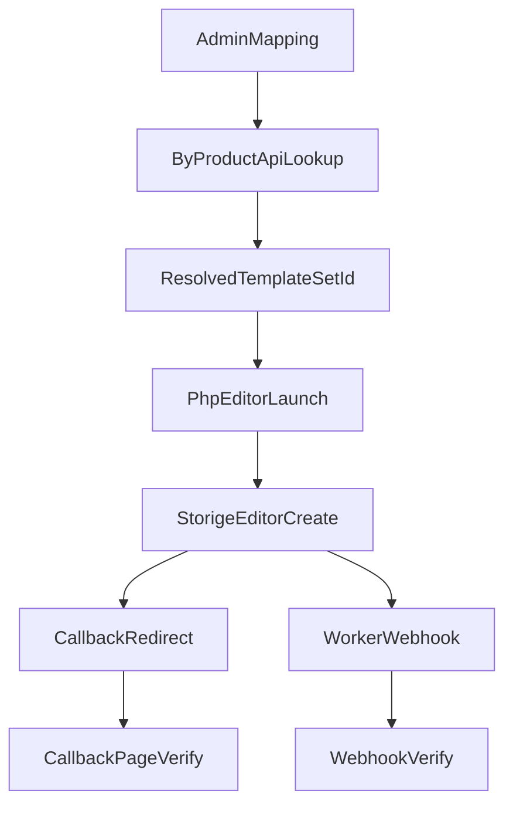

# Admin -> API -> test-php 실제 연결 체크리스트

> 📌 **전체 진입점은 [`00_MASTER_DEVELOPMENT_GUIDE.md`](./00_MASTER_DEVELOPMENT_GUIDE.md) §6.6**. 이 문서는 거기서 가리키는 **외부 쇼핑몰 연동 검증 전용** 체크리스트입니다.

## 목적
이 문서는 Admin에서 템플릿셋을 실제 상품과 연결한 뒤, API와 `test-php` 하네스를 통해 에디터 구동, 완료 콜백, 웹훅까지 한 번에 검증하기 위한 운영 체크리스트다.

기준 코드는 아래 파일이다.

- `apps/api/src/templates/product-template-sets.controller.ts`
- `apps/api/src/auth/auth.controller.ts`
- `apps/api/src/edit-sessions/edit-sessions.controller.ts`
- `apps/api/src/worker-jobs/worker-jobs.controller.ts`
- `apps/api/src/webhook/webhook.service.ts`
- `apps/editor/src/embed.tsx`
- `apps/editor/src/views/EditorView.tsx`
- `test-php/php/config.php`
- `test-php/php/editor.php`
- `test-php/php/callback.php`
- `test-php/php/webhook.php`

## 먼저 알아둘 점
- 외부 상품 -> 템플릿셋 조회는 `GET /api/product-template-sets/by-product` 이고 `X-API-Key`가 필요하다.
- 현재 `test-php/php/editor.php`는 `sortcode`를 직접 쓰지 않고, 이미 확정된 `templateSetId`와 `productId`를 받아 에디터를 띄운다.
- 에디터 임베드 기준 필수값은 사실상 `templateSetId`이며, `productId`는 운영 메타데이터 성격이 더 강하다.
- `apps/editor/src/views/EditorView.tsx`에서 `templateSetId`가 있으면 상품 기반 로드보다 먼저 `template-set 모드`로 처리한다.
- `test-php/php/config.php`는 현재 `POST /api/auth/login`으로 JWT를 받아 `editor.php`에 넘긴다.
- `POST /api/auth/shop-session`도 존재하지만, 현재 `test-php` 기본 경로는 이 쿠키 세션 경로가 아니라 Bearer 토큰 경로다.

## 전체 흐름


## 1. Admin 선행 체크
### 1.1 템플릿셋 자체 확인
- 연결하려는 `templateSetId`가 실제로 존재해야 한다.
- 여러 템플릿셋을 한 상품에 붙일 수 있으므로, 대표 템플릿은 `isDefault=true` 여부까지 확인한다.

### 1.2 상품-템플릿 연결 확인
- Admin의 "상품-템플릿 연결"에서 `sortcode` 기준 연결이 생성되어 있어야 한다.
- 규격까지 분기한다면 `prdtStanSeqno`도 함께 맞춰야 한다.
- 외부 조회 API는 `sortcode` 필수, `stanSeqno` 선택값 구조다.
- 운영상 외부 쇼핑몰이 특정 규격을 갖고 있다면 `sortcode`만 맞춘 뒤 끝내지 말고 `stanSeqno`까지 검증해야 한다.

### 1.3 활성 상태 확인
- 매핑이 비활성화되어 있으면 외부 조회가 기대와 다르게 나올 수 있다.
- 동일 상품에 여러 연결이 있어도 기본값/정렬값이 잘못되면 PHP 쪽에서 다른 템플릿을 선택할 수 있다.

## 2. API 체크
### 2.1 로그인 토큰 경로 확인
현재 `test-php/php/config.php`는 아래 순서로 동작한다.

1. `POST /api/auth/register`
2. `POST /api/auth/login`
3. 응답의 `accessToken`을 세션에 캐싱
4. `test-php/php/editor.php`가 이 토큰을 `window.StorigeEditor.create()`에 전달

체크 포인트:
- `http://host.docker.internal:4000/api/auth/login`이 PHP 컨테이너에서 열려 있어야 한다.
- 응답 JSON에 `accessToken`이 있어야 한다.
- 로그인은 되지만 에디터 내부 API가 실패하면 브라우저에서 쓰는 `apiBaseUrl`인 `http://localhost:4000/api` 접근도 별도로 확인해야 한다.

### 2.2 외부 상품 -> 템플릿셋 조회 확인
실제 외부 연동 기준 핵심 API:

```bash
curl -G "http://localhost:4000/api/product-template-sets/by-product" \
  -H "X-API-Key: YOUR_API_KEY" \
  --data-urlencode "sortcode=001001001" \
  --data-urlencode "stanSeqno=1"
```

성공 기준:
- `templateSets` 배열이 비어 있지 않다.
- 기대한 `templateSetId`가 응답 안에 포함된다.
- 다건 응답이면 어떤 항목을 기본으로 쓸지 PHP 로직에서 명시해야 한다.

### 2.3 편집 세션/후속 파일 조회 확인
후속 검증에 자주 쓰는 외부 조회 API:

```bash
curl -G "http://localhost:4000/api/edit-sessions/external" \
  -H "X-API-Key: YOUR_API_KEY" \
  --data-urlencode "orderSeqno=12345"
```

이 경로는 주문번호 기준으로 세션과 PDF 파일 URL을 돌려준다.

### 2.4 워커 웹훅/상태 경로 확인
- 외부 검증 작업 생성: `POST /api/worker-jobs/validate/external`
- 외부 합성 작업 생성: `POST /api/worker-jobs/synthesize/external`
- 외부 분리 합성 작업 생성: `POST /api/worker-jobs/split-synthesize/external`
- 외부 작업 상태 조회: `GET /api/worker-jobs/external/:id`

## 3. test-php 체크
### 3.1 현재 하네스의 실제 동작
`test-php/php/editor.php`는 다음 값을 받는다.

- `templateSetId`
- `productId`
- `sessionId` 선택
- `pages`
- `wingFront`
- `wingBack`
- `mode`
- `orderSeqno`

이후 브라우저에서 아래와 비슷한 설정으로 에디터를 띄운다.

```js
window.StorigeEditor.create({
  templateSetId,
  productId,
  token,
  apiBaseUrl: 'http://localhost:4000/api',
  mode,
  orderSeqno,
  sessionId,
  options: { pages }
})
```

### 3.2 실제 연결 방식
운영에서 `sortcode` 기반으로 움직이려면 PHP는 대개 아래 순서를 가져야 한다.

1. 쇼핑몰 상품 정보에서 `sortcode`와 `stanSeqno` 확보
2. `GET /api/product-template-sets/by-product` 호출
3. 응답에서 사용할 `templateSetId` 결정
4. `editor.php?productId=...&templateSetId=...` 형태로 에디터 진입

즉, `test-php`에서 실제 연결의 핵심은 `editor.php` 자체를 바꾸는 것이 아니라, `editor.php`에 들어오기 전에 `templateSetId`를 어떻게 해석하느냐다.

## 4. callback 검증
### 4.1 현재 구현
`test-php/php/editor.php`의 `onComplete`는 브라우저 리다이렉트로 아래 페이지를 연다.

- `/callback.php?sessionId=...&pages=...&productId=...`

`test-php/php/callback.php`는 이 값을 화면에 보여줄 뿐이며, 현재는 장바구니 적재나 주문 생성 API를 직접 호출하지 않는다.

### 4.2 확인 항목
- `sessionId`가 빈 값이 아니어야 한다.
- `productId`가 최초 진입 값과 동일해야 한다.
- `pages`가 최종 편집 결과와 맞아야 한다.
- 재편집 링크가 동일한 `productId`와 `templateSetId`로 다시 열리는지 확인한다.

## 5. webhook 검증
### 5.1 현재 구현
`test-php/php/webhook.php`는 `POST` JSON만 받고, 수신 결과를 아래 파일에 남긴다.

- 로그: `test-php/php/logs/webhook.log`
- 결과 JSON: `test-php/php/logs/results/<jobId>.json`

### 5.2 주의할 헤더
`apps/api/src/webhook/webhook.service.ts` 기준으로 웹훅 전송 시 헤더는 다음과 같다.

- `X-Storige-Event`
- `X-Storige-Signature`

여기서 `X-Storige-Signature`는 현재 HMAC이 아니라 `identifier:event:timestamp`를 base64로 인코딩한 값이다.

### 5.3 성공 기준
- `webhook.php`가 `200`을 반환한다.
- `logs/results/<jobId>.json` 파일이 생긴다.
- `status=completed`면 `mergedUrl` 또는 `coverUrl/contentUrl`이 기록된다.
- `status=failed`면 `errorMessage`가 남는다.

## 6. 권장 점검 순서
1. Admin에서 `sortcode`/`prdtStanSeqno`/`templateSetId` 매핑을 확인한다.
2. `curl` 또는 검증 스크립트로 `by-product` 응답을 확인한다.
3. PHP에서 로그인 토큰을 정상 발급받는지 확인한다.
4. `editor.php`를 `templateSetId`와 함께 열어 에디터가 뜨는지 확인한다.
5. 편집 완료 후 `callback.php`에 `sessionId`가 넘어오는지 확인한다.
6. 필요하면 외부 합성 API를 호출하고 `webhook.php` 수신 결과 파일이 생기는지 확인한다.

## 7. 빠른 장애 분류표
| 증상 | 가장 먼저 볼 곳 | 의미 |
| --- | --- | --- |
| `by-product`가 빈 배열 | Admin 매핑, `sortcode`, `stanSeqno`, `X-API-Key` | 상품-템플릿 연결이 없거나 조회 키가 다름 |
| PHP 로그인 실패 | `test-php/php/config.php`, `/api/auth/login` | 테스트 사용자 생성/로그인 문제 |
| 에디터가 템플릿을 못 불러옴 | `templateSetId` 값, `apps/editor/src/views/EditorView.tsx` | 잘못된 템플릿셋 ID이거나 템플릿 조회 실패 |
| 완료 후 callback 값이 비어 있음 | `editor.php`의 `onComplete` | 에디터 저장/완료 결과에서 `sessionId` 미생성 |
| 웹훅 파일이 안 생김 | `callbackUrl`, 워커 작업 생성 API, `webhook.php` 접근성 | 워커 작업은 돌았지만 callback URL이 잘못됐거나 PHP 수신 실패 |

## 8. 이 문서와 함께 만든 파일
- 샘플 코드: `.cursor/plans/admin_api_testphp_sample.php`
- 검증 코드: `.cursor/plans/admin_api_testphp_verify.php`

두 파일 모두 `php` CLI로 바로 실행할 수 있게 만들었고, 현재 `test-php` 하네스의 설정 파일을 재사용한다.
