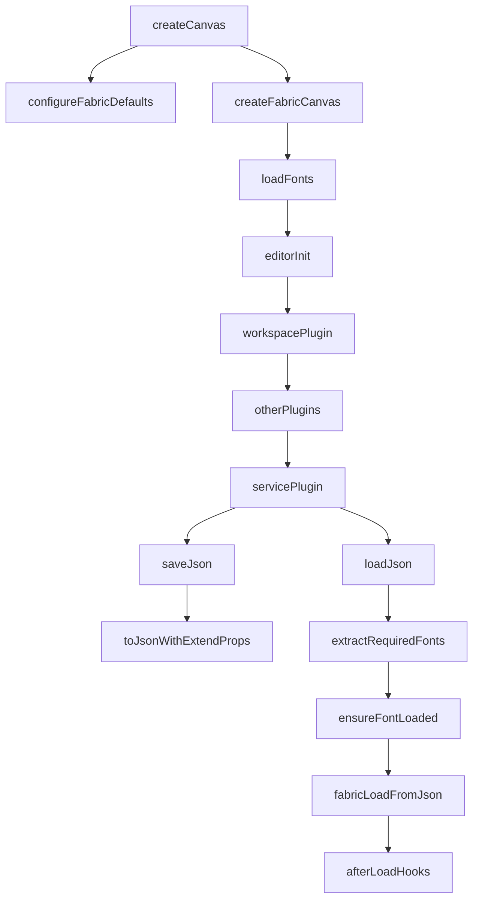
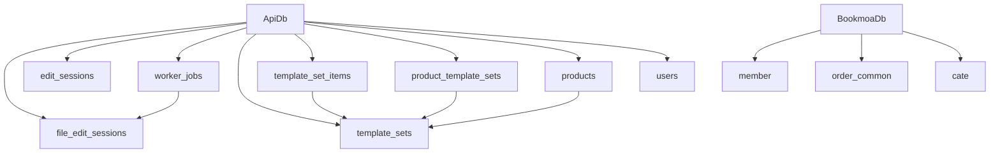
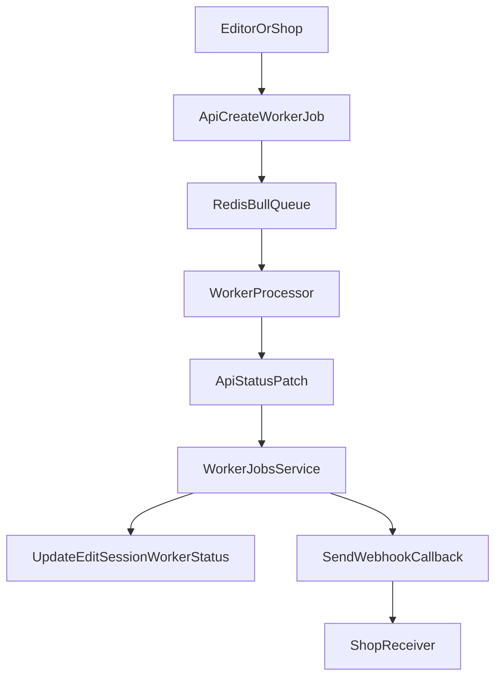
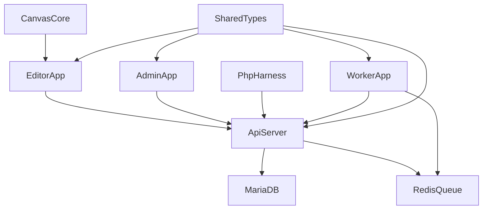

# Storige 기술 인수 및 개발 로드맵

> 📌 **전체 진입점은 [`00_MASTER_DEVELOPMENT_GUIDE.md`](./00_MASTER_DEVELOPMENT_GUIDE.md)**. 이 문서는 원본 기술 인수 보고서(ChatGPT-5.4 작성)로 **배경 이해용** 참고 자료입니다. 실제 작업 지시는 `HANDOFF_GUIDE.md`와 각 P0~P16 문서에서 관리됩니다.

## 문서 목적
이 문서는 원작자 부재 상황에서 `Storige` 코드베이스를 즉시 이어받아 개발할 수 있도록, 실제 코드와 설정 파일을 근거로 현재 구조와 위험 지점을 정리한 기술 인수 문서다.  
조사 범위는 `apps/editor`, `apps/admin`, `apps/api`, `apps/worker`, `packages/*`, Docker 구성, PHP 테스트 하네스, Claude 작업 흔적이다.

## 한눈에 보는 결론
- 저장소는 `pnpm` 워크스페이스 + `turbo` 기반 모노레포이며, 런타임은 `editor`, `admin`, `api`, `worker` 네 축으로 분리되어 있다.
- 핵심 편집 엔진은 `packages/canvas-core`에 집중되어 있고, `apps/editor/src/utils/createCanvas.ts`가 실제 캔버스 생성과 플러그인 체인을 시작하는 엔트리포인트다.
- Fabric.js 상태 저장/복원은 `core.extendFabricOption` + `ServicePlugin.saveJSON()`/`loadJSON()` 조합이 중심이며, PDF 내보내기 로직도 같은 플러그인에 대규모로 응집되어 있다.
- 인증은 완전히 통일되어 있지 않다. 에디터는 `auth_token`, 어드민은 `accessToken`/`refreshToken`, 쇼핑몰 임베드는 HttpOnly 쿠키 세션까지 병존한다.
- Docker는 운영형 통합 실행에 가깝고, 각 앱의 `.env.example`은 localhost 중심 개발 환경을 가정한다.
- PHP 코드는 메인 제품 런타임이 아니라 `test-php/` 아래의 쇼핑몰/임베드/웹훅 시뮬레이션 하네스다.

---

## 1. 기술 부채 및 의존성

### 1.1 워크스페이스 구조
근거 파일:
- `package.json`
- `pnpm-workspace.yaml`
- `turbo.json`
- `CLAUDE.md`

확인 내용:
- 루트 `package.json`은 `workspaces: ["apps/*", "packages/*"]`를 선언하고, `dev`, `build`, `lint`, `test`를 모두 `turbo run ...`으로 위임한다.
- `pnpm-workspace.yaml`도 동일하게 `apps/*`, `packages/*`를 정의한다.
- `turbo.json`에서 `build`는 상위 의존 패키지의 빌드를 선행하고(`dependsOn: ["^build"]`), `dev`는 캐시 없이 지속 실행된다.
- `CLAUDE.md`는 실제 구조를 `apps/editor`, `apps/admin`, `apps/api`, `apps/worker`, `packages/types`, `packages/canvas-core`, `packages/ui` 중심으로 설명한다.

### 1.2 핵심 패키지와 버전
근거 파일:
- `package.json`
- `apps/editor/package.json`
- `apps/admin/package.json`
- `apps/api/package.json`
- `apps/worker/package.json`
- `packages/canvas-core/package.json`
- `packages/types/package.json`

| 영역 | 핵심 스택 | 근거 |
| --- | --- | --- |
| 모노레포 툴링 | `pnpm@9.15.0`, `turbo@^2.3.3`, `typescript@^5.7.2` | 루트 `package.json` |
| Editor | `React 18.3.1`, `Vite 6.0.7`, `fabric ^5.5.2`, `zustand ^5.0.3` | `apps/editor/package.json` |
| Admin | `React 18.3.1`, `Vite 6.0.7`, `antd ^5.23.2`, `@tanstack/react-query ^5.62.11` | `apps/admin/package.json` |
| API | `NestJS 10`, `typeorm ^0.3.20`, `mysql2 ^3.12.0`, `bull ^4.16.4`, `@anthropic-ai/sdk ^0.32.1`, `replicate ^1.0.1` | `apps/api/package.json` |
| Worker | `NestJS 10`, `bull ^4.16.4`, `pdf-lib ^1.17.1`, `sharp ^0.33.5`, `canvas ^2.11.2` | `apps/worker/package.json` |
| Canvas Core | `fabric ^5.5.2`, `jspdf ^2.5.1`, `svg2pdf.js ^2.2.4`, `fabric-history ^1.7.0`, `opentype.js ^1.3.4` | `packages/canvas-core/package.json` |
| Shared Types | CJS/ESM 이중 출력 | `packages/types/package.json` |

추가 관찰:
- `packages/ai`가 실제로 존재하며 여러 앱이 참조하지만, 루트 `README.md`의 구조 설명에는 누락되어 있다. 문서와 실제 코드베이스 간의 첫 번째 불일치다.

### 1.3 TypeScript 컴파일 구조
근거 파일:
- `apps/editor/tsconfig.json`
- `apps/admin/tsconfig.json`
- `apps/api/tsconfig.json`
- `apps/worker/tsconfig.json`
- `packages/types/tsconfig.cjs.json`
- `packages/types/tsconfig.esm.json`
- `packages/types/package.json`

확인 내용:
- `apps/editor`와 `apps/admin`은 Vite용 프런트 구성이다.
  - `moduleResolution: "bundler"`
  - `noEmit: true`
  - `jsx: "react-jsx"`
- 타입 엄격도는 균일하지 않다.
  - `apps/editor/tsconfig.json`: `strict: false`
  - `apps/admin/tsconfig.json`: `strict: true`, `noUnusedLocals: true`, `noUnusedParameters: true`
- `apps/api`와 `apps/worker`는 NestJS용 서버 구성이다.
  - `module: "commonjs"`
  - `emitDecoratorMetadata: true`
  - `experimentalDecorators: true`
  - `outDir: "./dist"`
- `packages/types`는 CJS와 ESM을 별도 산출한다.
  - `tsconfig.cjs.json` -> `dist/cjs`
  - `tsconfig.esm.json` -> `dist/esm`
  - `package.json`의 `exports`가 `import`/`require`를 분기한다.

정리:
- 이 저장소는 단일 TypeScript 규칙이 아니라, 프런트는 번들러 모드, 서버는 CommonJS, 공유 타입은 이중 패키징으로 나뉜다.
- 특히 `editor`만 `strict: false`라서, 캔버스 관련 코드가 빠르게 성장하는 동안 타입 안전성이 상대적으로 약해졌을 가능성이 높다.

### 1.4 Claude Code 작업 흔적
근거 파일:
- `CLAUDE.md`
- `.claude/commands/dev.md`
- `README.md`
- `.claude` 하위 `plans/**` 검색 결과 없음

확인 내용:
- `CLAUDE.md`는 이 저장소 전용 개발 지침 문서다.
- `.claude/commands/dev.md`에는 WBS 번호 기반 개발 워크플로우가 정의되어 있고, `docs/PDF_VALIDATION_WBS.md`를 기준으로 태스크를 추적하도록 설계되어 있다.
- `README.md`는 `./.claude/plans/snuggly-soaring-piglet.md`를 링크하지만, 현재 워크스페이스의 `.claude/plans/**`에는 해당 파일이 없다.

의미:
- 이전 개발자가 Claude Code를 실제 워크플로우에 통합해 사용했다는 근거는 충분하다.
- 다만, 링크된 계획 문서 일부가 저장소에 남아 있지 않아 이전 맥락이 부분적으로 유실된 상태다.

### 1.5 즉시 보이는 기술 부채
- 문서와 실제 구조가 불일치한다. `README.md`에는 `packages/ai`가 빠져 있고, 존재하지 않는 `.claude/plans/...` 링크가 남아 있다.
- 타입 엄격도가 앱마다 다르다. `admin`은 엄격하지만 `editor`는 `strict: false`라 편집기 쪽 회귀 위험이 더 크다.
- Dockerfile에서 `pnpm --filter @storige/types build || true`가 사용된다. 빌드 실패가 가려질 수 있어 CI/이미지 빌드의 신뢰도를 낮춘다.
- `apps/editor/vite.config.ts`에는 선택 의존성 `@pf/color-runtime`이 없을 때 `throw new Error('not available')`를 던지는 스텁이 들어 있다. CMYK/색공간 기능이 이 경로를 타면 런타임에서 기능이 빠질 수 있다.

---

## 2. Fabric.js 캔버스 로직 분석

### 2.1 핵심 엔트리포인트
근거 파일:
- `apps/editor/src/utils/createCanvas.ts`
- `packages/canvas-core/src/utils/factory.ts`
- `packages/canvas-core/src/utils/canvas.ts`
- `packages/canvas-core/src/plugins/ServicePlugin.ts`
- `packages/canvas-core/src/ruler/guideline.ts`

핵심 구조:
- 실제 앱 엔트리포인트는 `apps/editor/src/utils/createCanvas.ts:createCanvas()`이다.
- 이 함수는 다음 순서로 캔버스를 구성한다.
  1. 설정 스토어 갱신
  2. DOM에 새 `<canvas>` 생성
  3. `configureFabricDefaults()` 1회 호출
  4. `createFabricCanvas()`로 Fabric 인스턴스 생성
  5. 폰트 로드
  6. `Editor` 인스턴스 생성 후 플러그인 체인 등록
  7. `workspace.init()` 호출
  8. `appStore.init(canvas, editor, initId)`로 앱 상태에 연결

`packages/canvas-core/src/utils/factory.ts`에서 확인되는 내용:
- `getFabric()`은 `fabric` 모듈을 캐싱한다.
- `createFabricCanvas()`는 `new fabric.Canvas(...)`를 감싸며, `uuid` 기반 `id`를 캔버스에 부여한다.
- `configureFabricDefaults()`는 `fabric.Object.prototype`의 캐싱 설정을 수정한다.

### 2.2 플러그인 구조
근거 파일:
- `apps/editor/src/utils/createCanvas.ts`
- `packages/canvas-core/src/Editor.ts` 재사용 근거는 `CLAUDE.md`와 export 구조

`createCanvas.ts`에서 확인되는 등록 순서:
- `WorkspacePlugin`
- `SpreadPlugin` 조건부
- `ObjectPlugin`
- `RulerPlugin` 조건부
- `ControlsPlugin`
- `GroupPlugin`
- `HistoryPlugin`
- `CopyPlugin`
- `AlignPlugin`
- `DraggingPlugin`
- `FontPlugin`
- `FilterPlugin`
- `EffectPlugin`
- `SmartCodePlugin`
- `ImageProcessingPlugin` 조건부
- `AccessoryPlugin`
- `PreviewPlugin`
- `TemplatePlugin`
- `ServicePlugin`

의미:
- 편집기 핵심 로직은 React 컴포넌트가 아니라 `canvas-core` 플러그인에 쏠려 있다.
- 특히 저장/로드/PDF/폰트 후처리는 `ServicePlugin`과 `FontPlugin`에 응집되어 있다.

### 2.3 커스텀 오브젝트
근거 파일:
- `packages/canvas-core/src/ruler/guideline.ts`
- `packages/canvas-core/src/utils/canvas.ts`

확인 내용:
- 이 코드베이스에서 명시적으로 정의된 Fabric 커스텀 클래스는 `fabric.GuideLine`이다.
- `guideline.ts`는 `fabric.util.createClass(fabric.Line, { ... })`로 `GuideLine`을 만들고,
  - `type: 'GuideLine'`
  - `extensionType: 'guideline'`
  - `excludeFromExport: true`
  를 설정한다.
- 같은 파일의 `fabric.GuideLine.fromObject()`는 역직렬화 루틴을 제공한다.
- 나머지 대부분의 “커스텀 객체”는 별도 클래스보다는 표준 Fabric 오브젝트에 `id`, `extensionType`, `effects`, `parentLayerId` 같은 추가 메타데이터를 붙이는 방식이다.

### 2.4 이벤트 처리
근거 파일:
- `packages/canvas-core/src/ruler/guideline.ts`
- `packages/canvas-core/src/plugins/ServicePlugin.ts`
- `packages/canvas-core/src/utils/canvas.ts`

확인 내용:
- 가이드라인은 `mousedown:before`, `mouse:move`, `mouse:up`, `viewport:changed`, `object:added` 등 Fabric 이벤트를 직접 바인딩한다.
- `guideline.ts`는 드래그 중 ruler 위로 다시 올라오면 선을 제거하는 동작까지 포함한다.
- 저장/로드 전후 훅은 `ServicePlugin`이 `editor.hooks.get('beforeSave')`, `beforeLoad`, `afterLoad`, `afterSave`를 중심으로 실행한다.
- `core.getObjects()`는 `excludeFromExport`, `GuideLine`, `workspace` 특수 케이스를 걸러 내보내기 대상만 선별한다.

### 2.5 JSON 직렬화/역직렬화
근거 파일:
- `packages/canvas-core/src/utils/canvas.ts`
- `packages/canvas-core/src/plugins/ServicePlugin.ts`

핵심 포인트:
- 직렬화 보존 필드는 `core.extendFabricOption`에 정의되어 있다.
- 여기에 `id`, `extensionType`, `styles`, `effects`, `fillImage`, `filters`, 각종 lock 속성, CMYK 원본값, 레이어 순서 관련 속성까지 포함된다.
- `ServicePlugin.saveJSON()`는 저장 직전 overlay 객체의 `excludeFromExport`를 잠시 해제하고 `canvas.toJSON(core.extendFabricOption)`을 호출한다.
- `ServicePlugin.loadJSON()`는
  1. history 비활성화
  2. canvas clear
  3. JSON에서 필요한 폰트 추출
  4. `FontPlugin.ensureFontLoaded()` 선실행
  5. `canvas.loadFromJSON(...)`
  6. overlay/outline/text 후처리
  7. `afterLoad` 훅
  8. history 재활성화
  순으로 복원한다.

정리:
- 이 프로젝트의 JSON 저장은 단순한 `fabric.Canvas.toJSON()` 호출이 아니라, 커스텀 메타데이터와 폰트 상태를 포함한 도메인 직렬화 레이어다.

### 2.6 PDF 내보내기
근거 파일:
- `packages/canvas-core/src/plugins/ServicePlugin.ts`

`ServicePlugin` 내부에서 확인되는 역할:
- 다중 페이지 PDF 생성
- 텍스트 글리프 검증
- 텍스트를 path 또는 이미지로 벡터화/폴백
- overlay/effects용 마스크 생성
- SVG 생성 후 `svg2pdf` 변환
- 실패 시 이미지 제거 -> SVG 단순화 -> 래스터 fallback의 다단계 복구
- export 완료 뒤 캔버스 상태 복원

즉, `ServicePlugin`은 단순 저장 플러그인이 아니라:
- JSON 세이브/로드
- PDF export
- SVG 가공
- 폰트 의존성 보정
- 일시적 캔버스 상태 변환
까지 모두 담당하는 대형 서비스 플러그인이다.

### 2.7 Canvas 엔진 흐름도

### 2.8 인수 관점 핵심 파일
- `apps/editor/src/utils/createCanvas.ts`: 앱과 캔버스 코어가 만나는 진입점
- `packages/canvas-core/src/utils/factory.ts`: Fabric 인스턴스 생성/기본값 설정
- `packages/canvas-core/src/utils/canvas.ts`: 공통 객체 헬퍼와 직렬화 필드 정의
- `packages/canvas-core/src/plugins/ServicePlugin.ts`: 저장/로드/PDF export의 중심
- `packages/canvas-core/src/ruler/guideline.ts`: 명시적 커스텀 Fabric 클래스 구현

---

## 3. 서비스 아키텍처 및 Admin 분리

### 3.1 코드 레벨 서비스 분리
근거 파일:
- `CLAUDE.md`
- `package.json`
- 각 앱의 `package.json`
- `docker-compose.yml`

| 서비스 | 역할 | 주요 기술 |
| --- | --- | --- |
| `apps/editor` | 고객용 편집기 | React, Vite, Fabric.js, Zustand |
| `apps/admin` | 관리자 페이지 | React, Vite, Ant Design, React Query |
| `apps/api` | REST API | NestJS, TypeORM, JWT, Bull |
| `apps/worker` | PDF 작업 처리 | NestJS, Bull, Sharp, pdf-lib, canvas |
| `packages/canvas-core` | 편집 엔진 코어 | Fabric.js 래퍼, 플러그인 시스템 |
| `packages/types` | 공용 타입 | CJS/ESM 이중 산출 |

결론:
- 이 저장소는 단일 애플리케이션이 아니라, 프런트 2개 + 백엔드 2개 + 공용 패키지군으로 분리된 모노레포다.
- `admin`은 `editor`와 UI/상태 관리는 다르지만 API와 shared types를 공유한다.

### 3.2 프런트엔드와 API의 데이터 교환 방식
근거 파일:
- `apps/editor/src/api/client.ts`
- `apps/editor/src/api/edit-sessions.ts`
- `apps/admin/src/lib/axios.ts`
- `apps/worker/src/processors/validation.processor.ts`

확인 내용:
- 에디터는 `apiClient`를 통해 `VITE_API_BASE_URL` 기준 Axios 요청을 보내고, `localStorage.getItem('auth_token')`을 `Authorization: Bearer`에 넣는다.
- 어드민은 별도의 `axiosInstance`를 쓰며 `accessToken`/`refreshToken`을 사용한다.
- `apps/editor/src/api/edit-sessions.ts`는 `/edit-sessions`, `/edit-sessions/:id`, `/edit-sessions/:id/complete` 엔드포인트를 이미 감싸고 있다.
- 워커는 직접 DB를 갱신하지 않고 API 상태 업데이트 엔드포인트를 호출한다. 다만 구현은 큐/프로세서별로 다르며, `validation`은 `/worker-jobs/external/:jobId/status` + `X-API-Key`, `synthesis`와 `conversion`은 비-`external` 경로를 호출하는 코드가 공존한다.

즉:
- 데이터 교환은 전반적으로 REST + JSON + Axios 기반이다.
- 에디터 저장과 워커 상태 업데이트는 이미 API DTO/엔드포인트를 전제로 설계되어 있지만, 워커 callback 경로가 완전히 통일되어 있지는 않다.

### 3.3 인증(Auth) 흐름
근거 파일:
- `apps/api/src/auth/auth.controller.ts`
- `apps/editor/src/api/client.ts`
- `apps/admin/src/lib/axios.ts`
- `test-php/php/editor.php`
- `test-php/php/config.php`

확인된 인증 경로는 세 갈래다.

1. 일반 Bearer 로그인
- `POST /auth/login`
- `POST /auth/refresh`
- `POST /auth/me`

2. Admin 토큰 갱신형 흐름
- 브라우저 localStorage에 `accessToken`, `refreshToken`
- 401 발생 시 `/auth/refresh`로 재발급 시도

3. Bookmoa 연동 세션 흐름
- `POST /auth/shop-session`
- `POST /auth/shop-refresh`
- API Key 가드 통과 후 HttpOnly 쿠키 `storige_access`, `storige_refresh` 발급

주의점:
- 인증 저장 키가 앱마다 다르다.
  - 에디터: `auth_token`
  - 어드민: `accessToken`, `refreshToken`
  - 쇼핑몰 연동: 쿠키
- 원작자 없이 유지보수할 때 가장 먼저 혼동을 일으킬 수 있는 영역이다.

### 3.4 DB 구조 및 핵심 엔티티
근거 파일:
- `apps/api/src/app.module.ts`
- `apps/api/src/bookmoa/bookmoa.module.ts`
- `apps/api/src/editor/entities/edit-session.entity.ts`
- `apps/api/src/edit-sessions/entities/edit-session.entity.ts`
- `apps/api/src/worker-jobs/entities/worker-job.entity.ts`
- `apps/api/src/templates/entities/template-set.entity.ts`
- `apps/api/src/templates/entities/product-template-set.entity.ts`
- `apps/api/src/products/entities/product.entity.ts`
- `apps/api/src/auth/entities/user.entity.ts`

확인 내용:
- API 기본 DB 연결은 `apps/api/src/app.module.ts`에서 MariaDB 단일 연결로 시작하며, `entities: [__dirname + '/*/entities/*.entity{.ts,.js}']`, `synchronize: NODE_ENV === 'development'`로 구성된다.
- `apps/worker/src/app.module.ts`도 MariaDB 연결 설정을 갖고 있지만, 현재 워커 앱 내부에는 실제 `*.entity` 파일이 확인되지 않는다. 코드상 상태 갱신의 주 경로는 TypeORM 쓰기보다 API callback이다.
- Bookmoa 연동은 별도 읽기 전용 DB 연결이다. `apps/api/src/bookmoa/bookmoa.module.ts`는 `name: 'bookmoa'` 연결을 따로 만들고, `BookmoaMemberEntity`, `BookmoaOrderEntity`, `BookmoaCategoryEntity`만 등록하며 `synchronize: false`로 고정한다.
- 편집 세션은 한 종류가 아니다.
  - `apps/api/src/editor/entities/edit-session.entity.ts`의 `EditSession`은 테이블 `edit_sessions`를 사용하며, 캔버스 편집 세션/이력 관리 중심 모델이다.
  - `apps/api/src/edit-sessions/entities/edit-session.entity.ts`의 `EditSessionEntity`는 테이블 `file_edit_sessions`를 사용하며, 주문/파일/워커 상태/콜백 URL까지 포함하는 외부 연동용 세션 모델이다.
- `apps/api/src/worker-jobs/entities/worker-job.entity.ts`의 `WorkerJob`은 `ManyToOne(() => EditSessionEntity)`로 `file_edit_sessions`를 참조한다. 즉, 워커 큐는 `editor` 도메인의 `edit_sessions`보다 `edit-sessions` 도메인의 `file_edit_sessions`와 더 직접적으로 연결된다.
- 템플릿/상품 관계는 세 겹으로 나뉜다.
  - `template_sets`
  - `template_set_items`
  - `product_template_sets`
  - `products.template_set_id`
- 인증 사용자 저장소는 `users` 테이블이지만, Shop 세션은 예외다. `auth` 경로의 Shop JWT는 일반 로그인 사용자처럼 `users` 조회를 강제하지 않는다.

인수 관점 핵심 해석:
- “편집 세션”이라는 이름만 보고 단일 테이블로 이해하면 안 된다.
- 운영 중 워커 상태, callbackUrl, 파일 기반 합성 흐름을 따라갈 때는 `file_edit_sessions`와 `worker_jobs`를 먼저 보는 것이 정확하다.
- Bookmoa 연동은 단순 API Key가 아니라 별도 읽기 전용 DB 연결까지 포함한 구조다.

### 3.5 API 인수 지도
근거 파일:
- `apps/api/src/main.ts`
- `apps/api/src/auth/auth.controller.ts`
- `apps/api/src/edit-sessions/edit-sessions.controller.ts`
- `apps/api/src/worker-jobs/worker-jobs.controller.ts`
- `apps/api/src/templates/templates.controller.ts`
- `apps/api/src/templates/template-sets.controller.ts`
- `apps/api/src/storage/storage.controller.ts`
- `apps/api/src/files/files.controller.ts`
- `apps/api/src/editor/editor.controller.ts`
- `apps/api/src/library/library.controller.ts`
- `apps/api/src/products/products.controller.ts`
- `apps/api/src/products/spine.controller.ts`
- `apps/api/src/health/health.controller.ts`

기준 정보:
- `apps/api/src/main.ts`는 전역 prefix를 `api`로 설정하므로 실제 베이스 경로는 `/api/*`다.
- 같은 파일에서 Swagger 문서는 `/api/docs`, 허용 헤더는 `Content-Type`, `Authorization`, `Accept`, `X-API-Key`로 설정된다.
- 전역 인증은 JWT 기반이지만 `@Public()` 또는 `ApiKeyGuard` 적용 경로가 다수 존재한다.

| 영역 | 대표 경로 | 인증 경계 | 비고 |
| --- | --- | --- | --- |
| Auth | `/api/auth/*` | `login`, `register`, `refresh`, `shop-refresh`는 공개. `shop-session`은 API Key. `me`는 JWT | 일반 로그인 + Shop 세션 공존 |
| Edit Sessions | `/api/edit-sessions/*` | 일반 CRUD는 JWT, `GET /external`은 API Key | 주문/파일/워커 상태 기반 세션 |
| Worker Jobs | `/api/worker-jobs/*` | 일반 목록/통계/상태 일부는 JWT/역할, `*/external`은 API Key | 검증/변환/합성/외부 폴링 |
| Templates | `/api/templates`, `/api/template-sets`, `/api/categories`, `/api/product-template-sets` | 공개/관리자/API Key 혼합 | 외부 상품-템플릿 매핑 포함 |
| Storage / Files | `/api/storage/*`, `/api/files/*` | 다운로드/썸네일은 공개, 업로드/삭제는 JWT 또는 API Key | 파일 저장과 디자인 PDF 업로드 분리 |
| Library | `/api/library/*` | 다수 조회 GET은 공개, 쓰기는 관리자 계열 | 폰트/배경/클립아트/도형 |
| Editor | `/api/editor/*` | 공개 경로가 많음 | 캔버스 편집 세션/자동저장/상태/검증/PDF |
| Products | `/api/products/*`, `/api/products/spine/*` | 상품 변경은 역할 기반, `spine`은 공개 | 책등 계산 API 별도 |
| Health | `/api/health*` | 공개 | 운영/배포 상태 점검 |

추가 메모:
- 현재 `apps/api/src`에는 별도의 `review` REST API가 없다. `review`는 주로 `editor` 도메인의 세션 상태 값으로 등장한다.
- 외부 시스템 관점에서 가장 중요한 표면은 `auth`, `edit-sessions`, `worker-jobs`, `storage/files`, `product-template-sets`, `editor`, `products/spine`이다.
- `template-sets/admin/update-thumbnails`는 `@Public()`이므로 운영 보안 정책상 의도 여부를 반드시 재검토해야 한다.
- `PATCH /api/worker-jobs/:id/status`는 컨트롤러 설명상 worker용이지만 `@Public()`이나 `ApiKeyGuard`가 없다. 현재 코드만 기준으로 보면 JWT 보호 경로로 해석되므로, 실제 운영 호출 경로를 반드시 확인해야 한다.
- 일부 컨트롤러는 Swagger 태그가 충분히 정리되지 않아, 문서 신뢰도보다 컨트롤러 코드를 직접 보는 편이 정확하다.

### 3.6 Worker / Webhook 비동기 파이프라인
근거 파일:
- `apps/api/src/worker-jobs/worker-jobs.service.ts`
- `apps/api/src/worker-jobs/worker-jobs.controller.ts`
- `apps/api/src/webhook/webhook.service.ts`
- `apps/worker/src/processors/validation.processor.ts`
- `apps/worker/src/processors/conversion.processor.ts`
- `apps/worker/src/processors/synthesis.processor.ts`
- `test-php/php/webhook.php`
- `test-php/php/webhook-status.php`

큐 구성:
- `pdf-validation` / `@Process('validate-pdf')`
- `pdf-conversion` / `@Process('convert-pdf')`
- `pdf-synthesis` / `@Process('synthesize-pdf')`

확인 내용:
- API는 `WorkerJobsService`를 통해 Bull 큐에 작업을 넣고, Worker는 각 프로세서에서 해당 작업을 소비한다.
- Worker는 원칙적으로 DB 직접 갱신 대신 API 상태 업데이트를 호출한다.
- 다만 callback 경로는 완전히 일관되지 않다.
  - `ValidationProcessor`는 `/worker-jobs/external/:id/status` + `X-API-Key`
  - `SynthesisProcessor`는 비-`external` 경로를 호출하는 코드가 있음
  - `ConversionProcessor`도 비-`external` 경로를 호출하는 코드가 있음
- `WorkerJobsService.updateJobStatus()`는 상태 저장 뒤 세션 상태를 갱신하고, 조건에 따라 callback을 발송한다.
- webhook은 단일 종류가 아니다.
  - 세션 검증용: `session.validated`, `session.failed`
  - 합성 결과용: `synthesis.completed`, `synthesis.failed`
- callbackUrl도 두 갈래다.
  - 세션 엔티티의 `callbackUrl`
  - worker job options 내부의 `callbackUrl`
- 스프레드 합성은 Worker가 별도 webhook POST를 직접 보내는 경로가 있어, API 서비스 callback과 중복 이벤트 가능성이 있다.
- `test-php/php/webhook.php`와 `webhook-status.php`는 이 비동기 callback 체인을 로컬에서 확인하는 하네스다.

운영상 주의점:
- 현재 문서나 환경 변수만 보고 “웹훅은 하나다”라고 이해하면 오해가 생긴다.
- `WEBHOOK_SECRET`, `BOOKMOA_WEBHOOK_URL`은 `.env.example`에 보이지만, 현재 코드 기준으로 실사용 여부가 분명하지 않거나 `WebhookService` 구현과 1:1로 대응되지 않는다. 인수 후 실제 운영 경로를 검증해야 한다.
- Worker callback은 `external`/비-`external` 경로가 혼재하므로, 인증 실패나 프록시 설정 차이가 발생할 수 있다.
- `apps/api/src/webhook/webhook.service.ts`의 시그니처는 현재 HMAC이 아니라 `identifier:event:timestamp`를 Base64로 인코딩한 값이다. 또한 retry 요청은 `X-Storige-Retry`만 추가하고 첫 요청의 `X-Storige-Signature`를 유지하지 않는다.

### 3.7 시스템 흐름도

---

## 4. 도커 및 배포 환경

### 4.1 `docker-compose.yml`이 의미하는 운영 구조
근거 파일:
- `docker-compose.yml`

루트 Compose 서비스:
- `nginx`
- `api`
- `worker`
- `editor`
- `admin`
- `mariadb`
- `redis`

확인 내용:
- `api`, `worker`는 `NODE_ENV=production`으로 실행된다.
- `nginx`가 `api`, `editor`, `admin` 앞단에 위치한다.
- `storage` 디렉터리가 API/Worker/Nginx에 공유 마운트된다.
- DB는 `mariadb:11.2`, 큐는 `redis:7.2-alpine`이다.

해석:
- 루트 Compose는 “개발용 편의 실행”보다 “운영형 통합 스택”에 가깝다.

### 4.2 Dockerfile 비교
근거 파일:
- `docker/api/Dockerfile`
- `docker/editor/Dockerfile`
- `docker/admin/Dockerfile`
- `docker/worker/Dockerfile`

| 파일 | 특징 |
| --- | --- |
| `docker/api/Dockerfile` | Node 20 Alpine 멀티스테이지. 워크스페이스 전체를 복사하고 `@storige/types`를 먼저 빌드한 뒤 API를 빌드한다. 런타임도 Node다. |
| `docker/editor/Dockerfile` | Node 빌드 후 `nginx:alpine`로 정적 파일 배포. `@storige/types`, `@storige/canvas-core`를 선빌드한다. |
| `docker/admin/Dockerfile` | Node 빌드 후 `nginx:alpine`로 정적 파일 배포. |
| `docker/worker/Dockerfile` | 빌드 스테이지에서 `canvas` 네이티브 의존성 빌드 도구를 설치하고, 런타임 스테이지에서 `ghostscript`, `imagemagick`, `cairo`, `pango` 등 PDF/이미지 처리용 시스템 패키지를 설치한다. |

운영상 의미:
- `editor`와 `admin`은 정적 SPA다.
- `api`와 `worker`는 Node 런타임 컨테이너다.
- `worker`가 가장 시스템 의존성이 크고, 배포 실패 가능성이 높은 서비스다.

### 4.3 개발/운영 환경 차이
근거 파일:
- `.env.example`
- `apps/api/.env.example`
- `apps/editor/.env.example`
- `apps/worker/.env.example`

확인 내용:
- 루트 `.env.example`은 Compose/운영 관점 환경값이다.
  - `DATABASE_HOST=mariadb`
  - `REDIS_HOST=redis`
  - `WORKER_API_KEY`
  - `API_BASE_URL=http://localhost:4000/api`
- `apps/api/.env.example`, `apps/worker/.env.example`는 개발용 localhost 구성을 전제로 한다.
  - `DATABASE_HOST=localhost`
  - `REDIS_HOST=localhost`
- `apps/editor/.env.example`는 브라우저 기준 `VITE_API_BASE_URL=http://localhost:4000/api`를 사용한다.

불일치:
- 루트 `.env.example`에는 워커 콜백 변수(`WORKER_API_KEY`, `API_BASE_URL`)가 있으나, `apps/worker/.env.example`에는 이 항목이 없다.
- 온보딩 시 워커만 따로 띄우면 상태 콜백이 왜 실패하는지 바로 파악하기 어려운 구조다.
- `.env.example`에 있는 `BOOKMOA_WEBHOOK_URL`, `WEBHOOK_SECRET`은 현재 코드와의 직접 대응이 문서만으로는 명확하지 않다. 운영 중이라면 실제 사용 경로를 재검증해야 한다.

### 4.4 PHP 코드의 실제 용도
근거 파일:
- `test-php/php/config.php`
- `test-php/php/index.php`
- `test-php/php/editor.php`
- `test-php/php/callback.php`
- `test-php/php/webhook.php`
- `test-php/php/webhook-status.php`
- `test-php/docker-compose.yml`

결론:
- PHP는 메인 서비스가 아니다.
- `test-php/`는 별도 Docker Compose를 가진 테스트 하네스이며, 쇼핑몰 페이지와 에디터 임베드, 편집 완료 콜백, 워커 웹훅 수신까지 재현한다.

구체적 역할:
- `config.php`: API 호출 헬퍼와 테스트 유저 생성/로그인
- `editor.php`: 로그인 API로 JWT를 받은 뒤 JS 번들 `editor-bundle.iife.js`를 임베딩
- `callback.php`: 편집 완료 후 리디렉션 랜딩
- `webhook.php`: 워커 웹훅 수신 및 로그 기록
- `webhook-status.php`: 웹훅 상태 디버그 UI

즉, PHP 코드는 레거시 렌더링 엔진이 아니라 “외부 쇼핑몰 연동 시나리오를 검증하는 샘플/시뮬레이터”다.

---

## 5. 개발 즉시 실행 가이드

### 5.1 로컬 개발 시작 순서
근거 파일:
- `CLAUDE.md`
- `README.md`
- `.env.example`
- `apps/api/.env.example`
- `apps/editor/.env.example`
- `apps/worker/.env.example`

권장 순서:
1. `pnpm install`
2. `@storige/types` 선빌드가 필요하면 `pnpm --filter @storige/types build`
3. 로컬 개발이면 각 앱 `.env.example`를 기준으로 환경 변수 파일 준비
4. 전체 실행은 `pnpm dev`
5. 개별 실행은 아래 중 필요한 것만
   - `pnpm --filter @storige/editor dev`
   - `pnpm --filter @storige/admin dev`
   - `pnpm --filter @storige/api dev`
   - `pnpm --filter @storige/worker dev`
6. 통합 스택 검증 또는 운영형 확인은 `docker-compose up -d`

### 5.2 처음 띄울 때 특히 주의할 점
- `editor`는 `@storige/canvas-core`, `@storige/types`를 참조하므로 타입 패키지 빌드 누락 시 문제가 날 수 있다.
- `worker`는 로컬 `.env.example`만으로는 `WORKER_API_KEY`, `API_BASE_URL` 정보가 빠져 있어 API 상태 콜백이 실패할 수 있다.
- `test-php`는 메인 앱이 아니라 연동 시뮬레이터이므로, 일반 개발 시작점은 아니다.

---

## 6. 오늘 바로 코딩을 시작해야 할 우선순위 작업

근거 파일:
- `apps/editor/src/hooks/useWorkSave.ts`
- `apps/editor/src/api/edit-sessions.ts`
- `apps/admin/src/pages/Reviews/ReviewDetail.tsx`
- `apps/api/src/storage/storage.service.ts`
- `apps/api/src/templates/template-sets.service.ts`
- `apps/worker/src/services/pdf-synthesizer.service.ts`
- `apps/editor/src/hooks/useEditorContents.ts`
- `apps/editor/vite.config.ts`

### 우선순위 1. `useWorkSave.ts`의 EditSession 완료 API 연동
근거:
- `apps/editor/src/hooks/useWorkSave.ts`는 표지 PDF와 내지 PDF 업로드까지 끝낸 뒤, 3단계에서 “EditSession 완료 API 호출”을 해야 한다고 적어 놓고 실제로는 mock job id를 반환한다.
- 반면 `apps/editor/src/api/edit-sessions.ts`에는 이미 `complete(id)` API 래퍼가 존재한다.

왜 먼저 해야 하나:
- 저장 플로우의 마지막 단계가 비어 있으므로, 워커 Job 자동 생성 체인이 실제 운영과 분리되어 있다.
- 편집기에서 가장 치명적인 “완료는 되는데 후속 처리 안 됨” 상태다.

### 우선순위 2. Worker의 중철 제본 페이지 순서 구현
근거:
- `apps/worker/src/services/pdf-synthesizer.service.ts`는 `bindingType === 'saddle'`일 때 `TODO: Implement saddle stitch page ordering`만 남기고 단순 병합으로 우회한다.

왜 먼저 해야 하나:
- 제본 규칙이 제품 결과물 품질에 직접 영향을 준다.
- 이 로직은 PDF 합성 핵심 도메인이므로, 구현 누락 상태로 운영하면 결과물 자체가 잘못 나올 수 있다.

### 우선순위 3. Admin 리뷰 승인자 하드코딩 제거
근거:
- `apps/admin/src/pages/Reviews/ReviewDetail.tsx`는 승인/반려 시 세 번째 파라미터로 `'admin'` 문자열을 하드코딩한다.

왜 먼저 해야 하나:
- 감사 추적과 운영 로그의 신뢰성이 깨진다.
- 이미 Auth 체계가 존재하므로, 현재 로그인 사용자와 연결하는 것이 자연스럽다.

### 우선순위 4. API 스토리지 썸네일 생성 구현
근거:
- `apps/api/src/storage/storage.service.ts:generateThumbnail()`는 TODO 상태이며 원본 경로를 그대로 반환한다.

왜 먼저 해야 하나:
- 관리 페이지/에디터 자산 목록에서 원본만 사용하면 대용량 파일 처리 부담이 커진다.
- 이미 `sharp`가 API 의존성에 있으므로 구현 여건은 갖춰져 있다.

### 우선순위 5. 템플릿셋 삭제 전 사용 중 상품 검증
근거:
- `apps/api/src/templates/template-sets.service.ts:remove()`는 “상품에서 사용 중인지 확인” TODO를 남긴 채 소프트 삭제를 진행한다.

왜 먼저 해야 하나:
- 상품-템플릿 정합성이 깨질 수 있다.
- 운영 데이터 무결성 문제로 이어질 가능성이 크다.

### 우선순위 6. 콘텐츠 편집기 GraphQL 로드 경로 구현 또는 정리
근거:
- `apps/editor/src/hooks/useEditorContents.ts:loadContentEditor()`는 “GraphQL로 콘텐츠 데이터 가져와서 로드” TODO만 남기고 `initWorkspace()`만 호출한다.

왜 먼저 해야 하나:
- 기능이 미완성이라면 로드 경로를 구현해야 하고, 더 이상 GraphQL을 쓰지 않는다면 TODO와 함수 이름/설계를 정리해야 한다.

### 우선순위 7. 색공간 런타임 스텁 제거 여부 판단
근거:
- `apps/editor/vite.config.ts`는 `@pf/color-runtime`이 없을 때 `cmykToRgb`, `rgbToCmyk`, `transformImageDataToProfile`이 모두 `throw new Error('not available')`인 스텁을 주입한다.

왜 먼저 해야 하나:
- CMYK 또는 프로파일 변환 기능이 실제 제품 요구라면, 현재는 “빌드는 되지만 기능은 죽는” 상태일 수 있다.
- 반대로 기능이 폐기되었다면 문서와 코드에서 명시적으로 제거해야 한다.

### 미구현 인터페이스/스텁 관찰
- 전형적인 `NotImplementedError` 인터페이스 골격은 많이 보이지 않았다.
- 대신 실제 제품 영향이 있는 미구현 상태는 아래처럼 나타난다.
  - TODO 기반 미완성 플로우: `useWorkSave.ts`, `pdf-synthesizer.service.ts`, `useEditorContents.ts`
  - 런타임 스텁: `apps/editor/vite.config.ts`
  - 플레이스홀더 구현: `storage.service.ts:generateThumbnail()`

---

## 7. 인수자가 가장 먼저 알아야 할 위험 포인트

- 캔버스 관련 도메인 로직이 `ServicePlugin`에 과도하게 집중되어 있다. 버그 수정 시 JSON 저장/로드와 PDF export가 서로 영향 줄 가능성이 높다.
- 인증 방식이 세 갈래로 공존한다. 편집기, 관리자, 쇼핑몰 임베드의 세션 저장 방식이 다르다.
- DB 모델도 단일하지 않다. `edit_sessions`와 `file_edit_sessions`는 서로 다른 목적을 가진다.
- Worker 비동기 흐름은 단순 큐 처리 이상이다. callback 종류, callbackUrl 저장 위치, 상태 PATCH 경로가 완전히 통일되어 있지 않다.
- 문서가 최신 코드와 완전히 일치하지 않는다. 특히 `README.md`의 구조 설명과 `.claude/plans` 링크는 신뢰도를 낮춘다.
- 환경 변수 문서가 분산되어 있다. 루트 `.env.example`와 앱별 `.env.example`를 함께 봐야 실제 실행 조건이 완성된다.

---

## 8. 추천 인수 순서

1. `apps/editor/src/utils/createCanvas.ts`와 `packages/canvas-core/src/plugins/ServicePlugin.ts`를 먼저 읽어 캔버스 저장/출력 흐름을 이해한다.
2. `apps/editor/src/hooks/useWorkSave.ts`와 `apps/editor/src/api/edit-sessions.ts`를 읽어 편집 완료 체인의 누락 지점을 메운다.
3. `apps/api/src/edit-sessions/entities/edit-session.entity.ts`, `apps/api/src/worker-jobs/entities/worker-job.entity.ts`, `apps/api/src/editor/entities/edit-session.entity.ts`를 비교해 세션/워커 DB 구조를 먼저 구분한다.
4. `apps/api/src/auth/auth.controller.ts`, `apps/editor/src/api/client.ts`, `apps/admin/src/lib/axios.ts`를 비교해 인증 정책을 문서화한다.
5. `apps/api/src/worker-jobs/worker-jobs.service.ts`, `apps/worker/src/processors/*.ts`, `apps/api/src/webhook/webhook.service.ts`를 읽고 callback과 webhook 체인을 정리한다.
6. `apps/worker/src/services/pdf-synthesizer.service.ts`를 읽고 제본 규칙별 합성 전략을 정리한다.
7. 마지막으로 `docker-compose.yml`, 각 Dockerfile, `.env.example`들을 맞춰 실제 로컬/운영 실행 매뉴얼을 팀 표준으로 다시 문서화한다.

이 순서대로 보면 “에디터 저장 -> API 세션 완료 -> 워커 처리 -> 상태 PATCH -> callback/webhook 회신”의 전체 제품 흐름을 가장 짧은 시간 안에 이해할 수 있다.
