# Bookmoa Platform Plan — Storige × bookmoa-mobile 통합 개발 계획

> 작성일: 2026-05-16
> 통합 기반: `bookmoa_platform_plan_20260516.md`(Claude) + `bookmoa_codex_plan20260516..md`(Codex)
> 1차 연동 대상: **bookmoa-mobile**
> 후속 검증 대상: **bookmoa web (PHP)** — 같은 플랫폼 계약 회귀 보호

---

## 0. 작업 원칙

| 항목 | 정의 |
|---|---|
| 주 작업 루트 | `/Users/yohan/claude/Bookmoa Storige editor/storige` |
| 추가 참조 루트 | `/Users/yohan/Documents/claude/bookmoa-mobile` |
| 저장소 관계 | **별도 git repo** — 상태 확인/커밋/브랜치는 항상 분리 |
| API Key 정책 | `STORIGE_API_KEY`는 브라우저 노출 금지. 외부 서비스 서버 어댑터에서만 사용 |
| 편집기 실행 정책 | **Same-page Inline Embed 단일 표준** (새 탭/페이지 라우팅 폐기) |
| 상태 보존 정책 | 편집기 닫기 → 호출 페이지의 스크롤·폼·장바구니·필터 직전 상태 그대로 복귀 |
| 결과 PDF 정책 | 클라이언트에 Storige storage URL 직접 노출 금지. 서버 어댑터 프록시 단일 |

---

## 0.5. 진행 전략 — 보완과 연동의 순서

> 두 저장소의 보완 작업과 연동 작업을 어떤 순서로 진행할지에 대한 결정.
> **하이브리드 진행**으로 확정: Phase 0(계약 결정) → Group A 보완(병렬) → 메인 연동 → Pilot 운영 → Group B 보완(병렬).

### 왜 하이브리드인가
- "보완을 다 끝내고 연동" → 보완 중 연동 요구사항이 보완 방향을 바꿔 두 번 작업하게 됨. 실데이터 없는 성능 개선은 헛수고가 되기 쉬움.
- "연동을 다 끝내고 보완" → 흔들리는 화면/엔진 위에 연동을 얹어 디버깅이 어려워짐. 곧 바뀔 UI에 진입점을 붙이면 다시 떼어야 함.
- **연동 인터페이스에 영향을 주는 보완만 먼저 처리하고, 나머지 내부 보완은 Pilot 운영 데이터를 보고 우선순위를 잡는다.**

### Group A — 연동 전 필수 보완 (두 저장소 병렬)

| 저장소 | 보완 항목 | 왜 연동 전인가 |
|---|---|---|
| Storige | 편집기 embed 모드 안정화 (postMessage, CSP `frame-ancestors`, `parentOrigin`) | inline embed가 연동 핵심. 불안정하면 디버깅 시 Storige 버그/연동 버그 구분 불가 |
| Storige | Admin 사이트 관리 기능 (`sites` CRUD, `allowedOrigins`/`frameAncestors`) | Phase 1 자체가 이 작업. 분리할 수 없음 |
| Storige | 외부 API 응답/DTO 안정화 (URL 케이스 호환, webhook 서명 방식) | Phase 0 계약이 흔들리면 어댑터도 흔들림 |
| bookmoa-mobile | 상품 주문 화면 데이터 모델 정리 (`customProducts` 스키마) | 어차피 `storige.*` 필드 추가가 필요. 구조가 흔들리면 cart 스키마도 같이 흔들림 |
| bookmoa-mobile | 상품 상세 진입점/주문 화면 구조 정리 | "편집기 열기" 버튼 위치가 흔들리면 진입점도 다시 붙여야 함 |

### Group B — Pilot 운영 후 진행 (두 저장소 병렬, 우선순위는 Pilot 데이터로 재조정)

| 저장소 | 보완 항목 |
|---|---|
| Storige | 워커 성능 개선 (병렬 처리, 큐 튜닝, Ghostscript 옵션) |
| Storige | 편집기 내부 기능 추가 (도구, 효과, 정렬 옵션 등) |
| Storige | Admin 통계/대시보드/리포트 기능 |
| bookmoa-mobile | 주문 화면 UI/UX 개선, 결제 플로우 보강 |
| bookmoa-mobile | 부가 기능 (알림, 추천, 검색 강화 등) |

### 전체 진행 흐름

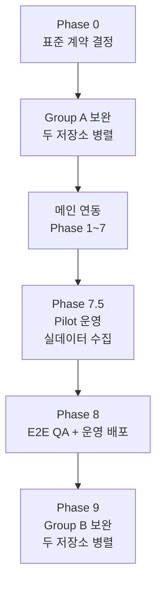

### 운영 규칙

- Group A는 두 저장소에서 **병렬** 진행 가능. 단, 결과물(특히 Storige API DTO와 bookmoa-mobile 어댑터 시그니처)이 Phase 0 계약과 일치하는지 **매주 점검**.
- Group B는 Pilot 운영 데이터를 보고 우선순위를 정한다. 사전 추정으로 우선순위를 고정하지 않는다.
- 운영 중인 서비스에 심각한 결함(고객 항의)이 있으면 Group 분류와 무관하게 **핫픽스 우선**.

---

## 1. 두 저장소의 역할 구분

### Storige (`/Users/yohan/claude/Bookmoa Storige editor/storige`)
**역할: 외부사이트 연동 플랫폼 공급자**

| 책임 영역 | 핵심 |
|---|---|
| Site/Tenant 관리 | `sites` 테이블, `editorAuthCode`/`workerAuthCode`, 사이트별 옵션 |
| 인증/권한 | `X-API-Key` → `siteId` 주입, `shop-session` JWT 발급 |
| 편집기 공급 | `apps/editor` IIFE 번들 + iframe embed 진입점 |
| Worker | PDF 검증/합성/변환 (NestJS + Bull + Redis) |
| Webhook 발신 | `synthesis.completed`, `validation.*` 등 외부 서비스로 push |
| 도메인 보안 | CORS, iframe `frame-ancestors`, postMessage 검증, webhook allowlist |
| Admin | 사이트별 작업/세션 필터, 파트너 포털 (별도 트랙) |

### bookmoa-mobile (`/Users/yohan/Documents/claude/bookmoa-mobile`)
**역할: 첫 번째 외부 서비스 테넌트**

| 책임 영역 | 핵심 |
|---|---|
| 서버 어댑터 | `api/storige/*` Vercel Functions — API Key 보관, Storige API 프록시 |
| 상품 매핑 | `customProducts`에 `sortcode`/`stanSeqno`/`templateSetId`/`allowEditor` 추가 |
| 관리자 UI | `ProductEditor`에 Storige 매핑 입력, 엑셀 import/export 확장 |
| 편집기 진입 | `StorigeEditorHost` (inline 오버레이) + `useStorigeEditor()` hook |
| 장바구니/주문 | cart item에 `storige.{sessionId, coverFileId, contentFileId, status}` 저장 |
| Webhook 수신 | `/api/storige/webhook`에서 서명 검증 후 주문 상태 갱신 |
| 결과 PDF | `/api/storige/files/proxy-download`로 서버 프록시 후 사용자 제공 |

### 협업 경계 다이어그램

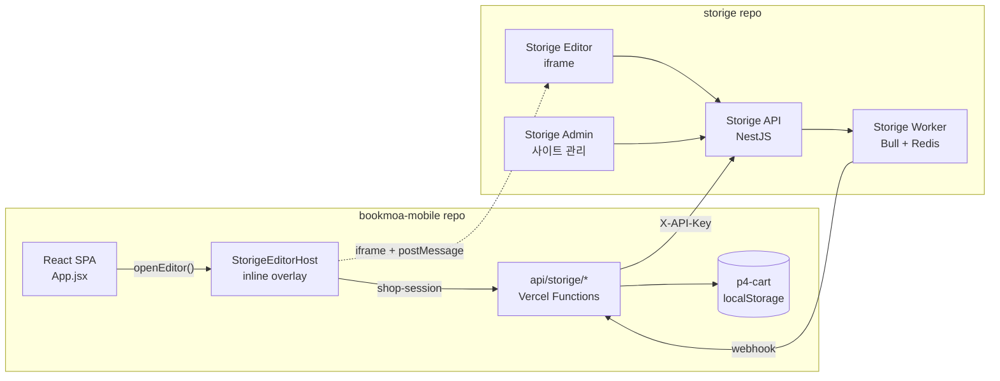

---

## 2. Phase 0 — 표준 계약 결정 (코드 작성 전)

> 이 단계의 결정이 모든 SDK·문서·구현에 영향을 준다. 가장 먼저 확정한다.

### 결정 사항

| 결정 항목 | 선택지 | **확정안** | 영향 저장소 |
|---|---|---|---|
| 편집기 실행 모드 | inline / new tab / iframe 분리 | **inline embed 단일** | bookmoa-mobile, storige |
| URL 파라미터 케이스 | snake_case / camelCase / 양쪽 | **에디터가 양쪽 수용** (PHP 영향 0) | storige |
| Webhook 서명 | HMAC-SHA256 / Base64 (현행) | **Base64 유지 + 문서 정정**, HMAC은 v2 분리 | storige (문서) + bookmoa-mobile (검증 코드) |
| Editor 진입 토큰 | 장기 / 단기 (≤1h) | **단기 JWT (≤1h)**, 어댑터가 refresh | bookmoa-mobile |
| 결과 PDF 다운로드 | 직접 URL / 서버 프록시 | **서버 프록시 단일** | bookmoa-mobile |
| `shop-session` 응답 | 200 / 201 | **2xx 모두 성공 처리** | bookmoa-mobile |

### Storige가 확인할 파일 (구현 전 계약 조사)

- `apps/api/src/auth/auth.controller.ts` — `shop-session` 실제 응답 형태
- `apps/api/src/templates/product-template-sets.controller.ts` — 상품→템플릿셋 조회 계약
- `apps/api/src/worker-jobs/worker-jobs.controller.ts` — `validate/external`, `synthesize/external`, `check-mergeable/external` DTO
- `apps/api/src/worker-jobs/dto/worker-job.dto.ts`
- `apps/api/src/worker-jobs/dto/check-mergeable.dto.ts`
- `apps/api/src/webhook/webhook.service.ts` — 실제 서명 헤더/방식
- `apps/editor/src/embed.tsx` — `EditorConfig`/완료 이벤트 payload

### 산출물

- 결정 결과를 다음 문서에 반영:
  - `docs/PHP_INTEGRATION_FINAL_v3.md`
  - `docs/PLATFORM_WORKER_INTEGRATION_v1.md`
  - `apps/editor/src/embed.tsx` README

---

## 3. 메인 트랙 Phase 흐름

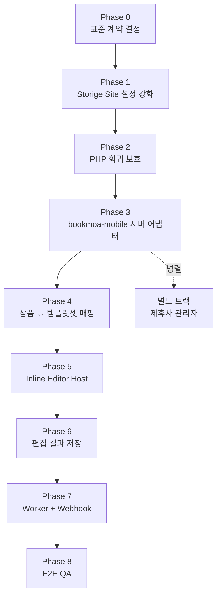

각 Phase는 다음 4축으로 정리한다.
**(1) 목표 / (2) Storige 작업 / (3) bookmoa-mobile 작업 / (4) 처리 플로우 / (5) 산출물·검증**

---

## Phase 1 — Storige Site 설정 강화

### 목표
외부 사이트 온보딩의 단일 진입점을 `sites` 테이블로 고정. CORS/iframe/webhook을 환경변수에서 DB 기반으로 옮긴다.

### Storige 작업
1. `sites` 테이블 마이그레이션 — 다음 컬럼 추가:

| 컬럼 | 타입 | 용도 |
|---|---|---|
| `domain` | string | 외부 서비스 대표 도메인 |
| `returnUrlBase` | string | 검증용 (라우팅에는 사용 안 함) |
| `uploadCallbackUrl` | string | webhook URL |
| `editorAuthCode` | string | 편집기/shop-session/API 호출 키 |
| `workerAuthCode` | string | 워커 호출 키 |
| `allowedOrigins` | string[] | CORS allowlist |
| `frameAncestors` | string[] | iframe embed 허용 parent origin |
| `editorLaunchMode` | enum | **`inline` 고정** (Phase 0 결정) |
| `editorBundleUrl` / `editorCssUrl` / `editorVersion` | string | embed 번들 공급 정보 |
| worker default 옵션 | json | PDF 변환·단위·작업서/재단선/안전선 체크 |

2. `apps/api/src/sites/sites.service.ts` CRUD 확장
3. **API CORS callback**을 환경변수 → DB `sites.allowedOrigins` 기반 (60초 캐시)으로 전환
4. **nginx/Vercel edge**에서 Editor 응답에 `Content-Security-Policy: frame-ancestors 'self' <site.frameAncestors join>` 동적 합성
5. `WEBHOOK_ALLOWED_HOSTS`도 sites 기반으로 검증 (`webhook.service`)
6. Admin UI에 위 필드 입력 화면 추가

### bookmoa-mobile 작업
없음 (이 Phase는 Storige 단독)

### 처리 플로우
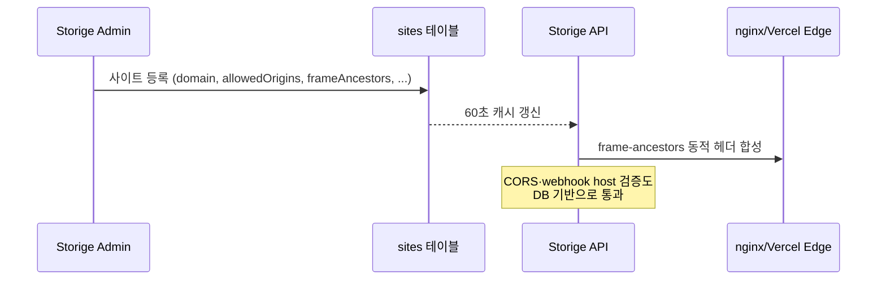

### 산출물·검증
- 산출물: `sites` 마이그레이션 + Admin UI + CORS/CSP/webhook 동적 정책
- 검증: 새 사이트 추가 시 `.env` 수정 없이 CORS·iframe·webhook 모두 통과

> Phase 1이 끝나기 전에는 Phase 3(외부 도메인 연동) 시작 금지.

---

## Phase 2 — bookmoa web(PHP) 회귀 보호

### 목표
새 변경이 운영 중인 PHP를 깨지 않도록 못 박는다.

### Storige 작업
1. 기존 `STORIGE_API_KEY`로 다음 API 회귀 테스트:
   - `POST /auth/shop-session`
   - `POST /worker-jobs/validate/external`
   - `POST /worker-jobs/synthesize/external`
2. snake_case URL 파라미터 호환 레이어 동작 검증 (Phase 0 결정 반영)
3. Phase 1 마이그레이션 후에도 PHP 호출이 통과하는지 확인

### bookmoa-mobile 작업
없음

### 처리 플로우
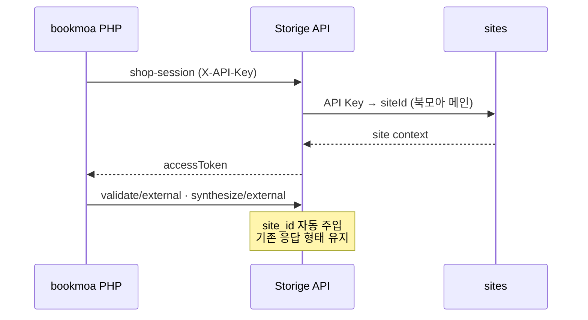

### 산출물·검증
- 산출물: PHP 회귀 테스트 체크리스트
- 검증: PHP 측 코드/.env 변경 0으로 모든 호출 통과

> Phase 2 통과 전 Phase 3 시작 금지.

---

## Phase 3 — bookmoa-mobile 서버 어댑터 구축

### 목표
bookmoa-mobile 클라이언트가 `STORIGE_API_KEY`를 알지 못하도록 서버 어댑터를 구축한다. **이 Phase가 가장 큰 보안 게이트.**

### Storige 작업
없음 (Storige는 이미 `/external` 엔드포인트 제공)

### bookmoa-mobile 작업

1. **환경 변수 추가** (Vercel env, 모두 서버 전용)

```
STORIGE_API_BASE=https://api.papascompany.co.kr/api
STORIGE_API_KEY=sk-storige-...
STORIGE_EDITOR_URL=https://editor.papascompany.co.kr
STORIGE_WEBHOOK_URL=https://bookmoa-mobile.vercel.app/api/storige/webhook
STORIGE_WEBHOOK_VERIFY_HEADER=X-Storige-Signature
```

> `VITE_` prefix 절대 사용 금지. 클라이언트 번들 노출 차단.

2. **공통 fetch 유틸**: `api/storige/_client.js`
   - `STORIGE_API_BASE`, `STORIGE_API_KEY` 필수값 검증
   - `X-API-Key` 헤더 자동 부착
   - Storige 오류 응답을 일관된 JSON으로 변환

3. **어댑터 파일 트리**

```
bookmoa-mobile/
  api/
    storige/
      _client.js              # 공통 fetch 유틸
      shop-session.js         # POST → /auth/shop-session
      template-sets.js        # GET → /product-template-sets/by-product
      check-mergeable.js      # POST → /worker-jobs/check-mergeable/external
      synthesize.js           # POST → /worker-jobs/synthesize/external
      validate.js             # POST → /worker-jobs/validate/external
      webhook.js              # ← Storige가 호출, 서명 검증
      files/
        upload.js             # POST → /files/upload/external
        proxy-download.js     # GET → /worker-jobs/:jobId/output 프록시
```

### 처리 플로우
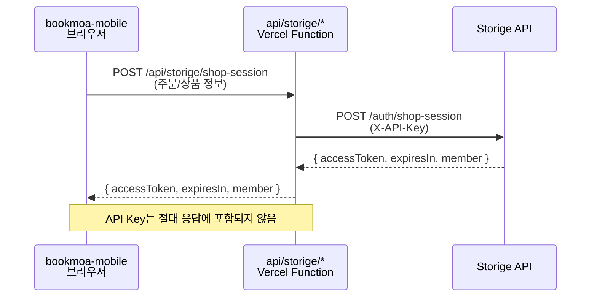

### 산출물·검증
- 산출물: 8개 어댑터 endpoint + 공통 client + `.env.example`
- 검증:
  - `rg "STORIGE_API_KEY|VITE_STORIGE" src/`로 클라이언트 노출 0
  - 환경 변수 누락 시 500 + 명확한 오류 메시지
  - API Key가 응답 body/header에 포함되지 않음

---

## Phase 4 — 상품 ↔ Storige 템플릿셋 매핑

### 목표
어떤 상품에 Storige 편집기를 띄울지 운영자가 등록할 수 있게 한다.

### Storige 작업
없음 (`GET /product-template-sets/by-product` 이미 존재)

응답 형태:
```
{ templateSets: [{ id, name, type, width, height, thumbnailUrl, isDefault }] }
```

### bookmoa-mobile 작업

1. **`customProducts` 데이터 모델 확장** (`src/App.jsx`)
   - `allowEditor` (기본 false)
   - `storigeProductSortcode`
   - `storigeStanSeqno`
   - `storigeTemplateSetId`
   - `storigeTemplateSetName`
   - 기존 `p4-cprods` localStorage 구조 하위 호환 유지

2. **`ProductEditor` modal 확장** (`src/App.jsx`)
   - `Storige 편집기 사용` 체크박스
   - `sortcode`, `stanSeqno`, `templateSetId` 입력 필드
   - "템플릿셋 조회" 버튼 → `/api/storige/template-sets` 호출
   - 조회 결과 드롭다운에서 기본 템플릿셋 선택

3. **엑셀 import/export 확장**
   - 상품 sheet에 Storige 필드 컬럼 포함
   - 기존 엑셀 파일은 신규 필드 없이도 정상 파싱

### 처리 플로우
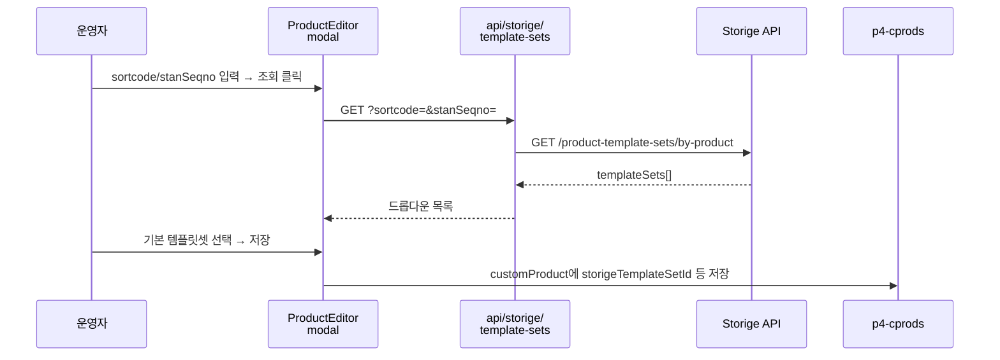

### 산출물·검증
- 산출물: 상품 매핑 UI + 엑셀 호환
- 검증:
  - 기존 상품이 Storige 필드 없이도 정상 렌더/수정/저장
  - 매핑 저장 후 새로고침해도 유지
  - `sortcode`/`stanSeqno` 누락 시 어댑터가 400 반환

---

## Phase 5 — Inline Editor Host 구현 (핵심)

### 목표
호출 페이지를 언마운트하지 않고 편집기를 띄우고, 닫을 때 직전 상태가 그대로 복귀되도록 한다.

### Storige 작업

1. **편집기 iframe 응답 헤더 정비**
   - `X-Frame-Options` 제거
   - `Content-Security-Policy: frame-ancestors 'self' <site.frameAncestors>` 적용 (Phase 1과 연계)
2. **편집기 IIFE 번들** (`apps/editor/src/embed.tsx`) 안정화
   - `parentOrigin` 필수 옵션
   - `targetOrigin='*'` 금지, 부모로부터 받은 `parentOrigin` 사용
3. **postMessage 이벤트 표준 확정**
   - `editor.ready` / `editor.save` / `editor.complete` / `editor.cancel` / `editor.error`
   - payload 스키마 문서화

### bookmoa-mobile 작업

#### 5.1 컴포넌트 구조

`App.jsx` 최상단에 Portal 형태로 `StorigeEditorHost` 1개 마운트, 전역 컨텍스트로 hook 제공.

```
<App>
  <Routes ... />        ← 호출 페이지(Configure, ProdConfigure)는 그대로 유지
  <StorigeEditorHost /> ← 평소 숨김, openEditor() 호출 시 풀스크린 오버레이
</App>
```

호출 페이지는 단순:
```js
const { openEditor } = useStorigeEditor();
<button onClick={() => openEditor({ templateSetId, pageCount, ... })}>
  편집기 열기
</button>
```

> `navigate`, `<Link>`, `window.open`, `<a target="_blank">` 일절 사용 금지.

#### 5.2 EditorHost 동작 시퀀스

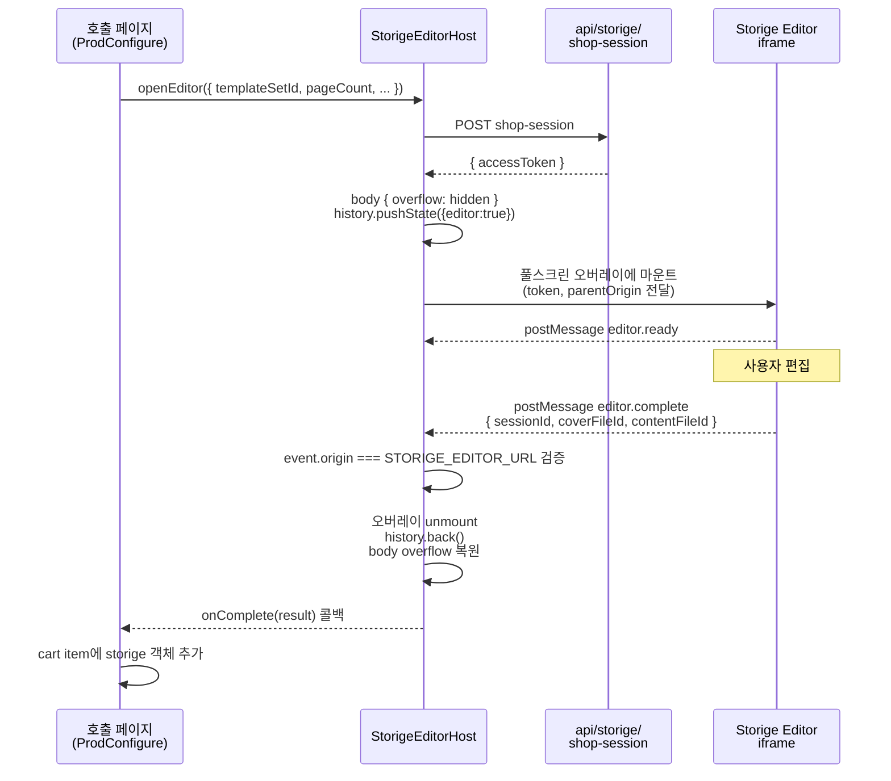

#### 5.3 상태 보존 보장

| 보존 대상 | 보존 방법 |
|---|---|
| **스크롤 위치** | 오버레이 마운트 시 `body { overflow: hidden }`만 토글. `scrollTo` 호출 금지 |
| **폼 입력값** | 호출 페이지가 React state로 보관 (자동) + localStorage 자동저장 병행 |
| **장바구니** | 기존 `p4-cart` 그대로 |
| **선택 옵션·필터** | 호출 컴포넌트의 useState/Context로 보존 |
| **브라우저 뒤로가기** | 오버레이 열 때 `history.pushState({editor:true})`, 닫을 때 `history.back()`. `popstate` 이벤트로 오버레이 자동 닫힘 |
| **포커스/스크린리더** | 오버레이 안 focus trap, 닫을 때 직전 포커스 요소 복귀 (`opener` 저장) |
| **모바일 키보드** | iOS Safari `visualViewport` 이벤트로 viewport 점프 방지 |

#### 5.4 표준 embed 파라미터 (iframe URL/postMessage)

| 파라미터 | 필수 | 비고 |
|---|---|---|
| `siteCode` 또는 `siteId` | 필수 | site context |
| `templateSetId` | 필수 | |
| `parentOrigin` | 필수 | postMessage 검증용 |
| `token` | 필수 | 단기 JWT (≤1h) |
| `mode` | 선택 | `both` / `cover` / `content` |
| `pageCount`, `paperType`, `bindingType`, `width`, `height` | 선택 | 주문 옵션 |
| `orderSeqno` / `orderId` | 선택 | 주문 식별 |
| ~~`returnUrl`~~ | **금지** | inline embed에서는 페이지 전환이 없음 |

#### 5.5 폐기되는 옵션

- `window.open` 새 탭
- `<a target="_blank">`
- `navigate('/storige/edit')` 같은 라우팅
- `window.location.href` 변경
- `returnUrl` 기반 복귀

### 산출물·검증
- 산출물: `StorigeEditorHost` 컴포넌트 + `useStorigeEditor` hook + Storige 측 CSP/postMessage 규칙
- 검증:
  - "편집기 열기" 후 페이지 URL/타이틀 변경 없음
  - 닫기 시 스크롤·폼·장바구니·선택 옵션 직전 그대로
  - 브라우저 뒤로가기로 페이지 이탈 없이 오버레이만 닫힘
  - 가짜 origin postMessage는 무시됨

---

## Phase 6 — 편집 결과를 장바구니/주문에 저장

### 목표
`editor.complete`로 받은 `sessionId`, `coverFileId`, `contentFileId`를 cart/order에 안전하게 저장한다.

### Storige 작업
없음

### bookmoa-mobile 작업

1. **cart item 스키마 확장** (`src/App.jsx`)

```js
cartItem.storige = {
  sessionId,
  coverFileId,
  contentFileId,
  templateSetId,
  status: 'edited',     // edited | validated | synthesis_pending | completed | failed
  orderSeqno,
  // siteId/siteName은 표시·관리화면 조회용. 권한 판단은 자체 주문 DB 기준.
}
```

2. **`Configure.handleAdd` / `ProdConfigure.handleAdd`** 시그니처 확장
   - 기존 Supabase Storage URL 기반 `files` 필드 유지
   - `storige` 키를 병행 추가
3. **checkout/order 생성 흐름**에서 `storige` 객체 유지
4. **주문 상세 화면**에 Storige 상태 + 파일 ID 표시

### 처리 플로우
```mermaid
flowchart LR
    Edit[Editor onComplete<br/>sessionId/fileId] --> Host[StorigeEditorHost]
    Host --> Add[Configure.handleAdd]
    Add --> Cart[(p4-cart<br/>cart.items[].storige)]
    Cart --> Checkout[Checkout]
    Checkout --> Order[(p4-orders<br/>order.items[].storige)]
    Order --> Detail[주문 상세<br/>Storige 상태 표시]
```

### 산출물·검증
- 산출물: cart/order 스키마 + 표시 UI
- 검증:
  - 장바구니/주문/재주문에서 기존 cart 항목이 깨지지 않음
  - 주문 완료 후 새로고침해도 `storige` 필드 유지

---

## Phase 7 — Worker + Webhook + 결과 PDF

### 목표
주문 확정 시점에 PDF 검증/합성을 호출하고, 결과를 webhook으로 받아 주문 상태에 반영한다.

### Storige 작업
1. (Phase 0 결정 반영) `synthesis.completed` / `synthesis.failed` / `validation.completed` / `validation.fixable` / `validation.failed` 이벤트 payload 안정화
2. webhook 재시도 정책 문서화 (200 / 4xx 5xx / 타임아웃)
3. `WEBHOOK_ALLOWED_HOSTS` 또는 sites 기반 검증으로 bookmoa-mobile 도메인 등록 확인

### bookmoa-mobile 작업

1. **`api/storige/check-mergeable.js`**
   - `coverFileId`, `contentFileId`, 주문 옵션 받음
   - `POST /worker-jobs/check-mergeable/external` 호출
2. **`api/storige/synthesize.js`**
   - 주문 확정 시 호출
   - 필수: `coverFileId`, `contentFileId`, `spineWidth`, `bindingType`, `outputFormat`, `orderId`, `editSessionId`, `callbackUrl=STORIGE_WEBHOOK_URL`
   - 응답 `jobId`를 주문에 저장
3. **`api/storige/validate.js`**
   - 업로드 PDF 또는 편집 결과 검증 job 생성
4. **`api/storige/webhook.js`**
   - `X-Storige-Event`, `X-Storige-Signature` 검증 (Phase 0 결정)
   - 이벤트별 주문 상태 갱신
   - 200 빠른 응답 (무거운 처리는 비동기 큐)
5. **`api/storige/files/proxy-download.js`**
   - `jobId` 기준 `GET /worker-jobs/:jobId/output` 프록시
   - 권한/주문 소유 검증 후 스트림 전달

### 처리 플로우
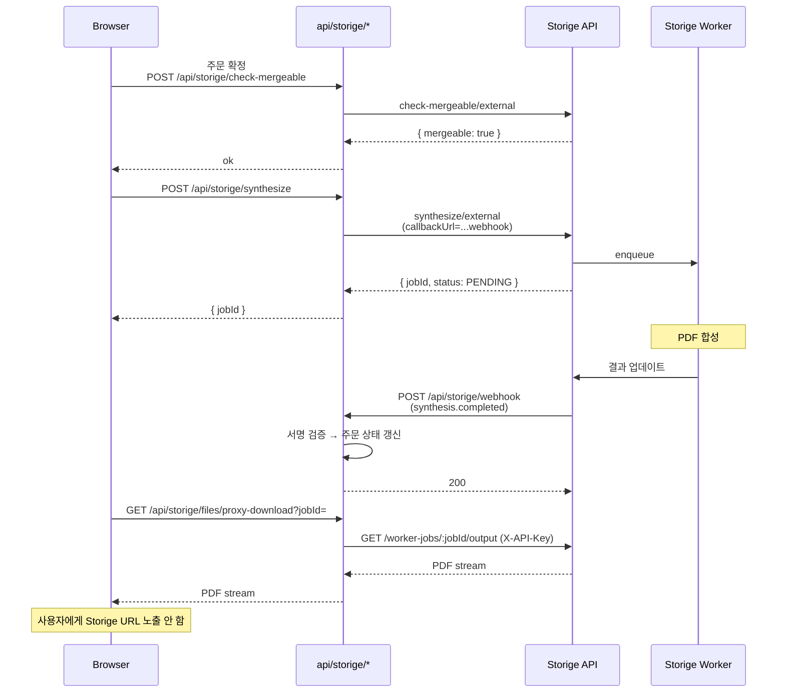

### 산출물·검증
- 산출물: 5개 어댑터 + webhook 검증 + 주문 상태 머신
- 검증:
  - 잘못된 서명 webhook은 거부
  - 클라이언트가 Storige storage URL/API Key를 알 수 없음
  - 같은 주문 중복 합성 호출 처리 정책 명시

---

## Phase 7.5 — Pilot 운영 (실데이터 수집)

### 목표
1~2개 상품으로 실데이터를 굴려서 **진짜 병목과 우선순위**를 식별한다. Group B 보완 항목의 순서를 사전 추정이 아닌 데이터로 결정하기 위한 단계.

### Storige 작업
1. **워커 메트릭 수집 활성화**
   - 큐 길이(`bull:pdf-validation:wait`, `bull:pdf-synthesis:wait`)
   - 평균 처리 시간 (validate / synthesize)
   - 실패율 (`worker_jobs.status = FAILED` 비율)
   - Ghostscript 타임아웃 발생 빈도
2. **Sentry 알람 임계치 점검** — Pilot 트래픽 기준에 맞게 조정
3. **편집기 사용 패턴 로깅** (ready→complete 평균 소요, save 횟수, error 발생률)
4. **Admin 사이트 필터로 Pilot 사이트만 분리 모니터링**

### bookmoa-mobile 작업
1. **Pilot 상품 선정**: `customProducts` 1~2개에 `allowEditor: true` 설정
2. **내부 사용자 대상 운영** — 실고객 노출 전에 운영팀/관계자가 먼저 사용
3. **이슈 트래킹 시트** 운영 — 편집기 진입/완료/저장/주문 단계별 이슈 기록
4. **클라이언트 메트릭 수집** — 편집기 열기까지 걸린 시간, 닫기 후 호출 페이지 복귀 정상 여부

### 처리 플로우
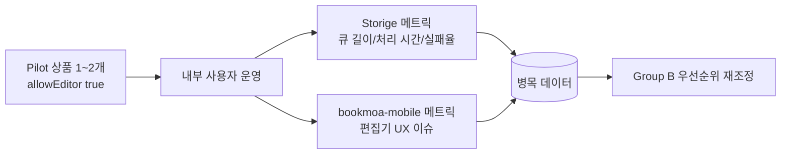

### 산출물·검증
- 산출물: Group B 우선순위 재조정 근거 데이터, 이슈 트래킹 시트
- 검증: 최소 1주일 이상 운영, 누락된 시나리오/장애 패턴 식별

> Phase 7.5 통과 전에는 Phase 9 Group B 보완 시작 금지. 단 Phase 8 E2E QA는 Pilot과 병행 가능.

---

## Phase 8 — E2E QA

### 목표
상품 등록부터 결과 PDF 다운로드까지 전체 흐름을 로컬/스테이징에서 검증한다.

### 시나리오 체크리스트

| # | 시나리오 | 책임 |
|---|---|---|
| 1 | Storige Admin에서 `북모아 메인` + 테스트 사이트 각각 등록, 인증코드 발급 | Storige |
| 2 | `allowedOrigins`/`frameAncestors`/`uploadCallbackUrl` 등록 후 CORS·iframe·webhook 통과 | Storige |
| 3 | 테스트 상품 `sortcode + stanSeqno` ↔ 템플릿셋 연결 | Storige |
| 4 | **PHP 회귀**: `STORIGE_API_KEY`로 shop-session/validate/synthesize 통과 | Storige |
| 5 | bookmoa-mobile 관리자에서 동일 `sortcode/stanSeqno/templateSetId` 저장 | bookmoa-mobile |
| 6 | **Inline embed**: 상품 상세에서 "편집기 열기" → 풀스크린 오버레이가 같은 페이지 위에 뜸 (URL/타이틀 변경 없음) | bookmoa-mobile |
| 7 | 편집 중 자동저장 동작 | Storige (Editor) |
| 8 | **닫기**: 오버레이만 사라지고 스크롤·폼·장바구니·선택 옵션 그대로 | bookmoa-mobile |
| 9 | **완료**: `sessionId/coverFileId/contentFileId` 저장 확인 | bookmoa-mobile |
| 10 | **브라우저 뒤로가기**: 편집기 열린 상태에서 뒤로가기 → 페이지 이탈 없이 오버레이만 닫힘 | bookmoa-mobile |
| 11 | **모바일**: iOS Safari, Android Chrome viewport 점프 없음 | bookmoa-mobile |
| 12 | **postMessage origin 검증**: 가짜 origin 메시지 무시됨 | bookmoa-mobile |
| 13 | `check-mergeable` + `validate/external` 정상 동작 | bookmoa-mobile + Storige |
| 14 | 주문 확정 → `synthesize/external` → webhook `synthesis.completed` 수신 | bookmoa-mobile + Storige |
| 15 | 결과 PDF를 서버 프록시로 다운로드, 클라이언트에 Storige URL 미노출 | bookmoa-mobile |
| 16 | Admin `편집데이터관리` / `워커관리` 사이트 필터로 작업 분리 | Storige |
| 17 | (별도 트랙 완료 시) 파트너 계정이 타 사이트 자원 직접 URL 접근 → 403 | Storige |

---

## Phase 9 — Group B 보완 진행

### 목표
Pilot 운영(Phase 7.5)과 E2E QA(Phase 8) 통과 후, **데이터 기반으로 우선순위를 정한 내부 보완**을 두 저장소에서 병렬로 진행한다.

### 진행 원칙
- Pilot 데이터 기반으로 항목별 우선순위 결정 (사전 추정 금지)
- 두 저장소 병렬 진행 가능
- **연동 인터페이스 변경 없음** 보장 — Phase 8 회귀 시나리오를 통과하지 못하는 변경은 반려
- 작업 단위마다 회귀 테스트 → 운영 배포의 짧은 사이클 유지

### Storige 작업 후보

| 항목 | 우선순위 결정 근거 |
|---|---|
| 워커 성능 개선 (병렬 처리, 큐 튜닝, Ghostscript 옵션) | Pilot 큐 길이/처리 시간/실패율 |
| 편집기 내부 기능 추가 (도구, 효과, 정렬 등) | Pilot 사용자 피드백, save 횟수 |
| Admin 통계/대시보드/리포트 | 사이트별 작업량/실패율 데이터 누적 후 |
| 편집기 모바일 UX 보강 | Pilot iOS/Android 이슈 |
| 워커 알람·자동 재시도 정책 강화 | Pilot 실패 패턴 분석 |

### bookmoa-mobile 작업 후보

| 항목 | 우선순위 결정 근거 |
|---|---|
| 주문 화면 UI/UX 개선 | Pilot 운영자/사용자 피드백 |
| 결제 플로우 보강 | Pilot 주문 완료 단계 이슈 |
| 부가 기능 (알림, 추천, 검색 강화) | Pilot 사용 패턴 |
| 주문 상세의 Storige 상태 시각화 강화 | Pilot 운영자 요청 빈도 |
| 재편집(`session_id` 복원) UX | Pilot 재주문/수정 패턴 |

### 처리 플로우
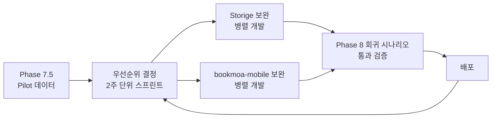

### 산출물·검증
- 산출물: 우선순위 1차 스프린트 백로그 + 회귀 시나리오 포함 PR 템플릿
- 검증:
  - 모든 PR이 Phase 8 시나리오 6~12 회귀 통과 확인 후 머지
  - 운영 배포 후 Sentry/메트릭 비교 (개선 효과 정량화)

---

## 별도 트랙 — 제휴사 관리자/주문처리 (병렬 가능)

> 보안 범위가 크고 마이그레이션이 무거우므로 메인 트랙(Phase 3~7)과 분리. 단 `site_id` 권한 모델은 지금부터 모든 신규 API에 일관 적용.

### Storige 작업

#### 데이터 모델
- `packages/types/src/index.ts` — `UserRole.PARTNER_ADMIN`, `UserRole.PARTNER_OPERATOR` 추가
- `apps/api/src/auth/entities/user.entity.ts` — `users.site_id` nullable FK
- 필요 시 `partner_profiles` / `site_users` 테이블
- `worker_jobs`, `file_edit_sessions`, `files`의 `site_id` 정합성 강화
- 외부 주문 별도 관리 시 `partner_orders` / `external_orders`

#### 권한 정책

| 역할 | 범위 |
|---|---|
| `SUPER_ADMIN` / `ADMIN` | 모든 사이트 |
| `MANAGER` | 내부 운영 범위 |
| `PARTNER_ADMIN` | 자기 `site_id`의 주문/편집세션/워커잡/PDF 조회·다운로드·상태 변경 |
| `PARTNER_OPERATOR` | 자기 `site_id`의 주문처리·제작상태 변경·PDF 다운로드만 |
| `CUSTOMER` | 편집기 고객 세션 전용 |

#### API
- 공통 `SiteScopeGuard` — 파트너 역할이면 `siteId=user.siteId` 강제
- `GET /partner/orders` / `GET /partner/orders/:id` / `PATCH /partner/orders/:id/status`
- `GET /partner/worker-jobs` / `GET /partner/files/:id/download`
- 기존 `edit-sessions`/`worker-jobs`/`files` 상세에도 site scope 검증

#### Admin UI
- 역할별 메뉴 분리
- 파트너 메뉴: 주문관리 / PDF 검수·다운로드 / 제작관리 / 편집데이터 / 워커 작업
- 내부 관리자 메뉴: 기존 기본설정 / 템플릿 / 라이브러리 / 전체 워커관리 유지
- 파트너 화면은 사이트 선택 드롭다운 숨김 + 자기 사이트 고정

#### 주문처리 기능
- 목록: 외부 주문번호 / 고객명 / 상품 / 편집 상태 / PDF 검증·합성·제작 상태
- 상세: 편집 미리보기 / 원본 PDF / 검증 리포트 / 합성 PDF 다운로드 / webhook 이력 / 작업 메모
- 상태: `received` → `editing` → `validated` → `pdf_ready` → `production` → `shipped` → `completed` / `failed`
- 파일 다운로드는 API가 권한 확인 후 스트리밍 (storage 내부 경로 비노출)

### bookmoa-mobile 작업
없음 (이 트랙은 Storige 단독)

### 별도 트랙 내 개발 순서
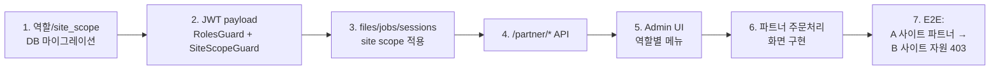

---

## 우선순위 매트릭스

> 보완 작업과 연동 작업을 같은 매트릭스에 통합. 분류 컬럼은 **Phase / Group A / Group B**.
> Group A는 연동 시작 전 필수, Group B는 Pilot 운영 후 우선순위 재조정 대상.

### P0 (1차 MVP — 연동 시작 전)

| 작업 | 저장소 | 분류 |
|---|---|---|
| 표준 계약 결정 (URL 케이스, webhook 서명, inline embed 표준) | Storige | Phase 0 |
| 편집기 embed 모드 안정화 (postMessage, CSP, parentOrigin) | Storige | Group A |
| Admin 사이트 관리 기능 (`sites` CRUD, `allowedOrigins`/`frameAncestors`) | Storige | Group A 겸 Phase 1 |
| URL 파라미터 snake/camel 호환 레이어 | Storige | Group A 겸 Phase 0 |
| 상품 주문 화면 데이터 모델 정리 (`customProducts` 스키마) | bookmoa-mobile | Group A |
| 상품 상세 진입점/주문 화면 구조 정리 | bookmoa-mobile | Group A |

### P1 (메인 연동 + Pilot 운영)

| 작업 | 저장소 | 분류 |
|---|---|---|
| 서버 어댑터 8종 (`_client`, `shop-session`, `template-sets` 등) | bookmoa-mobile | Phase 3 |
| 상품 ↔ 템플릿셋 매핑 UI | bookmoa-mobile | Phase 4 |
| Inline Editor Host (`StorigeEditorHost`) + `useStorigeEditor` hook | bookmoa-mobile | Phase 5 |
| cart/order에 `storige` 결과 저장 | bookmoa-mobile | Phase 6 |
| Worker 어댑터 (`check-mergeable`, `validate`, `synthesize`) | bookmoa-mobile | Phase 7 |
| webhook endpoint + 서명 검증 | bookmoa-mobile | Phase 7 |
| 결과 PDF 다운로드 프록시 | bookmoa-mobile | Phase 7 |
| Pilot 운영 1~2개 상품 (실데이터 수집) | 양쪽 | Phase 7.5 |
| E2E QA 시나리오 1~17 통과 | 양쪽 | Phase 8 |

### P2 (Pilot 후 보완 — 우선순위는 데이터로 결정)

| 작업 | 저장소 | 분류 |
|---|---|---|
| 워커 성능 개선 (병렬, 큐 튜닝, Ghostscript 옵션) | Storige | Group B / Phase 9 |
| 편집기 내부 기능 추가 (도구, 효과, 정렬) | Storige | Group B / Phase 9 |
| Admin 통계/대시보드/리포트 | Storige | Group B / Phase 9 |
| Site 기반 CORS/iframe/webhook allowlist 자동화 (확장) | Storige | Phase 1 확장 |
| 주문 화면 UI/UX 개선 | bookmoa-mobile | Group B / Phase 9 |
| 결제 플로우 보강 | bookmoa-mobile | Group B / Phase 9 |
| 부가 기능 (알림, 추천, 검색 강화) | bookmoa-mobile | Group B / Phase 9 |
| 파트너 관리자 권한 모델 + 주문처리 API/UI | Storige | 별도 트랙 |
| 다중 외부 서비스 온보딩 문서/SDK 정리 | Storige | 별도 |

---

## 첫 구현 단위 (가장 빠른 MVP 경로)

> Group A 병렬 보완을 먼저 끝내고 메인 연동 경로(M1~M6)로 진입한다.

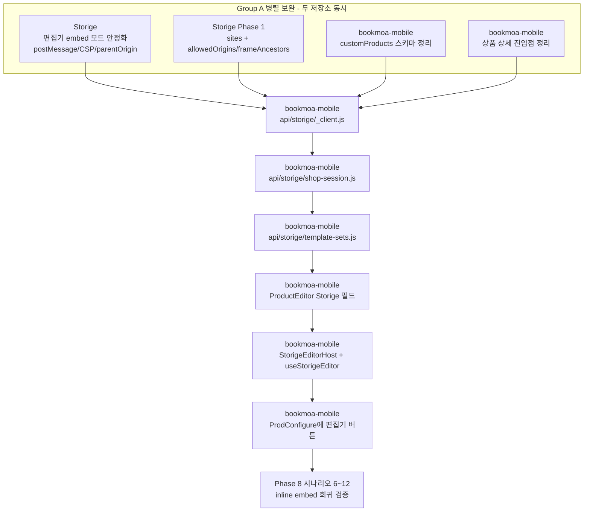

이 경로가 끝나면 **API Key 비노출 원칙을 지키면서 상품별 inline 편집기 실행 + 상태 보존**까지 검증할 수 있다.

---

## 최종 주의점

- `bookmoa-mobile` 루트는 client-only 상태이므로 **첫 작업은 서버 API 어댑터 추가**.
- 문서의 snake_case URL과 실제 `EditorView`의 camelCase URL이 어긋남 → **Phase 0에서 호환 레이어 표준화**.
- `POST /auth/shop-session`은 현재 컨트롤러 기준 HTTP 200. 클라이언트는 **2xx 성공으로 처리**.
- webhook 허용 호스트는 Storige API의 `WEBHOOK_ALLOWED_HOSTS` 또는 sites 기반 검증에 포함되어야 함.
- 외부 서비스가 늘어날수록 공통 SDK/샘플 코드 필요. **모든 샘플은 inline embed 패턴으로 통일.**
- 파트너 관리자 기능은 보안 범위가 크므로 편집기 연동보다 뒤에 "운영 포털 Phase"로 분리. 단 `site_id` 권한 모델은 지금부터 모든 API에 일관 적용.
- **편집기 실행은 inline embed 단일 표준.** 새 탭/페이지 라우팅 패턴은 외부 SDK·문서·샘플에서 모두 제거.
- **편집기 닫기 = 호출 페이지의 직전 상태 그대로 복귀.** 회귀 테스트(Phase 8 시나리오 6~12) 통과 없이 운영 배포 금지.
- **두 저장소는 별도 git repo.** 한쪽에서 작업할 때 다른 저장소 변경을 같이 커밋하지 않도록 항상 경로 확인.
- **보완 작업은 Group A와 Group B로 분리 운영.** Group A(연동에 영향)는 메인 연동 시작 전, Group B(내부 개선)는 Pilot 운영(Phase 7.5) 후로 미룬다. 분류를 섞지 않는다.
- **Group B 우선순위는 Pilot 데이터로 재조정.** 사전 추정만으로 우선순위를 고정하지 않는다. Pilot 메트릭(큐 길이, 처리 시간, 실패율, 사용자 피드백)을 본 뒤 결정.
- **Group A 병렬 진행 중 매주 계약 정합성 점검.** 두 저장소가 동시에 진행하므로 Storige API DTO와 bookmoa-mobile 어댑터 시그니처가 Phase 0 계약과 일치하는지 매주 확인하고, 어긋나면 즉시 동기화.
