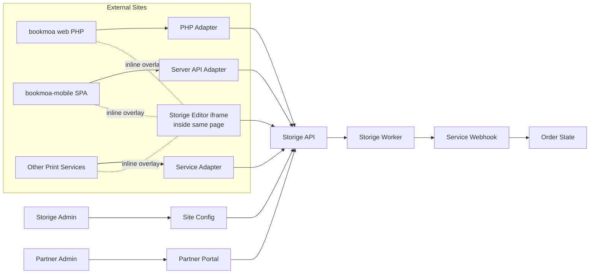

# Bookmoa Storige 외부사이트 플랫폼 연동 개발 계획 (2026-05-16)

## 0. 이번 버전의 핵심 변경

**편집기 실행 정책 단일화 — Same-page Inline Embed.**

- 외부 서비스(예: bookmoa-mobile)의 주문/상품 화면에서 **"편집기 열기"**를 누르면, **새 탭으로 이동하거나 페이지 라우팅을 갈아치우지 않는다.**
- 호출 페이지 위에 풀스크린 오버레이(또는 모달) 로 편집기 UI가 마운트되고, **닫기/완료** 시 오버레이만 사라지며 **호출 페이지는 직전 상태(스크롤 위치, 입력값, 장바구니, 선택한 옵션, 필터, 페이지네이션)** 그대로 복귀한다.
- 따라서 편집기 호출은 **언마운트되지 않는 React 컴포넌트** 또는 **detachable iframe 오버레이**로 구현하며, `window.open` / `<a target="_blank">` / `navigate('/storige/edit')` 같은 라우팅 방식은 사용하지 않는다.

→ 이 결정 한 줄이 Phase 0/1/3/5/6의 모든 세부 항목에 영향을 준다.

---

## 1. 현재 판단

- Storige 편집기/워커는 [`/Users/yohan/claude/Bookmoa Storige editor/storige`](/Users/yohan/claude/Bookmoa%20Storige%20editor/storige)에 있고, Node 22 + pnpm workspace 구조. 핵심 앱은 `apps/api`, `apps/editor`, `apps/worker`, `apps/admin`.
- Storige의 1차 목표는 **bookmoa web(PHP)** 을 첫 운영 테넌트로 붙이는 것. `docs/PHP_INTEGRATION_FINAL_v3.md`, `docs/PLATFORM_WORKER_INTEGRATION_v1.md`, `docs/PHASE_A_SITE_MODEL_REPORT_2026-05-06.md`, `docs/PHASE_B2_C2_C3_FOLLOWUP_REPORT_2026-05-07.md` 기반으로 PHP 영향 0 멀티사이트 플랫폼화는 이미 시작됨.
- 다른 외부 서비스도 Storige Admin의 `sites` 행으로 등록되어 `editor_auth_code`, `worker_auth_code`, worker default 옵션, `site_id` 기준 작업/세션 분리로 운영됨.
- `bookmoa-mobile` 루트는 [`/Users/yohan/Documents/claude/bookmoa-mobile`](/Users/yohan/Documents/claude/bookmoa-mobile)에 있고 React 18 + Vite 단일 SPA. 등록 상품 흐름은 [`src/App.jsx`](/Users/yohan/Documents/claude/bookmoa-mobile/src/App.jsx)의 `customProducts` / `p4-cprods`.
- 현재 루트에 Vercel 서버리스 API가 없음. `.claude/worktrees/...`에는 일부 함수가 있지만 루트 앱에는 없음. Storige `X-API-Key`는 브라우저에 노출 금지 → **서버 어댑터 신규 추가 필수**.
- Storige PHP 문서는 `template_set_id`, `page_count`처럼 snake_case를 쓰지만, 현재 편집기 `EditorView`는 camelCase를 읽는다. → 표준화 결정 필요(Phase 0).

---

## 2. 플랫폼화 확인 결과 (현재 코드 기준)

- **외부 서비스 단위**: [`apps/api/src/sites/entities/site.entity.ts`](/Users/yohan/claude/Bookmoa%20Storige%20editor/storige/apps/api/src/sites/entities/site.entity.ts)의 `Site` = 외부 쇼핑몰/앱 1개.
- **인증코드 발급**: [`apps/api/src/sites/sites.service.ts`](/Users/yohan/claude/Bookmoa%20Storige%20editor/storige/apps/api/src/sites/sites.service.ts) 가 `editorAuthCode`, `workerAuthCode` 발급/재발급. `.env API_KEYS`는 부팅 시 자동 시드되어 기존 PHP 키 그대로 작동.
- **요청별 사이트 식별**: [`apps/api/src/auth/guards/api-key.guard.ts`](/Users/yohan/claude/Bookmoa%20Storige%20editor/storige/apps/api/src/auth/guards/api-key.guard.ts) 가 `X-API-Key`로 `req.user.siteId`, `siteName`, `role` 주입.
- **작업/세션 격리**: `validate/external`, `synthesize/external`, `shop-session`, `edit-sessions` 흐름에서 `site_id` 자동 주입. Admin에 사이트 필터 이미 존재.
- **사이트별 워커 정책**: `Site`에 `pdfConversionEnabled`, `defaultUnit`, `checkWorkorder`, `checkCutting`, `checkSafezone` 존재.
- **결론**: 멀티사이트 플랫폼 골격은 갖춰져 있음. 단 아래 리스크를 표준 계약으로 정리해야 안정 확장 가능.

---

## 3. 플랫폼 연동 리스크

- **URL 파라미터 케이스 불일치**: 문서는 snake_case / `EditorView`는 camelCase. 둘 중 하나로 표준화 필수.
- **Webhook 서명 불일치**: 문서는 HMAC-SHA256 / 현재 구현은 `identifier:event:timestamp` Base64. 재시도 요청에는 헤더가 빠질 수 있음.
- **권한 경계**: `editorAuthCode`와 `workerAuthCode`가 별도 컬럼이지만 Phase A에서는 동일 값으로 시드될 수 있음 → 분리 발급 정책 필요.
- **결과 PDF 다운로드**: 클라이언트가 직접 Storige storage URL이나 API Key를 만지면 안 됨 → 외부 서비스 서버가 프록시.
- **용어**: 여기서 "worker"는 Cloudflare Worker가 아니라 NestJS + Bull + Redis PDF 처리 서비스. 외부 문서에도 명확히.
- **도메인 차이로 인한 브라우저 제약**: CORS, 쿠키 SameSite, **iframe `frame-ancestors`**, `postMessage` origin 검증, webhook allowlist 모두 계약에 포함.
- **제휴사 관리자 기능 부재**: `users.site_id` 없음. `UserRole`에 `PARTNER_*` 없음. 별도 트랙 필요.

---

## 4. 외부 도메인 제약 검토와 대응

> **이번 버전부터 "새 탭/팝업/페이지 라우팅" 항목은 모두 삭제**되었다. 편집기는 항상 호출 페이지 위 inline 오버레이로 뜬다.

- **CORS**: 현재 API는 `CORS_ORIGIN`, 로컬 기본값, `*.vercel.app`, `*.papascompany.co.kr`만 허용. 외부 서비스 도메인에서 직접 API 호출이 차단될 수 있음. → `sites.allowedOrigins` 컬럼 추가, API CORS callback이 DB/캐시 기반 allowlist 참조.
- **API Key 노출**: `X-API-Key`는 브라우저 호출 금지. 외부 사이트는 자체 서버 어댑터에서 `shop-session`, `files/upload/external`, `worker-jobs/*/external` 호출. 브라우저에는 단기 JWT만 전달.
- **쿠키 SameSite/서드파티 쿠키**: inline embed라 해도 편집기가 다른 도메인(editor.papascompany.co.kr) iframe 안에 있으면 서드파티 쿠키 차단에 걸린다. → **쿠키 의존 최소화**. shop-session JWT는 `StorigeEditor.create({ token })` 또는 URL/일회성 코드로 직접 전달.
- **iframe 제한 (가장 중요)**: inline embed가 단일 표준이므로 Storige Editor 응답이 반드시 다음 조건을 만족해야 한다.
  - `X-Frame-Options` 헤더 제거 (또는 SAMEORIGIN 금지)
  - `Content-Security-Policy: frame-ancestors 'self' https://partner-domain ...` 동적 적용
  - `sites.frameAncestors` 컬럼 기반으로 nginx/Vercel edge에서 헤더 합성
- **postMessage 보안**: iframe 편집기 → 부모 페이지 이벤트는 `event.origin`이 등록된 Storige Editor 도메인인지 검증. Storige Editor는 `targetOrigin='*'` 금지, 부모로부터 받은 `parentOrigin` 사용. 서버는 `parentOrigin` 이 `sites.allowedOrigins`에 있는지 검증.
- **Webhook allowlist**: 외부 사이트 온보딩 시 `sites.uploadCallbackUrl` host 자동 등록. 코드가 sites 테이블 기반으로 callback host 검증.
- **정적 자산/CDN**: 외부 사이트가 자체 CDN에서 IIFE 번들을 로드하는 경우 버전 불일치 발생. `editorBundleUrl`, `editorCssUrl`, `editorVersion`, `integrity`를 Site 설정에 저장.
- **도메인별 OAuth/로그인 혼동 방지**: 제휴사 관리자 로그인은 Storige Admin 도메인에서만. 고객 편집 권한은 `shop-session` JWT, 파트너 운영 권한은 Admin JWT + site scope로 분리.

---

## 5. 목표 아키텍처



핵심: 편집기는 항상 **외부 사이트의 같은 페이지 안 오버레이**로 뜬다. 페이지 전환이 일어나지 않는다.

---

## Phase 0 — 표준 계약 결정 (코드 작성 전)

> 결정이 늦으면 모든 SDK 샘플과 문서를 다시 써야 한다. 가장 먼저 확정한다.

| 결정사항 | 선택지 | 권장 |
|---|---|---|
| **편집기 실행 모드** | inline embed / new tab / iframe | **inline embed 단일** (이번 결정) |
| URL 파라미터 케이스 | snake_case 표준 / camelCase 표준 / 양쪽 호환 | **에디터가 양쪽 모두 수용**, 문서는 snake_case 권장 (PHP 영향 0) |
| Webhook 서명 | HMAC-SHA256 / Base64 (현행) | **Base64 유지 + 문서 정정**, HMAC은 v2로 분리 |
| Editor 진입 토큰 | 장기 JWT / 단기 (≤1h) JWT | **단기 JWT (≤1h)**, refresh는 어댑터가 처리 |
| 결과 PDF 다운로드 | 직접 URL / 서버 프록시 | **서버 프록시 단일** (API Key 비노출) |

→ 결정 결과를 `PHP_INTEGRATION_FINAL_v3.md`, `PLATFORM_WORKER_INTEGRATION_v1.md`, `embed.tsx` README에 반영.

---

## Phase 1 — Storige Admin Site 설정 강화 (P0 안정화)

**todos**: `platform-contract`, `domain-hardening`

`sites` 테이블/엔티티 확장 (마이그레이션):

| 컬럼 | 타입 | 용도 |
|---|---|---|
| `domain` | string | 외부 서비스 대표 도메인 |
| `returnUrlBase` | string | 편집기 닫기 후 호출 페이지 식별용 (라우팅 아님, 검증용) |
| `uploadCallbackUrl` | string | webhook URL |
| `editorAuthCode` | string | 편집기/shop-session/API 호출 키 |
| `workerAuthCode` | string | 워커 호출 키 |
| `allowedOrigins` | string[] | CORS allowlist |
| `frameAncestors` | string[] | iframe embed 허용 parent origin |
| `editorLaunchMode` | enum | **`inline` 고정 (Phase 0 결정). 향후 enum 확장 여지만 유지** |
| `editorBundleUrl`, `editorCssUrl`, `editorVersion` | string | embed 번들 공급 정보 |
| worker default 옵션 | json | PDF 변환, 단위, 작업서/재단선/안전선 체크 |

작업 항목:
1. 위 컬럼 마이그레이션 + `SitesService` CRUD 확장
2. **API CORS callback** 을 환경변수에서 DB `sites.allowedOrigins` 기반으로 전환 (캐시 60초)
3. **nginx/Vercel edge 헤더 합성** — Editor 응답에 `Content-Security-Policy: frame-ancestors 'self' <site.frameAncestors join>` 동적 적용
4. **`WEBHOOK_ALLOWED_HOSTS`** 도 sites 테이블 기반으로 검증하도록 webhook.service 개선
5. Admin UI에 위 필드 입력 화면 추가

이 단계 끝나기 전엔 Phase 3 이후 외부 도메인 연동을 시작하지 않는다.

---

## Phase 2 — bookmoa web(PHP) 1차 테넌트 회귀 보호

**todos**: `php-bookmoa-first`

새 변경이 운영 중인 PHP를 깨지 않는지 못박는 단계.
- 기존 `STORIGE_API_KEY`로 `shop-session`, `validate/external`, `synthesize/external` 회귀 테스트
- snake_case 파라미터 호환 레이어 (Phase 0 결정 반영) 동작 검증
- Phase 1 의 sites 마이그레이션 후 bookmoa PHP 호출이 여전히 통과하는지 확인
- 이 단계 통과 전에는 Phase 3 시작 금지

PHP 측 필수 흐름 (변경 없음, 회귀 확인용):
- 주문/상품 선택 시 `POST /auth/shop-session`으로 JWT 발급
- 상품의 `sortcode + stanSeqno` 또는 `templateSetId`로 편집기 호출
- 편집 완료 후 `sessionId`, `coverFileId`, `contentFileId`를 주문 DB에 저장
- 주문 확정 시 `check-mergeable/external` → `synthesize/external`
- `synthesis.completed` webhook 수신 후 결과 PDF 저장

---

## Phase 3 — bookmoa-mobile 서버 어댑터 구축

**todos**: `server-adapter`

`bookmoa-mobile` 루트에 Vercel Function 추가. **이게 없으면 API Key가 브라우저에 노출되므로 가장 큰 보안 리스크.**

신규 파일 트리:
```
bookmoa-mobile/
  api/
    storige/
      shop-session.js          # POST → /auth/shop-session
      check-mergeable.js       # POST → /worker-jobs/check-mergeable/external
      synthesize.js            # POST → /worker-jobs/synthesize/external
      validate.js              # POST → /worker-jobs/validate/external
      webhook.js               # ← Storige가 호출, X-Storige-Signature 검증
      files/
        proxy-download.js      # GET → /worker-jobs/:jobId/output 프록시
        upload.js              # POST → /files/upload/external
```

서버에만 보관할 환경 변수 (Vercel env):
- `STORIGE_API_BASE=https://api.papascompany.co.kr/api`
- `STORIGE_API_KEY=sk-storige-...`
- `STORIGE_EDITOR_URL=https://editor.papascompany.co.kr`
- `STORIGE_WEBHOOK_URL=https://bookmoa-mobile.vercel.app/api/storige/webhook`
- `STORIGE_WEBHOOK_VERIFY_HEADER=X-Storige-Signature`

브라우저에는 `X-API-Key`를 절대 내려주지 않는다. 클라이언트는 항상 자기 어댑터만 호출.

---

## Phase 4 — 상품과 Storige 템플릿셋 연결

**todos**: `product-mapping`

Storige 외부 상품 템플릿셋 조회 API (이미 존재):
- `GET /api/product-template-sets/by-product?sortcode=...&stanSeqno=...`
- 인증: `X-API-Key`
- 응답: `templateSets[{ id, name, type, width, height, thumbnailUrl, isDefault }]`

`bookmoa-mobile` 변경:
- 일반 상품: `sortcode`, `stanSeqno`, `templateSetId`
- 커스텀 상품: `storigeTemplateSetId`, `storigeProductSortcode`, `storigeStanSeqno`, `allowEditor`
- 상품 등록 UI: [`src/App.jsx`](/Users/yohan/Documents/claude/bookmoa-mobile/src/App.jsx) 의 `ProductEditor`에 Storige 템플릿셋 선택 드롭다운 추가
- 저장: `p4-cprods` localStorage 스키마 + Supabase `app_config` 동시 갱신

---

## Phase 5 — Inline Editor Host 구현 (이번 버전의 핵심)

**todos**: `inline-editor-host`, `state-preservation`

### 5.1 구조 결정

호출 페이지를 언마운트시키지 않기 위해 **App.jsx 최상단에 Portal 형태로 `StorigeEditorHost` 컴포넌트**를 1개 마운트하고, 전역 컨텍스트로 `openEditor(params)` / `closeEditor()` 함수를 제공한다.

```
<App>
  <Routes ... />        ← 호출 페이지(예: Configure, ProdConfigure)는 그대로 유지
  <StorigeEditorHost /> ← 평소엔 숨김, openEditor() 호출 시 풀스크린 오버레이 표시
</App>
```

호출 페이지의 코드는 단지:
```js
const { openEditor } = useStorigeEditor();
<button onClick={() => openEditor({ templateSetId, pageCount, ... })}>편집기 열기</button>
```

→ 라우팅 호출(`navigate`, `<Link>`, `window.open`) 일절 없음.

### 5.2 EditorHost 동작

1. `openEditor(params)` 호출 시:
   - 어댑터 `POST /api/storige/shop-session` 으로 단기 JWT 발급
   - 풀스크린 오버레이(`position: fixed; inset: 0; z-index: 9999`) 노출
   - 오버레이 안에 `<iframe src="https://editor.papascompany.co.kr/embed?...">` 마운트 (또는 `window.StorigeEditor.create()` IIFE)
   - `parentOrigin` 을 query/postMessage로 전달
2. 편집기 → 부모 `postMessage` 이벤트 처리:
   - `editor.ready` — 로딩 스피너 제거
   - `editor.save` — 자동 저장 표시
   - `editor.complete` — `{ sessionId, coverFileId, contentFileId }` 수신 후 오버레이 닫고 호출 페이지의 콜백 실행
   - `editor.cancel` — 오버레이만 닫고 호출 페이지 그대로 복귀
   - `editor.error` — 토스트 + 오버레이 유지(재시도 가능)
3. **모든 `postMessage`에서 `event.origin === STORIGE_EDITOR_URL` 검증.**

### 5.3 상태 보존 보장 (state-preservation)

호출 페이지가 언마운트되지 않는 것 만으로는 부족하다. 추가 보장:

| 보존 대상 | 보존 방법 |
|---|---|
| **스크롤 위치** | 오버레이 마운트 시 `body { overflow: hidden }` 만 토글, 스크롤 좌표는 그대로 둔다. `scrollTo` 호출 금지 |
| **폼 입력값** | 호출 페이지가 React state로 들고 있으므로 자동 보존. **단 localStorage 자동저장도 병행 권장** |
| **장바구니** | 기존 `p4-cart` 그대로 |
| **선택 옵션·필터** | 호출 컴포넌트의 useState/Context로 보존 |
| **브라우저 뒤로가기** | 오버레이 열 때 `history.pushState({editor:true}, '')`, 닫을 때 `history.back()`. `popstate` 이벤트에서 오버레이 자동 닫음 → 사용자가 뒤로가기 눌러도 페이지 이탈 없음 |
| **포커스/스크린리더** | 오버레이 안에 focus trap, 닫을 때 직전 포커스 요소로 복귀 (`opener` 저장) |
| **모바일 키보드** | iOS Safari에서 iframe 키보드 닫힘 시 viewport 점프 방지 — `visualViewport` 이벤트 핸들링 |

### 5.4 표준 embed 파라미터

`StorigeEditorHost` → 편집기 iframe URL/postMessage payload 표준:
- `siteCode` 또는 `siteId`
- `orderSeqno` / `orderId` (선택)
- `templateSetId`
- `parentOrigin` (필수)
- `token` (단기 JWT)
- `mode`
- `pageCount`, `paperType`, `bindingType`, `width`, `height`
- ~~`returnUrl`~~ ← inline embed 에서는 **불필요/금지** (페이지 전환이 없으므로)

### 5.5 폐기되는 옵션

- ❌ `window.open` 새 탭
- ❌ `<a target="_blank">`
- ❌ `navigate('/storige/edit')` 같은 페이지 라우팅
- ❌ Storige Editor 도메인으로 `window.location.href` 변경
- ❌ `returnUrl` 기반 복귀 (이전에 권장되던 패턴)

---

## Phase 6 — 편집 완료 결과를 주문/장바구니에 저장

**todos**: `completion-state`

`StorigeEditorHost.onComplete(result)` 가 호출 페이지의 콜백을 트리거 → 호출 페이지가 자기 장바구니에 저장.

`Configure.handleAdd` / `ProdConfigure.handleAdd` 시그니처 확장:
```js
cartItem.storige = {
  sessionId,
  coverFileId,
  contentFileId,
  templateSetId,
  status: 'edited',            // edited | validated | synthesis_pending | completed | failed
  // siteId/siteName은 표시·관리화면 조회용만, 권한 판단은 자체 주문 DB 기준
}
```

기존 Supabase Storage URL 기반 `files` 필드는 그대로 두고 `storige` 키를 병행 추가.

---

## Phase 7 — 검증·합성 워커 + Webhook

**todos**: `worker-flow`

1. **검증** (옵션, 사용자가 직접 PDF 업로드한 경우): 서버 어댑터 → `POST /worker-jobs/validate/external`. DTO는 `CreateValidationJobDto`. `orderOptions`: `size.{width,height}`, `pages`, `binding`, `bleed`, `paperThickness`.
2. **사전 점검**: 결제 직전 `POST /worker-jobs/check-mergeable/external`.
3. **합성**: 주문 확정 시 `POST /worker-jobs/synthesize/external`.
   - 필수/권장: `coverFileId`, `contentFileId`, `spineWidth`, `bindingType`, `outputFormat`, `orderId`, `editSessionId`, `callbackUrl=STORIGE_WEBHOOK_URL`
4. **Webhook 수신** (`/api/storige/webhook`):
   - `X-Storige-Event` / `X-Storige-Signature` 검증 (Phase 0 결정대로 Base64 또는 HMAC)
   - 이벤트: `synthesis.completed`, `synthesis.failed`, `validation.completed`, `validation.fixable`, `validation.failed`
   - `jobId`, `orderId`, `status`, `outputFileUrl`, `errorMessage` 를 주문 상태에 반영
5. **결과 PDF 다운로드**: 클라이언트는 `/api/storige/files/proxy-download?jobId=...` 호출 → 서버가 `GET /worker-jobs/:jobId/output` 프록시. 사용자에게 Storige URL/API Key 직접 노출 금지.
6. **운영 사전 등록**: Storige 서버 `WEBHOOK_ALLOWED_HOSTS` 에 `bookmoa-mobile.vercel.app`, `bookmoa.co.kr`, 기타 외부 서비스 도메인 등록 (Phase 1 의 sites 기반 검증으로 자동화되면 이 단계 생략 가능).

---

## Phase 8 — E2E QA

**todos**: `qa`

테스트 시나리오:

1. Storige Admin에서 `북모아 메인` 사이트와 테스트 외부 서비스 사이트 각각 등록, 서로 다른 인증코드 발급
2. 각 사이트의 `allowedOrigins`, `frameAncestors`, `uploadCallbackUrl` 등록 후 CORS/iframe/webhook 모두 통과 확인
3. 테스트 상품 `sortcode + stanSeqno` 와 템플릿셋 연결
4. **PHP 회귀**: 기존 `STORIGE_API_KEY`로 `shop-session`/`validate/external`/`synthesize/external` 통과 확인
5. `bookmoa-mobile` 상품 등록 UI에서 동일 `sortcode`, `stanSeqno`, `templateSetId` 저장
6. **Inline embed 시나리오 (이번 버전 추가)**:
   - 상품 상세에서 "편집기 열기" → 풀스크린 오버레이가 같은 페이지 위에 뜬다 (페이지 URL/타이틀 변경 없음 확인)
   - 편집 중 자동저장 동작
   - **닫기**: 오버레이만 사라지고 호출 페이지의 **스크롤 위치, 폼 입력값, 장바구니, 선택 옵션이 그대로** 인지 확인
   - **완료**: `sessionId`, `coverFileId`, `contentFileId` 저장 확인
   - **브라우저 뒤로가기**: 편집기 열린 상태에서 뒤로가기 → 페이지 이탈 없이 오버레이만 닫힘
   - **모바일**: iOS Safari, Android Chrome 에서 viewport 점프 없음 확인
   - **postMessage origin 검증**: 가짜 origin 으로 메시지 보내면 무시되는지 확인
7. `check-mergeable` + `validate/external` 동작
8. 주문 확정 → `synthesize/external` 호출 → webhook 으로 `synthesis.completed` 수신 → 결과 PDF 서버 프록시 다운로드
9. Admin `편집데이터관리` / `워커관리 > 작업 목록` 사이트 필터로 북모아·테스트 서비스 작업 분리 확인
10. (별도 트랙 완료 시) 제휴사 관리자 계정으로 자기 사이트 주문만 보이고 타 사이트 자원 직접 URL 접근은 403 확인

---

## 별도 트랙 — 제휴사 관리자/주문처리 (병렬 가능)

**todos**: `partner-admin`

> 보안 범위가 크고 마이그레이션이 무거우므로 메인 트랙(Phase 3~7)과 분리해서 진행한다. 단 `site_id` 권한 모델은 지금부터 모든 신규 API에 일관 적용한다.

### 현재 상태
- [`packages/types/src/index.ts`](/Users/yohan/claude/Bookmoa%20Storige%20editor/storige/packages/types/src/index.ts) 의 `UserRole`에 `PARTNER_ADMIN`, `PARTNER_OPERATOR` 없음
- [`apps/api/src/auth/entities/user.entity.ts`](/Users/yohan/claude/Bookmoa%20Storige%20editor/storige/apps/api/src/auth/entities/user.entity.ts) `users` 엔티티에 `site_id` 없음
- Admin에 사이트 필터 목록은 있으나 파트너 포털/주문처리 메뉴 없음

### 데이터 모델 개선
- `UserRole.PARTNER_ADMIN`, `UserRole.PARTNER_OPERATOR` 추가
- `users.site_id` nullable FK
- 필요 시 `partner_profiles` / `site_users` 테이블
- `worker_jobs`, `file_edit_sessions`, `files` 의 `site_id` 정합성 강화
- 외부 주문 별도 관리 시 `partner_orders` / `external_orders`

### 권한 정책
- `SUPER_ADMIN/ADMIN`: 모든 사이트
- `MANAGER`: 내부 운영 범위
- `PARTNER_ADMIN`: 자기 `site_id`의 주문/편집세션/워커잡/PDF 조회·다운로드·상태 변경
- `PARTNER_OPERATOR`: 자기 `site_id`의 주문처리·제작상태 변경·PDF 다운로드만
- `CUSTOMER`: 편집기 고객 세션 전용

### API
- 공통 `SiteScopeGuard` — 파트너 역할이면 모든 목록/상세 조회에 `siteId=user.siteId` 강제
- `GET /partner/orders`, `GET /partner/orders/:id`, `PATCH /partner/orders/:id/status`
- `GET /partner/worker-jobs`, `GET /partner/files/:id/download`
- 기존 `edit-sessions`/`worker-jobs`/`files` 상세에도 site scope 검증 추가

### Admin UI
- 역할에 따라 메뉴 분리
- 파트너 메뉴: `주문관리`, `PDF 검수/다운로드`, `제작관리`, `편집데이터`, `워커 작업`
- 내부 관리자 메뉴: 기존 `기본설정`, `템플릿`, `라이브러리`, 전체 `워커관리` 유지
- 파트너 화면은 사이트 선택 드롭다운 숨기고 자기 사이트 고정

### 주문처리 기능
- 목록: 외부 주문번호, 고객명/회사명, 상품, 편집 상태, PDF 검증 상태, 합성 상태, 제작 상태
- 상세: 편집 미리보기, 원본 PDF, 검증 리포트, 합성 PDF 다운로드, webhook 이력, 작업 메모
- 상태: `received`, `editing`, `validated`, `pdf_ready`, `production`, `shipped`, `completed`, `failed`
- 파일 다운로드: API가 권한 확인 후 스트리밍, storage 내부 경로 비노출

### 별도 트랙 내 개발 순서
1. 역할/사용자 site scope DB 마이그레이션
2. JWT payload + `RolesGuard` / 신규 `SiteScopeGuard`
3. `worker_jobs`/`edit_sessions`/`files` 목록·상세·다운로드 site scope 적용
4. 파트너 주문처리 API
5. Admin 메뉴/라우팅 역할별 분리
6. 파트너 주문처리 화면
7. E2E: A 사이트 파트너가 B 사이트 자원 접근 403 검증

---

## 의존성 그래프 (메인 트랙)

```
Phase 0 (계약 결정) ──► Phase 1 (Site 강화) ──► Phase 2 (PHP 회귀)
                                                     │
                                                     ▼
                                                Phase 3 (어댑터)
                                                     │
                                                     ▼
                                                Phase 4 (상품 매핑)
                                                     │
                                                     ▼
                                                Phase 5 (Inline Editor Host + 상태 보존)
                                                     │
                                                     ▼
                                                Phase 6 (편집 결과 저장)
                                                     │
                                                     ▼
                                                Phase 7 (Worker + Webhook)
                                                     │
                                                     ▼
                                                Phase 8 (E2E QA)

[별도 트랙] 제휴사 포털 — Phase 3 이후 언제든 병렬
```

---

## 주요 주의점 (최종)

- `bookmoa-mobile` 루트는 client-only 상태이므로 첫 작업은 서버 API 어댑터 추가.
- 문서의 snake_case URL과 실제 `EditorView`의 camelCase URL이 어긋남. Phase 0에서 호환 레이어 표준화.
- `POST /auth/shop-session` 은 현재 컨트롤러 기준 HTTP 200. 클라이언트는 2xx 성공으로 처리.
- webhook 허용 호스트는 Storige API의 `WEBHOOK_ALLOWED_HOSTS` 또는 sites 기반 검증에 포함되어야 함.
- 외부 서비스가 늘어날수록 공통 SDK/샘플 코드 필요. PHP·Node/Vercel·Python/Go 예시는 `PLATFORM_WORKER_INTEGRATION_v1.md` 기준으로 작성. **모든 샘플은 inline embed 패턴으로 통일.**
- 파트너 관리자 기능은 보안 범위가 크므로 편집기 연동보다 뒤에 "운영 포털 Phase"로 분리하되, `site_id` 권한 모델은 지금부터 모든 API에 일관 적용.
- **편집기 실행은 inline embed 단일 표준. 새 탭/페이지 라우팅 패턴은 외부 SDK·문서·샘플에서 모두 제거한다.**
- **편집기 닫기 = 호출 페이지의 직전 상태 그대로 복귀**. 회귀 테스트(Phase 8 단계 6) 통과 없이 운영 배포 금지.

---

## 가장 빠른 MVP 경로

Phase 0 → Phase 1 (allowedOrigins/frameAncestors 만 우선) → Phase 3 → Phase 4 → Phase 5 → Phase 6 → Phase 7 → Phase 8.

제휴사 포털과 PHP 회귀 자동화는 운영 안정화 후 추가.
