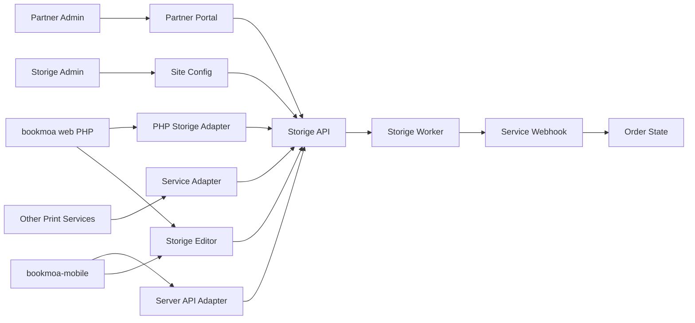

# Bookmoa Storige 외부사이트 플랫폼 연동 개발 가이드

## 현재 판단
- Storige 편집기/워커는 [`/Users/yohan/claude/Bookmoa Storige editor/storige`](/Users/yohan/claude/Bookmoa%20Storige%20editor/storige)에 있고, Node 22 + pnpm workspace 구조입니다. 핵심 앱은 `apps/api`, `apps/editor`, `apps/worker`, `apps/admin`입니다.
- Storige의 1차 목표는 **bookmoa web(PHP 인쇄쇼핑몰)** 을 외부사이트로 연동하는 것입니다. `docs/PHP_INTEGRATION_FINAL_v3.md`, `docs/PLATFORM_WORKER_INTEGRATION_v1.md`, `docs/PHASE_A_SITE_MODEL_REPORT_2026-05-06.md`, `docs/PHASE_B2_C2_C3_FOLLOWUP_REPORT_2026-05-07.md` 기준으로 이미 PHP 영향 0을 목표로 한 멀티사이트 플랫폼화가 들어가 있습니다.
- 다른 외부 서비스도 Storige Admin의 `sites` 행으로 등록되어, 사이트별 `editor_auth_code`, `worker_auth_code`, worker default 옵션, `site_id` 기반 작업/세션 분리로 관리되는 구조입니다. 따라서 bookmoa는 특수 하드코딩 대상이 아니라 **첫 번째 운영 테넌트**로 보는 것이 맞습니다.
- `bookmoa-mobile` 루트는 [`/Users/yohan/Documents/claude/bookmoa-mobile`](/Users/yohan/Documents/claude/bookmoa-mobile)에 있고, React 18 + Vite 단일 앱입니다. 실제 등록 상품은 [`src/App.jsx`](/Users/yohan/Documents/claude/bookmoa-mobile/src/App.jsx)의 `customProducts` / `p4-cprods` 흐름으로 관리됩니다.
- 현재 루트에는 Vercel 서버리스 API가 없습니다. `.claude/worktrees/...`에는 `api/notify-order.js`, `api/toss-confirm.js`가 있지만 루트 앱에는 없습니다. Storige `X-API-Key`는 브라우저에 노출하면 안 되므로 루트에 서버 측 API 어댑터를 추가해야 합니다.
- Storige 문서의 PHP URL 파라미터는 `template_set_id`, `page_count`처럼 snake_case를 쓰지만, 현재 편집기 `EditorView`는 `templateSetId`, `pageCount`, `paperType`, `bindingType` 같은 camelCase를 읽습니다. 직접 `editor.papascompany.co.kr`로 이동할 경우 camelCase를 쓰거나, `bookmoa-mobile` 쪽 어댑터 페이지에서 snake_case를 camelCase로 변환해야 합니다.

## 플랫폼화 확인 결과
- **외부 서비스 관리 단위**: [`apps/api/src/sites/entities/site.entity.ts`](/Users/yohan/claude/Bookmoa%20Storige%20editor/storige/apps/api/src/sites/entities/site.entity.ts)의 `Site`가 외부 쇼핑몰/앱/서비스 1개를 나타냅니다. 예: 북모아 메인, 점보포토, 스튜디오북 등.
- **인증코드 발급/재발급**: [`apps/api/src/sites/sites.service.ts`](/Users/yohan/claude/Bookmoa%20Storige%20editor/storige/apps/api/src/sites/sites.service.ts)가 `editorAuthCode`, `workerAuthCode`를 생성·조회·재발급합니다. `.env API_KEYS`는 부팅 시 DB `sites`에 자동 시드되어 기존 PHP 키가 그대로 작동합니다.
- **요청별 사이트 식별**: [`apps/api/src/auth/guards/api-key.guard.ts`](/Users/yohan/claude/Bookmoa%20Storige%20editor/storige/apps/api/src/auth/guards/api-key.guard.ts)가 `X-API-Key`를 `sites`에서 조회하고 `req.user.siteId`, `siteName`, `role`을 주입합니다.
- **작업/세션 격리**: 외부 `validate/external`, `synthesize/external`, `shop-session`, `edit-sessions` 흐름에서 `site_id`가 자동 주입됩니다. Admin에는 편집 세션/워커 잡 사이트 필터가 이미 들어가 있어 여러 외부 서비스가 같은 Storige 플랫폼을 써도 운영자가 구분할 수 있습니다.
- **사이트별 워커 정책**: `Site`에 `pdfConversionEnabled`, `defaultUnit`, `checkWorkorder`, `checkCutting`, `checkSafezone`이 있고, worker job 생성 시 누락 옵션에 default를 머지하는 방향으로 구현되어 있습니다.
- **결론**: 현재 구조는 “다른 서비스들이 Bookmoa Storige editor의 플랫폼 기능으로 연동”하는 데 맞는 형태입니다. 단, 아래 리스크 항목을 표준 계약으로 정리하고 회귀 테스트를 추가해야 안정적으로 확장됩니다.

## 플랫폼 연동 리스크
- **URL 파라미터 불일치**: PHP 문서는 snake_case, 현재 `EditorView`는 camelCase를 읽습니다. bookmoa PHP를 1차 대상으로 삼을 경우 `editor.papascompany.co.kr`에서 snake_case도 수용하도록 하거나, PHP/어댑터가 camelCase로 변환해야 합니다.
- **Webhook 서명 불일치**: 문서는 HMAC-SHA256을 안내하지만 현재 구현은 `identifier:event:timestamp`를 Base64 인코딩합니다. 재시도 요청에는 서명 헤더가 빠질 수 있습니다. 외부 서비스 표준 문서와 실제 코드 중 하나를 맞춰야 합니다.
- **권한 경계**: `editorAuthCode`와 `workerAuthCode`가 별도 컬럼이지만 Phase A에서는 동일 값으로 시드될 수 있습니다. 외부 서비스가 많아지면 편집기/워커 권한을 실제로 분리 발급하는 운영 정책이 필요합니다.
- **출력 PDF 다운로드**: 결과 PDF는 외부 서비스 서버가 다운로드하거나 프록시해야 합니다. 클라이언트에 Storige 내부 storage 경로나 API Key를 노출하면 안 됩니다.
- **Cloudflare Worker가 아님**: 여기서 “worker”는 Cloudflare Worker가 아니라 NestJS + Bull + Redis 기반 PDF 처리 서비스입니다. 외부 서비스 문서에도 이 용어를 명확히 써야 합니다.
- **도메인 차이로 인한 브라우저 제약**: 외부 사이트 도메인과 Storige API/Editor 도메인이 다르므로 CORS, 쿠키 SameSite, iframe 정책, popup 정책, `postMessage` origin 검증, webhook allowlist가 모두 연동 계약에 포함되어야 합니다.
- **제휴사 관리자 기능 부재**: 현재 Admin 권한은 `SUPER_ADMIN`, `ADMIN`, `MANAGER`, `CUSTOMER` 중심이고, `users` 테이블에는 `site_id`가 없습니다. 제휴사 관리자가 자기 사이트 주문/파일/제작상태만 보는 기능은 별도 개발이 필요합니다.

## 외부 도메인 제약 검토와 대응
- **CORS**: 현재 API는 `CORS_ORIGIN` 환경변수, 로컬 기본값, `*.vercel.app`, `*.papascompany.co.kr`만 허용합니다. 외부 서비스가 `bookmoa.co.kr`, `jumbophoto.co.kr`처럼 다른 도메인에서 직접 API를 호출하면 차단될 수 있습니다. 대응은 `sites.domain`과 별도 `allowedOrigins` 필드를 Admin에서 관리하고, API CORS origin callback이 DB/캐시 기반 allowlist를 보도록 개선합니다.
- **API Key 노출**: `X-API-Key`는 브라우저 CORS 호출에 쓰면 안 됩니다. 각 외부 사이트는 반드시 자체 서버 어댑터에서 `shop-session`, `files/upload/external`, `worker-jobs/*/external`을 호출해야 합니다. 브라우저에는 단기 JWT 또는 편집기 진입 URL만 전달합니다.
- **쿠키 SameSite/서드파티 쿠키**: 현재 shop-session은 HttpOnly 쿠키를 `sameSite: lax`, `path: /api`로 설정합니다. 외부 사이트 iframe 안에서 Storige API 쿠키를 기대하면 브라우저의 서드파티 쿠키 차단에 걸릴 수 있습니다. 대응은 외부 embed 모드에서는 쿠키 의존을 최소화하고, 서버가 받은 `accessToken`을 `StorigeEditor.create({ token })` 또는 편집기 URL 파라미터/일회성 세션 코드로 전달하는 방식으로 통일합니다.
- **iframe 제한**: 외부 사이트 안에 Storige 편집기를 iframe/embed로 띄우려면 Storige Editor 응답 헤더가 `X-Frame-Options: DENY/SAMEORIGIN`이면 안 되고, `Content-Security-Policy frame-ancestors`에 허용 파트너 도메인이 들어가야 합니다. 대응은 `sites.domain`을 기준으로 nginx/Vercel 헤더에 `frame-ancestors 'self' https://partner-domain`을 동적으로 반영하거나, iframe 대신 새 탭/팝업 방식으로 표준화합니다.
- **팝업/새 탭 제약**: “필요한 시점에만 편집기 뜨기”를 새 창으로 구현하면 사용자 클릭 이벤트 안에서만 `window.open`이 안정적으로 동작합니다. 비동기 API 호출 뒤 새 창을 열면 팝업 차단이 발생할 수 있으므로 먼저 빈 창을 열고 로딩 후 URL을 세팅하거나, 동일 페이지 modal iframe 방식을 사용합니다.
- **postMessage 보안**: iframe 편집기 완료 이벤트는 반드시 `event.origin`이 등록된 Storige Editor 도메인인지 확인해야 하며, Storige Editor도 `targetOrigin='*'` 대신 `returnUrlBase` 또는 `parentOrigin`을 명시해야 합니다. 대응은 `parentOrigin`을 편집기 진입 계약에 추가하고, `sites.domain`과 일치하는지 서버에서 검증합니다.
- **Webhook allowlist**: Storige webhook은 `WEBHOOK_ALLOWED_HOSTS`에 없는 콜백 URL을 차단합니다. 외부 사이트 온보딩 시 `sites.uploadCallbackUrl`의 host를 allowlist에 등록하거나, 코드가 `sites` 테이블 기반으로 callback host를 검증하도록 개선합니다.
- **정적 자산/CDN**: 외부 사이트가 IIFE 번들을 자체 CDN에서 로드하는 경우 버전 불일치가 생길 수 있습니다. 공급자 관점에서는 `editorVersion`, `bundleUrl`, `cssUrl`, `integrity`를 Site 설정에 보관하고, 운영 버전과 가이드 버전을 함께 관리해야 합니다.
- **도메인별 OAuth/로그인 혼동 방지**: 제휴사 관리자 로그인은 Storige Admin 도메인에서만 처리하고, 외부 쇼핑몰 고객 로그인과 섞지 않습니다. 고객 편집 권한은 `shop-session` JWT, 파트너 운영 권한은 Admin JWT로 분리합니다.

## 목표 아키텍처

## 1단계: Storige Admin 외부사이트 설정 확정
- Storige Admin `기본설정 > 사이트`를 외부 연동의 단일 관리 화면으로 사용합니다.
- bookmoa web(PHP)은 `북모아 메인` 사이트로 등록되어야 하며, 기존 `STORIGE_API_KEY`는 그대로 사용 가능합니다.
- 새 외부 서비스는 사이트 등록 → 인증코드 발급 → worker default 옵션 설정 → callback URL/도메인 등록 → 안전 채널로 키 전달 순서로 온보딩합니다.
- 서비스별로 아래 값을 기록합니다.
  - `site.name`: 운영 표시명
  - `domain`: 외부 서비스 도메인
  - `returnUrlBase`: 편집 완료 후 돌아갈 기본 URL
  - `uploadCallbackUrl`: PDF 결과 저장 webhook
  - `editorAuthCode`: 편집기/shop-session/API 호출용 키
  - `workerAuthCode`: 워커 호출용 키
  - `allowedOrigins`: 브라우저 CORS 허용 origin 목록
  - `frameAncestors`: iframe embed 허용 parent origin 목록
  - `editorLaunchMode`: `iframe` 또는 `new_tab`
  - `editorBundleUrl`, `editorCssUrl`, `editorVersion`: embed 번들 공급 정보
  - worker default 옵션: PDF 변환, 단위, 작업서/재단선/안전선 체크
- API CORS, webhook allowlist, iframe CSP를 환경변수 수동 관리에서 Site 설정 기반으로 옮기는 작업을 플랫폼 안정화 P0로 둡니다.

## 2단계: bookmoa web(PHP) 1차 연동 확정
- PHP 쇼핑몰은 Storige 플랫폼의 첫 운영 테넌트입니다. 기존 `STORIGE_API_KEY` 호환을 유지하고, PHP 코드는 `X-API-Key`를 서버에서만 사용합니다.
- PHP 측 필수 흐름:
  - 주문/상품 선택 시 `POST /auth/shop-session`으로 JWT 발급
  - 상품의 `sortcode + stanSeqno` 또는 확정 `templateSetId`로 편집기 URL 생성
  - 편집 완료 후 `sessionId`, `coverFileId`, `contentFileId`를 주문 DB에 저장
  - 주문 확정 시 `check-mergeable/external` → `synthesize/external` 호출
  - `synthesis.completed` webhook 수신 후 결과 PDF를 PHP 서버 저장소 또는 주문 파일 테이블에 저장
- PHP 문서와 실제 에디터 URL 파라미터를 맞추는 작업을 P0로 둡니다. 권장 표준은 외부 문서에 맞춰 `template_set_id`, `order_seqno`, `page_count`, `paper_type`, `binding_type`, `return_url`을 수용하도록 에디터가 호환 레이어를 갖는 방식입니다.

## 3단계: 도메인 연동 보안 계층 정리
- Site 설정에 등록된 도메인을 기준으로 아래 네 가지 검증을 일관되게 처리합니다.
  - API CORS origin 허용
  - Editor iframe `frame-ancestors` 허용
  - `postMessage` 송수신 origin 검증
  - webhook callback host 허용
- 외부 사이트별 편집기 진입 토큰은 1시간 이하 단기 JWT를 기본으로 하고, 새 창/iframe에 장기 API Key를 절대 넣지 않습니다.
- 고객 편집 흐름은 `shop-session` JWT로, 파트너 운영자 흐름은 Admin JWT + site scope로 분리합니다.
- 외부 서비스용 표준 embed 옵션:
  - `siteCode` 또는 `siteId`
  - `orderSeqno` / `orderId`
  - `templateSetId`
  - `parentOrigin`
  - `returnUrl`
  - `callbackUrl`
  - `mode`
  - `pageCount`, `paperType`, `bindingType`, `width`, `height`

## 4단계: 제휴사 관리자/주문처리 기능 추가
- 현재 상태:
  - [`packages/types/src/index.ts`](/Users/yohan/claude/Bookmoa%20Storige%20editor/storige/packages/types/src/index.ts)의 `UserRole`에는 `PARTNER_ADMIN`, `PARTNER_OPERATOR`가 없습니다.
  - [`apps/api/src/auth/entities/user.entity.ts`](/Users/yohan/claude/Bookmoa%20Storige%20editor/storige/apps/api/src/auth/entities/user.entity.ts)의 `users` 엔티티에는 `site_id`가 없습니다.
  - Admin에는 사이트 필터가 있는 편집세션/워커잡 목록은 있으나, 제휴사가 자기 주문만 처리하는 파트너 포털/주문처리 메뉴는 없습니다.
- 데이터 모델 개선:
  - `UserRole.PARTNER_ADMIN`, `UserRole.PARTNER_OPERATOR` 추가
  - `users.site_id` nullable FK 추가
  - 필요 시 `partner_profiles` 또는 `site_users` 테이블 추가
  - `worker_jobs`, `file_edit_sessions`, `files`의 `site_id` 정합성 강화
  - 외부 주문을 별도 관리하려면 `partner_orders` 또는 `external_orders` 테이블 추가
- 권한 정책:
  - `SUPER_ADMIN/ADMIN`: 모든 사이트 조회/처리
  - `MANAGER`: 내부 운영 범위 전체 또는 지정 범위
  - `PARTNER_ADMIN`: 자기 `site_id`의 주문, 편집세션, 워커잡, PDF 파일 조회/다운로드/상태 변경
  - `PARTNER_OPERATOR`: 자기 `site_id`의 주문처리, 제작상태 변경, PDF 다운로드만 허용
  - `CUSTOMER`: 편집기 고객 세션 전용
- API 개선:
  - 공통 `SiteScopeGuard` 또는 인터셉터 추가: 파트너 역할이면 모든 목록/상세 조회에 `siteId=user.siteId` 강제
  - `GET /partner/orders`, `GET /partner/orders/:id`, `PATCH /partner/orders/:id/status`
  - `GET /partner/worker-jobs`, `GET /partner/files/:id/download`
  - 기존 `edit-sessions`, `worker-jobs`, `files` 상세 조회에도 site scope 검증 추가
- Admin UI 개선:
  - 로그인 후 역할에 따라 메뉴 분리
  - 제휴사 메뉴: `주문관리`, `PDF 검수/다운로드`, `제작관리`, `편집데이터`, `워커 작업`
  - 내부 관리자 메뉴: 기존 `기본설정`, `템플릿`, `라이브러리`, 전체 `워커관리` 유지
  - 파트너 화면은 사이트 선택 드롭다운을 숨기고 자기 사이트로 고정
- 주문처리 기능:
  - 주문 목록: 외부 주문번호, 고객명/회사명, 상품, 편집 상태, PDF 검증 상태, 합성 상태, 제작 상태
  - 상세: 편집 미리보기, 원본 PDF, 검증 리포트, 합성 PDF 다운로드, webhook 이력, 작업 메모
  - 상태: `received`, `editing`, `validated`, `pdf_ready`, `production`, `shipped`, `completed`, `failed`
  - 파일 다운로드는 API가 권한 확인 후 스트리밍하며 storage 내부 경로를 노출하지 않습니다.
- 개발 순서:
  1. 역할/사용자 site scope DB 마이그레이션
  2. JWT payload와 `RolesGuard`/신규 `SiteScopeGuard` 확장
  3. worker_jobs/edit_sessions/files 목록·상세·다운로드 site scope 적용
  4. 파트너 주문처리 API 추가
  5. Admin 메뉴/라우팅 역할별 분리
  6. 파트너 주문처리 화면 구현
  7. E2E: A 사이트 파트너가 B 사이트 파일/잡/주문 접근 불가 검증

## 5단계: 환경 변수와 서버 어댑터 추가
- `bookmoa-mobile` 또는 다른 외부 서비스에 Vercel Function/PHP/Node 서버 API를 추가합니다. `bookmoa-mobile`의 기본 권장 위치는 루트 `api/storige/*.js`입니다.
- 서버에만 보관할 환경 변수:
  - `STORIGE_API_BASE=https://api.papascompany.co.kr/api`
  - `STORIGE_API_KEY=sk-storige-...`
  - `STORIGE_EDITOR_URL=https://editor.papascompany.co.kr`
  - `STORIGE_WEBHOOK_URL=https://service-domain/api/storige/webhook`
- 클라이언트에는 `X-API-Key`를 절대 내려주지 않습니다. 클라이언트는 항상 자기 서비스의 서버 어댑터만 호출합니다.

## 6단계: 상품과 Storige 템플릿셋 연결
- Storige에는 이미 외부 상품별 템플릿셋 조회 API가 있습니다: [`apps/api/src/templates/product-template-sets.controller.ts`](/Users/yohan/claude/Bookmoa%20Storige%20editor/storige/apps/api/src/templates/product-template-sets.controller.ts)
- 호출 계약:
  - `GET /api/product-template-sets/by-product?sortcode=...&stanSeqno=...`
  - 인증: `X-API-Key`
  - 응답: `templateSets[{ id, name, type, width, height, thumbnailUrl, isDefault }]`
- `bookmoa-mobile`의 등록 상품 데이터에 Storige 매핑 필드를 추가합니다.
  - 일반 도서/제본 상품: `sortcode`, `stanSeqno`, `templateSetId`
  - 커스텀 상품: `storigeTemplateSetId`, `storigeProductSortcode`, `storigeStanSeqno`, `allowEditor`
- 현재 상품 등록 UI는 [`src/App.jsx`](/Users/yohan/Documents/claude/bookmoa-mobile/src/App.jsx)의 `ProductEditor`에 있으므로, 여기서 Storige 템플릿셋 선택 필드를 추가하는 것이 가장 짧은 경로입니다.

## 7단계: 편집기 진입 흐름 연결
- 장바구니 담기 전에 “편집기로 작업하기” 버튼을 추가합니다.
- 서버 어댑터가 `POST /auth/shop-session`을 호출해 JWT를 발급받습니다. 실제 구현은 [`apps/api/src/auth/auth.controller.ts`](/Users/yohan/claude/Bookmoa%20Storige%20editor/storige/apps/api/src/auth/auth.controller.ts)에 있고 응답은 `success`, `accessToken`, `expiresIn`, `member`입니다.
- 편집기 실행 방식은 두 가지 중 하나로 통일합니다.
- 권장 A: `bookmoa-mobile` 내부 `/storige/edit` 페이지를 만들고 `window.StorigeEditor.create(...)`로 embed 번들을 마운트합니다. 계약은 [`apps/editor/src/embed.tsx`](/Users/yohan/claude/Bookmoa%20Storige%20editor/storige/apps/editor/src/embed.tsx)의 `EditorConfig`를 따릅니다.
- 대안 B: 운영 편집기 URL로 이동합니다. 이 경우 camelCase 쿼리로 `templateSetId`, `pageCount`, `paperType`, `bindingType`, `width`, `height`를 전달해야 합니다.
- 외부 사이트가 iframe 방식을 쓰면 `parentOrigin`을 필수로 받고, 완료/저장/에러 이벤트의 `postMessage` origin을 양쪽에서 검증합니다.
- 외부 사이트가 새 탭 방식을 쓰면 사용자 클릭 이벤트 안에서 창을 열고, 편집 완료 후 `returnUrl`로 복귀하거나 서버 webhook 상태를 폴링합니다.

## 8단계: 편집 완료 결과를 주문/장바구니에 저장
- 편집기 `onComplete(result)`는 `sessionId`, `orderSeqno`, `files.coverFileId`, `files.contentFileId`를 반환합니다.
- 현재 `Configure.handleAdd`와 `ProdConfigure.handleAdd`는 Supabase Storage URL 또는 파일명만 `files`에 저장합니다. 이 구조에 Storige 필드를 추가합니다.
- 권장 저장 형태:
  - `storige.sessionId`
  - `storige.coverFileId`
  - `storige.contentFileId`
  - `storige.templateSetId`
  - `storige.status = edited | validated | synthesis_pending | completed | failed`
  - `storige.siteId` 또는 `storige.siteName`은 Storige 응답/관리 화면 조회용으로만 사용하고, 외부 서비스의 권한 판단은 자체 주문 DB 기준으로 합니다.

## 9단계: PDF 업로드와 검증 워커 연결
- 일반 업로드 파일을 Storige 검증 대상으로 쓸 경우 서버 어댑터에서 `POST /files/upload/external`을 호출합니다. 실제 엔드포인트는 [`apps/api/src/files/files.controller.ts`](/Users/yohan/claude/Bookmoa%20Storige%20editor/storige/apps/api/src/files/files.controller.ts)입니다.
- 검증 워커는 `POST /worker-jobs/validate/external`을 사용합니다. DTO는 [`apps/api/src/worker-jobs/dto/worker-job.dto.ts`](/Users/yohan/claude/Bookmoa%20Storige%20editor/storige/apps/api/src/worker-jobs/dto/worker-job.dto.ts)의 `CreateValidationJobDto`를 따릅니다.
- 주문 옵션은 `orderOptions`로 정규화합니다.
  - `size.width`, `size.height`: 판형 mm
  - `pages`: 내지 페이지 수
  - `binding`: `perfect`, `saddle`, `spring`
  - `bleed`: 기본 3mm
  - `paperThickness`: 책등 계산이 필요한 경우 전달
- 검증 기준과 에러 코드는 [`docs/PDF_VALIDATION_API.md`](/Users/yohan/claude/Bookmoa%20Storige%20editor/storige/docs/PDF_VALIDATION_API.md)를 기준으로 UI 메시지에 매핑합니다.
- 여러 외부 서비스가 같은 worker API를 사용해도 `X-API-Key → siteId`가 자동 주입되므로 작업 목록과 통계는 사이트별로 구분됩니다.

## 10단계: 결제/주문 완료 시 합성 워커 호출
- 결제 또는 주문 확정 시 서버 어댑터에서 `POST /worker-jobs/synthesize/external`을 호출합니다. 실제 컨트롤러는 [`apps/api/src/worker-jobs/worker-jobs.controller.ts`](/Users/yohan/claude/Bookmoa%20Storige%20editor/storige/apps/api/src/worker-jobs/worker-jobs.controller.ts)입니다.
- 필수/권장 값:
  - `coverFileId`
  - `contentFileId`
  - `spineWidth`
  - `bindingType`: `perfect`, `saddle`, `hardcover`
  - `outputFormat`: `merged` 또는 `separate`
  - `orderId`: `bookmoa-mobile` 주문번호
  - `editSessionId`: 편집기를 사용한 주문이면 전달
  - `callbackUrl`: `STORIGE_WEBHOOK_URL`
- 합성 전 사전 점검은 `POST /worker-jobs/check-mergeable/external`로 수행합니다. DTO는 [`apps/api/src/worker-jobs/dto/check-mergeable.dto.ts`](/Users/yohan/claude/Bookmoa%20Storige%20editor/storige/apps/api/src/worker-jobs/dto/check-mergeable.dto.ts)입니다.

## 11단계: Webhook과 결과 PDF 저장
- Storige webhook은 [`apps/api/src/webhook/webhook.service.ts`](/Users/yohan/claude/Bookmoa%20Storige%20editor/storige/apps/api/src/webhook/webhook.service.ts)를 통해 전송됩니다.
- 헤더:
  - `X-Storige-Event`
  - `X-Storige-Signature`
- 이벤트:
  - `synthesis.completed`
  - `synthesis.failed`
  - `validation.completed`
  - `validation.fixable`
  - `validation.failed`
- `bookmoa-mobile`의 webhook API는 `jobId`, `orderId`, `status`, `outputFileUrl`, `errorMessage`를 주문 상태에 반영합니다.
- 결과 PDF 다운로드는 `GET /worker-jobs/{jobId}/output`을 사용하되, 클라이언트가 Storige URL을 직접 호출하지 않고 `bookmoa-mobile` 서버가 프록시 또는 자체 저장소로 복사합니다.
- 운영 전에 `WEBHOOK_ALLOWED_HOSTS`에 bookmoa web, bookmoa-mobile, 기타 외부 서비스 도메인을 등록해야 합니다.
- 표준 webhook 서명 방식은 구현과 문서를 맞춘 뒤 확정합니다. 현재 코드 기준으로 받으려면 Base64 서명을 검증하고, HMAC으로 바꿀 경우 모든 외부 서비스 SDK/샘플을 동시에 갱신합니다.

## 12단계: 테스트 순서
- Storige Admin에서 `북모아 메인` 사이트와 테스트 외부 서비스 사이트를 각각 등록하고, 서로 다른 인증코드를 발급합니다.
- 각 사이트의 `allowedOrigins`, `frameAncestors`, `uploadCallbackUrl`을 등록하고 CORS/iframe/webhook이 모두 통과하는지 확인합니다.
- Storige Admin에서 테스트 상품 `sortcode + stanSeqno`와 템플릿셋을 연결합니다.
- bookmoa web(PHP)에서 기존 `STORIGE_API_KEY`로 `shop-session`, `validate/external`, `synthesize/external` 호출이 통과하는지 확인합니다.
- `bookmoa-mobile` 상품 등록 UI에서 동일 `sortcode`, `stanSeqno`, `templateSetId`를 저장합니다.
- 상품 상세에서 편집기 열기 → `shop-session` 발급 → 에디터 로드 → 편집 완료 → `sessionId`, `coverFileId`, `contentFileId` 저장을 확인합니다.
- 업로드 PDF 또는 편집 결과에 대해 `check-mergeable`과 `validate/external`을 호출합니다.
- 주문 확정 시 `synthesize/external`을 호출하고 webhook으로 `synthesis.completed`가 들어오는지 확인합니다.
- 결과 PDF를 서버에서 내려받아 주문 상세/관리자 주문 화면에 연결합니다.
- Admin `편집데이터관리`와 `워커관리 > 작업 목록`에서 사이트 필터로 북모아와 테스트 외부 서비스 작업이 분리되는지 확인합니다.
- 제휴사 관리자 계정으로 로그인해 자기 사이트 주문/PDF만 보이고, 다른 사이트의 주문/파일/job 상세 URL 직접 접근은 403인지 확인합니다.

## 주요 주의점
- `bookmoa-mobile` 루트는 현재 client-only 상태이므로 Storige 연동의 첫 작업은 서버 API 어댑터 추가입니다.
- 문서의 snake_case URL과 실제 `EditorView`의 camelCase URL이 어긋납니다. 구현 전에 하나로 표준화해야 합니다.
- `POST /auth/shop-session`은 현재 컨트롤러 기준 HTTP 200입니다. 일부 문서 예시는 201로 되어 있으므로 클라이언트는 2xx 성공으로 처리하는 편이 안전합니다.
- webhook 허용 호스트는 Storige API의 `WEBHOOK_ALLOWED_HOSTS`에 포함되어야 합니다. 운영 도메인이 확정되면 Storige 서버 설정에 등록해야 합니다.
- 외부 서비스가 늘어날수록 공통 SDK/샘플 코드가 필요합니다. PHP용, Node/Vercel용, Python/Go용 예시는 `PLATFORM_WORKER_INTEGRATION_v1.md`를 기준으로 생성하되 실제 구현과 서명 방식이 맞는지 먼저 정리합니다.
- 파트너 관리자 기능은 보안 범위가 크므로 편집기 연동보다 뒤에 “운영 포털 Phase”로 분리하되, `site_id` 권한 모델은 지금부터 모든 API에 일관되게 적용해야 합니다.