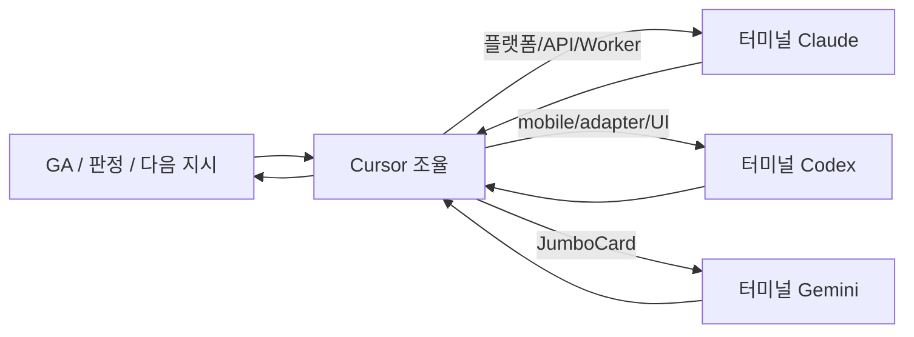

# Storige × bookmoa-mobile 연동 — Cursor 조율 협업 계획

> **작성일**: 2026-05-20  
> **운영 방식**: **Cursor가 두 프로젝트를 조율**하고, 터미널 **Claude(Code)** / **Codex** 에 작업을 분배·지시  
> **Codex Desktop 이관**: **취소** — 기존 3-터미널(Claude / Codex / Gemini) + Cursor 구조 유지

---

## 1. 작업 목적 (왜 이 연동을 했는가)

| 목표 | 설명 |
|------|------|
| **플랫폼화** | Storige = 인쇄 편집·PDF 워커·API 플랫폼 (VPS) |
| **테넌트 쇼핑몰** | bookmoa-mobile = 견적·주문·결제 SPA (Vercel) — Storige를 **서버 어댑터**로만 호출 |
| **v1 인쇄 워크플로우** | 면지·PDF 첨부·게스트 24h·레더커버·`compose-mixed` 합본·게스트→회원 전환 |
| **PHP 무영향** | 레거시 PHP 북모아 쇼핑몰은 코드 변경 없음 (`PHP_NOTICE`는 통보·회귀용) |
| **Pilot** | 운영 GA 통과 후 실사용 오픈 |

**단일 진실**: 필드·스키마 → `Bookmoa_platform_Plan.md` Phase 4·5·6 / API 계약 → `docs/PLATFORM_INTEGRATION_v1.md`

---

## 2. 아키텍처 (한 줄)

```
고객 → bookmoa-mobile (React + /api/storige/*)
         → Storige API (api.papascompany.co.kr)
         → Worker (validate / synthesize / compose-mixed)
         → webhook → bookmoa Supabase p4-orders

편집 → iframe editor.papascompany.co.kr
         ↔ postMessage (editor.complete, editor.needAuth)
         ↔ StorigeEditorHost.jsx
```

---

## 3. 역할 분담 (고정)

| 역할 | 도구 | 저장소 | cwd 주의 |
|------|------|--------|----------|
| **조율·지시·GA·문서** | **Cursor** (본 채팅) | 양쪽 읽기, storige에 핸드오프 MD | — |
| **플랫폼 구현** | 터미널 **Claude Code** | `storige` | `~/claude/.../storige` |
| **테넌트 연동** | 터미널 **Codex** | `bookmoa-mobile` | **`cd bookmoa-mobile` 필수** (storige cwd 착시 주의) |
| **JumboCard** | 터미널 **Gemini** | `PrintCard Studio` | 별도 트랙, v1 GA와 병렬 가능 |

**Cursor가 할 일**: 작업 범위 쪼개기 → `.tmp_*_prompt.md` 또는 `@docs2/...` 지시문 작성 → 결과 검수 → GA 실패 시 담당 에이전트 재지시.

**Cursor가 하지 않을 일**: bookmoa에 API Key 노출, PHP 레거시 무단 수정, v1 범위 밖 대규모 신규 기능.

---

## 4. 터미널별 완료 내역

### 4.1 Claude Code (터미널 · storige) — v1 Phase 1~8 **완료**

**HEAD**: `01e056d` (master, origin 동기화, working tree clean)  
**VPS**: API/Worker/DB 배포 완료, 최근 커밋은 docs-only → 재배포 불필요

| Phase | 커밋 | 핵심 산출 |
|-------|------|-----------|
| 1 | `7a4443e` | `POST /storage/upload-public` (게스트 50MB) |
| 2 | `8aedc9c` | DB 스키마 + 게스트 24h EVENT |
| P0 | `6b4de7d` | `event_scheduler=ON` |
| 3 | `d8f4e81` | Admin TemplateSetForm (면지/표지/레더) |
| 4 | `9491fe2` | Editor 게스트·PDF첨부·검증·레더커버 |
| 5 | `50c0d1c` | Worker **compose-mixed** + EditorWorkflowControls |
| 6 | `b45f614` | migrate / my-sessions / GuestAuthPrompt / `/my-works` |
| 7 | `ae59dd1` | PHP_NOTICE + 연동 문서 부록 |
| 8 | `c48e21e` | EDITOR §13, RESUME 2026-05-20, fabric-editor SKILL |
| handoff | `01e056d` | GA 체크리스트, WORKER_EDITOR 핸드오프, Gemini Phase2 프롬프트 |

**Claude 상태**: **Standby** — v2 진입 또는 **GA 핫픽스** 신호 대기.

---

### 4.2 Codex (터미널 · bookmoa-mobile) — 테넌트 연동 **완료**

**HEAD**: `ab79d71` (main, origin — **로컬이 behind 1이면 `git pull`**)  
**Vercel**: 배포 완료 (보안 패치 + 기존 Storige 연동 포함)

| 구간 | 커밋 예 | 핵심 산출 |
|------|---------|-----------|
| K1~K3 | `d27cd5e`~`6be49d7` | 호환 점검, 24h 배너, cart 검증 UI, receiver outline |
| M1~M4 | `7d10fdd`~`04f1d4b` | ProductEditor Phase2, template-sets, Orders UI |
| Phase 3~4 | `39067d3`~`db3cd1e` | shop-session, upload/validate/polling, smoke checklist |
| Phase 5~6 | `b2a56ba`~`92234f2` | migrate-guest, my-sessions, MyDesigns, `[...storige].js` |
| Phase 7 | `1930274`~`747405c` | needAuth→migrate, compose-mixed Orders, synthesize 정책 |
| docs | `9f053cb` | Phase 7 smoke checklist 갱신 |

**의도적 미구현** (Codex 명시):
- 결제 후 **synthesize 자동 트리거**
- **fixable 자동 보정** UX

**Codex 상태**: **Standby** — GA 실패 시 mobile/UI/adapter 핫픽스, 정책 결정 후 자동화.

---

### 4.3 Cursor (본 세션) — 조율·문서

| 산출 | 경로 |
|------|------|
| Worker/Editor 핸드오프 | `docs2/WORKER_EDITOR_INTEGRATION_HANDOFF.md` |
| Pilot GA 체크리스트 | `docs2/V1_PILOT_GA_CHECKLIST.md` |
| Gemini JumboCard Phase2 지시 | `docs2/GEMINI_JUMBOCARD_PHASE2_PROMPT.md` |
| **본 협업 계획** | `docs2/CURSOR_ORCHESTRATION_PLAN.md` |

---

## 5. 현재 진행 단계

```
[완료] v1 코드 + 문서 + 운영 배포 (Claude + Codex)
   ↓
[진행 중] Pilot 운영 검증 (GA) — 주로 사용자 브라우저 + Cursor 조율
   ↓
[대기] GO/NO-GO 판정 → v1 polish 또는 v2 (JumboCard / card imposition)
```

| 항목 | 상태 |
|------|------|
| API health | ✅ ok |
| editor / admin / bookmoa URL | ✅ 200 |
| **bookmoa 보안 패치** | ✅ `ab79d71` on origin/main — **로컬 pull + Supabase migrate + env 3종 대기** |
| **Storige × 보안 정렬** | ⏳ P-SEC-1~2 (Codex) — [`bookmoa-mobile/docs2/storige_security_alignment.md`](../../Documents/claude/bookmoa-mobile/docs2/storige_security_alignment.md) |
| GA 시나리오 실행 | ⏳ 사용자·Cursor |
| synthesize 자동화 정책 | ⏳ 사용자 결정 |
| JumboCard 실연동 | ⏳ Gemini Phase2 (별도) |

---

## 5.1 보안 패치(2026-05-21)와 Storige 연동

**별도 세션**에서 bookmoa-mobile `ab79d71` (보안 감사 19건)이 main에 올라갔습니다. Storige v1 연동(`9f053cb`~`747405c`)과 **병합은 되었으나**, Storige PDF 경로에는 아직 C-4 헬퍼가 **미적용**입니다.

| 구간 | Configure/ProdConfigure | StorigeFileUploadPanel | api/storige/files/upload |
|------|----------------------|------------------------|--------------------------|
| C-4 `file-validate.js` | ✅ (ab79d71) | ⚠️ 수동 pdf 체크만 | ⚠️ raw proxy |
| Storige API upstream | — | PDF+100MB (플랫폼) | PDF+100MB |

**Codex 우선 작업** (GA 전 권장):

1. **P-SEC-1** — `StorigeFileUploadPanel`에 `validateOrderFile` + `sanitizeFilename`
2. **P-SEC-2** — `upload.js` Content-Length/ multipart 가드
3. **RLS** — Supabase migrate 후 `anon_*` 중복 정책 운영 협의 (`p4-orders` read 차단 ↔ Orders UI 확인)

상세: `bookmoa-mobile/docs2/storige_security_alignment.md`

**사용자 선행**: Supabase 마이그레이션 3개 + Vercel env 3개 (`SUPABASE_SERVICE_ROLE_KEY`, `TOSS_WEBHOOK_SECRET`, `SUPABASE_URL`)

---

## 6. 이후 진행 방법 (Cursor 조율 워크플로)

### 6.1 일반 사이클



1. **Cursor**가 `git log`, 체크리스트, 실패 보고를 읽고 **담당 1곳**만 지정  
2. **지시문** 작성: `storige/.tmp_claude_*.md` 또는 `bookmoa-mobile/.tmp_codex_*.md` (또는 `docs2/` 영구 MD)  
3. 사용자가 해당 터미널에 `@파일` 또는 프롬프트 붙여넣기  
4. 완료 보고 → **Cursor**가 빌드·회귀·저장소 경계 검수  
5. 필요 시 **커밋/푸시/배포** 지시 (에이전트별 repo 분리)

### 6.2 실패 시 라우팅

| 증상 | 담당 |
|------|------|
| API 4xx/5xx, Worker, DB, Editor 버그 | **Claude** (storige) + VPS 재배포 |
| `/api/storige/*`, webhook, Cart/Orders UI | **Codex** (bookmoa-mobile) |
| Admin 매핑, GA 시나리오, GO/NO-GO | **사용자** + Cursor |
| JumboCard, 카드 조판 | **Gemini** + (v2) Claude Worker |

### 6.3 커밋·배포 규칙

| 저장소 | 브랜치 | 배포 |
|--------|--------|------|
| storige | `master` | API/Worker: VPS `docker compose` / Editor·Admin: Vercel 자동 |
| bookmoa-mobile | `main` | Vercel 자동 |

**SSH**: `deploy@158.247.235.202` 만 — `CLAUDE.local.md` 참조.

---

## 7. 협업 개발 계획 (로드맵)

### Phase A — Pilot GA (지금 ~ 1주)

| # | 담당 | 작업 |
|---|------|------|
| A1 | **사용자** | Storige Admin + bookmoa Admin 매핑 (`sortcode`/`stanSeqno`) |
| A1b | **사용자** | `git pull` + Supabase migrate 3 + Vercel env 3 (`ab79d71`) |
| A2 | **사용자** | `docs2/V1_PILOT_GA_CHECKLIST.md` Track A~C 실행, §9 기록 |
| A2b | **Codex** | P-SEC-1~2 Storige PDF 경로에 `file-validate` 적용 (GA 전 권장) |
| A3 | **Cursor** | FAIL 항목 분석 → Claude/Codex 지시문 생성 |
| A4 | **Claude** | GA 중 플랫폼 핫픽스만 (범위 최소) |
| A5 | **Codex** | GA 중 mobile/adapter 핫픽스만 |
| A6 | **사용자** | GO / NO-GO 판정 |

**GO 기준**: C-A, C-D, C-E, C-J, C-K PASS + API Key 미노출 (체크리스트 §6).

---

### Phase B — v1 운영 안정화 (GA GO 후)

| # | 담당 | 작업 | 전제 |
|---|------|------|------|
| B1 | **사용자** | synthesize 호출 정책 결정 (수동 / 결제 후 / webhook) | `bookmoa-mobile/docs2/storige_synthesize_policy.md` |
| B2 | **Codex** | 정책에 따른 synthesize 연동 (중복 방지 포함) | B1 |
| B3 | **Codex** | fixable 자동 보정 UX (선택) | 사용자 OK |
| B4 | **Claude** | compose-mixed fixable 자동 convert (선택) | B3 |
| B5 | **Codex** | Orders webhook UI 고도화, editor-config 보안 검토 | 운영 피드백 |
| B6 | **Claude** | `/my-works` polish (페이지네이션·다운로드) | 낮은 우선순위 |

---

### Phase C — v2 후보 (별도 스프린트, GA 데이터 후)

| 트랙 | 담당 | 내용 |
|------|------|------|
| **C1 JumboCard** | Gemini + Claude | Phase2 어댑터·E2E → `synthesize-imposition` Worker |
| **C2 Card imposition** | Claude (Worker) + Gemini | 명함재단기 센서 마커 |
| **C3 Group B** | Claude + Codex | Pilot 메트릭 기반 UX/성능 |
| **C4 PHP** | (보류) | MariaDB 이관은 React 안정화 후 |

**v2 진입 전 Cursor가 사용자에게 확인할 3가지**:
1. 우선순위: JumboCard vs card imposition vs Group B  
2. Pilot 성공 지표 (검증 통과율, 게스트 전환율 등)  
3. Supabase 의존 유지 여부  

---

## 8. Cursor → 터미널 지시 템플릿 (복사용)

### Claude (storige) — GA 핫픽스 예시

```markdown
저장소: /Users/yohan/claude/Bookmoa Storige editor/storige
참고: docs2/CURSOR_ORCHESTRATION_PLAN.md, .cursor/plans/RESUME_PROMPT_2026-05-20.md

GA 실패: [시나리오 ID, 예: C-K]
증상: [한 줄]
재현: [URL, endpoint]

범위: 최소 diff만. bookmoa-mobile write 금지.
완료 후: 커밋 메시지 + VPS 재배포 필요 여부 보고.
```

### Codex (bookmoa-mobile) — GA 핫픽스 예시

```markdown
cd /Users/yohan/Documents/claude/bookmoa-mobile
참고: AGENTS.md, docs2/storige_phase3_4_smoke_checklist.md

GA 실패: [시나리오 ID]
증상: [한 줄]

범위: api/storige/* 또는 src/components/Storige*.jsx 만.
storige write 금지. npm run build + secret rg 0건 필수.
완료 후: 커밋 + push (main).
```

### Codex — 정책 구현 (GA GO 후)

```markdown
cd /Users/yohan/Documents/claude/bookmoa-mobile
정책: [결제 후 자동 synthesize / 수동 유지]
참고: docs2/storige_synthesize_policy.md

구현 범위: PaymentResult 또는 webhook 후속만. idempotency 필수.
```

---

## 9. 문서 색인

| 문서 | 용도 |
|------|------|
| **본 문서** | Cursor 조율·로드맵 |
| `docs2/WORKER_EDITOR_INTEGRATION_HANDOFF.md` | Claude/Codex 완료·잔여 상세 |
| `docs2/V1_PILOT_GA_CHECKLIST.md` | GA 실행 |
| `.cursor/plans/RESUME_PROMPT_2026-05-20.md` | v1 완료 스냅샷 |
| `docs/PHP_NOTICE_2026-05-19_pdf_attach_endpapers.md` | API·webhook·needAuth |
| `bookmoa-mobile/AGENTS.md` | Codex 상시 컨텍스트 |
| `bookmoa-mobile/docs2/storige_synthesize_policy.md` | synthesize 정책 |
| **`bookmoa-mobile/docs2/storige_security_alignment.md`** | 보안 패치 × Storige 연동 gap |
| `docs2/GEMINI_JUMBOCARD_PHASE2_PROMPT.md` | Gemini (별도 트랙) |
| `CLAUDE.local.md` | VPS·Vercel·시크릿 (gitignored) |

---

## 10. 변경 이력

| 일시 | 변경 |
|------|------|
| 2026-05-20 | 최초 작성 — Codex Desktop 이관 취소, Cursor 조율 유지, 터미널별 완료·로드맵 정리 |
| 2026-05-21 | §5.1 보안 패치 ab79d71 × Storige 연동 정렬, Phase A 보강 |
